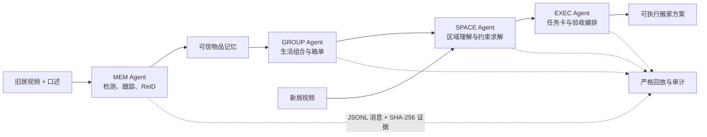

# AI 搬家复原 Agent

> 让 DGX Spark 记住一个家的秩序，并把它恢复成可执行、可验收的搬家计划。

**念头通达 · NVIDIA DGX Spark 黑客松 2026**

本项目是一套本地优先的多模态、多 Agent 搬家复原系统。它从旧居视频与口述中建立带证据的物品记忆，理解“哪些东西应该一起搬”，再从新居视频中识别可用区域，通过约束求解生成箱单、区域布局和搬运任务卡。

项目不追求像素级复刻旧房，而是尽量保留已经形成的生活关系：床头用品仍在顺手的位置，学习物品仍作为一个组合，搬家人员拿到的是可以直接执行的任务，而不是一段泛化建议。

## 系统流程



四个 Agent 不依赖隐式对话上下文，而是通过 Pydantic 定义的 JSON/JSONL 消息协作。每条交接记录生产者、因果引用和载荷哈希，因此同一次运行可以回放，结论也能追溯到输入、配置和阶段产物。

## 已验证的英雄任务

截至 2026-07-20，受控英雄任务的技术闭环已经跑通：

| 环节 | 结果 | 机器可读证据 |
| --- | --- | --- |
| 物品记忆 | 3306 个原始 ReID 实体经审计投影为 20 件可信物品；澄清请求受限为 4 个 | [`inventory/metrics.json`](results/hero/s1-auto-final-v1/inventory/metrics.json) |
| 跨视频匹配 | 20 件中 17 件完成跨视频完整合并；多策略联合 Recall@1 为 85.79% | [`showcase_metrics.json`](results/hero/s1-auto-final-v1/showcase_metrics.json) |
| 生活组合 | 3 个生活组合 + 2 个独立装箱单元，覆盖 20/20 件物品 | [`group/metrics.json`](results/hero/s1-auto-final-v1/group/metrics.json) |
| 新居空间 | 2278 条观测形成 168 个候选区域，自动确定 5 个区域，独立语义评分 5/5 | [`spatial/metrics.json`](results/hero/s1-auto-final-v1/spatial/metrics.json) · [`spatial_score/metrics.json`](results/hero/s1-auto-final-v1/spatial_score/metrics.json) |
| 自动布局 | 5 个搬运单元全部获得区域分配，求解状态为 `PLAN_READY` | [`layout/plan.json`](results/hero/s1-auto-final-v1/layout/plan.json) |
| Agent 协同 | `MEM → GROUP → SPACE → EXEC` 主链完整，严格回放为 `PASS` | [`audit/replay-report.json`](results/hero/s1-auto-final-v1/audit/replay-report.json) |

正式离线成果页位于 [`results/hero/s1-auto-final-v1/index.html`](results/hero/s1-auto-final-v1/index.html)。无需模型或 GPU 即可本地查看：

```bash
python3 -m http.server 8000 \
  --bind 127.0.0.1 \
  --directory results/hero/s1-auto-final-v1
```

随后访问 <http://127.0.0.1:8000/>。仓库还提供一个资源全部内嵌的单文件版本：[`AI搬家复原_队友展示_单文件.html`](results/hero/s1-auto-final-v1/AI搬家复原_队友展示_单文件.html)。

## 核心技术

| 层级 | 实现 |
| --- | --- |
| 多模态感知 | Step-Audio 2 mini、Grounding DINO、DINOv2、OpenCV、跨视角 ReID |
| 本地视觉语言模型 | Nemotron Nano 12B V2 VL、NVFP4-QAD、vLLM |
| 身份与关系建模 | 冻结视觉骨干、轻量投影头、匈牙利匹配、质量门与最小澄清 |
| 空间规划 | 区域属性图、OR-Tools CP-SAT、容量/支撑/电源/共置/互斥约束 |
| Agent 协作 | Python、Pydantic v2、确定性 fan-out/fan-in、追加式 JSONL trace |
| 证据工程 | YAML 配置、SHA-256 内容寻址、阶段新鲜度检查、严格 replay |

所有 GPU 推理与轻量训练都在一台 DGX Spark（GB10 / 128 GB 统一内存）上完成。Nemotron 的 NVFP4/vLLM 主路在真实图文工况达到 25.4 tok/s，约为已验证 BF16 Transformers 路径的 15 倍；完整口径见 [`docs/NEMOTRON_SPARK_SERVING.md`](docs/NEMOTRON_SPARK_SERVING.md)。Grounding DINO 的 TensorRT 实验同时保留正确性门：FP32 修复版通过严格决策等价门，FP16 虽达到 2.49×，但因阈值翻转未进入生产主路。

## 快速开始

### 1. 安装本地开发环境

```bash
git clone https://github.com/seandongAne/niantoutongda-dgx-spark.git
cd niantoutongda-dgx-spark

python3 -m venv .venv
.venv/bin/pip install -r requirements.txt
make test
```

`requirements.txt` 只覆盖本地编排、数据契约、求解与测试所需的基础依赖。模型权重和 Spark 侧推理依赖不在本地安装，也不会进入 Git。

### 2. 查看主链执行计划

```bash
.venv/bin/python scripts/hero_pipeline.py \
  --config configs/hero_pipeline_s1_final.yaml \
  --dry-run
```

完整运行需要未入库的授权原始视频、已配置的 `ssh spark`、Spark 侧模型环境，以及仍然可用的远程节点。公开仓库可以复核代码、配置、小型夹具、指标和审计产物，但不能仅凭仓库内容重新生成私人原始素材。

### 3. 在 DGX Spark 上执行

首次连接远端前必须通过安全自检；加载任何模型前必须检查统一内存：

```bash
./scripts/spark_healthcheck.sh
ssh spark 'free -h'
./scripts/deploy.sh

.venv/bin/python scripts/hero_pipeline.py \
  --config configs/hero_pipeline_s1_final.yaml
```

`scripts/deploy.sh` 是面向 `spark:~/proj/` 的单向同步，并带 `--delete`；远端手工修改会被覆盖。预计超过一分钟的任务由编排器在远端脱离 SSH 会话运行，并通过日志轮询，避免跨境网络断连破坏任务。

更多运行说明：

- [`configs/models.yaml`](configs/models.yaml)：模型、生态、运行环境与降级路径
- [`docs/STEPFUN_API_PLAYBOOK.md`](docs/STEPFUN_API_PLAYBOOK.md)：StepFun 开发期调用与凭据边界
- [`docs/运行时等价判定口径_2026-07-19.md`](docs/运行时等价判定口径_2026-07-19.md)：推理优化的正确性门
- [`SECURITY_SWEEP_2026-07-13.md`](SECURITY_SWEEP_2026-07-13.md)：Spark 安全清理与复验留档

## 仓库结构

```text
backend/      数据契约、确定性逻辑与测试
configs/      模型、ReID、主链和验收配置
docs/         产品设计、技术说明、演示脚本与十日谈
fixtures/     脱敏的小型夹具、确认项与验收真值
infra/        TensorRT 等隔离运行环境
results/      小体积、可复核的指标、trace 与展示结果
scripts/      Spark 部署、流水线、训练、评测和诊断工具
```

## 进一步阅读

- [`docs/参赛项目技术介绍.md`](docs/参赛项目技术介绍.md)：面向评审的技术概览
- [`docs/AI搬家复原Agent_产品与技术设计_v0.3.md`](docs/AI搬家复原Agent_产品与技术设计_v0.3.md)：产品范围、架构与验收标准
- [`docs/演示视频脚本_v2.md`](docs/演示视频脚本_v2.md)：3～4 分钟演示叙事
- [`docs/十日谈_念头通达.md`](docs/十日谈_念头通达.md)：项目过程汇编
- [`docs/journal/`](docs/journal/)：逐日目标、证据、失败与计划

## License

代码以 [GNU AGPL v3](LICENSE) 发布。第三方模型、数据与素材仍分别受其原始许可证和授权范围约束。
