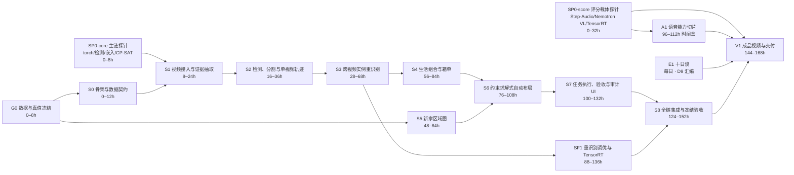

# AI 搬家复原 Agent：七日落地切片与验收手册 v0.3

> 队伍：念头通达
>
> 赛事：NVIDIA DGX Spark 黑客松（2026-07-12 ～ 2026-07-22）
>
> 文档日期：2026-07-15
>
> 执行窗口：从范围冻结起 0～168 小时；日历锚定 **Day 1 = 2026-07-15（D3）… Day 7 = 2026-07-21（D9）**；2026-07-22（D10）只留最终复验与提交，不排任何新工作
>
> 配套定义：[《产品与技术设计 v0.3》](./AI搬家复原Agent_产品与技术设计_v0.3.md)

## 0. 执行裁决

本手册按以下原则执行：

1. 七日主干同时包含**跨视频实例重识别**和**区域级自动布局**，二者都不是可选增强项。
2. 不安排“先全部人工确认”“先只做清单”“先只生成文案”的计划性降级。
3. `SUSPECTED_DUPLICATE` 二选一、组合模板选择、`NOT_SEEN` 和 `NEW_SPACE_INCOMPATIBLE` 是正式产品异常路径，不是项目没有完成的遮羞布。
4. 用户介入必须受指标约束：冻结任务中二选一率不得超过 20%，主演示最多出现一次。
5. 所有切片必须产生可见结果、机器可读指标、失败案例和可回放证据；“代码写了但没接通”不算完成。
6. 第六天结束后冻结新功能，第七天只修阻断问题、复验、录制和包装。
7. **裁剪争议一律以《产品与技术设计 v0.3》§4.4 评分对齐矩阵仲裁**——矩阵分三档：**必须得分载体**（主干闭环、协同 trace 回放含验收复核消息族、SF1-L1 投影头、双生态各一个主链模型、成品视频、十日谈）砍掉 = 主动放弃对应权重；**有条件增强**（TTS 镜头、9B 文案、SF1-L2/L3、界面打磨）超时按预案降级并如实记录；**明确可舍弃**（NVFP4 量化、TAO 微调、NvDINOv2）默认不做。“全部不可裁剪”式的假优先级不允许存在。
8. 十日谈按 AGENTS.md 纪律**每日强制更新**：任何实质成果在当次交付前写入当天 `docs/journal/DAY-XX.md`，D9 汇编——不是赛末补写材料。

---

## 1. 七日总览

### 1.1 依赖关系



### 1.2 按天执行表

| 天 | 主线 | 并行工作 | 当天必须可见的结果 | 日终门槛 |
|---|---|---|---|---|
| Day 1（07-15/D3） | G0、SP0-core、S0 | 非技术队员完成任务 A/B 拍摄和真值；技术队员完成主链探针与仓库骨架；SP0-score 下载启动 | 一套冻结开发任务、一套冻结验收任务；主链模型（检测/嵌入）与 CP-SAT 能在 Spark 跑通；空流程 UI 能创建任务 | **G1：数据、SP0-core、schema 三者全部 PASS 才开 S1；SP0-score 允许顺延至 Day 2 日终** |
| Day 2（07-16/D4） | S1、S2 | 前端制作旧家扫描和证据页；**SP0-score 收口**（Step-Audio 与 Nemotron VL 各完成一次加载探针） | 三段视频生成关键帧、框、轨迹和多视角证据 | 15 件至少看到 12 件；单视频轨迹可复现；SP0-score 未 PASS 则当晚触发降级预案评估 |
| Day 3（07-17/D5） | S3 第一轮 | 二选一界面；相似物品困难负样本补标 | 跨视频实体库、匹配分数、疑似重复队列 | **G2：13/15 正确合并、0 高置信误合并、确认率 ≤20%** |
| Day 4（07-18/D6） | S3 加固、S4、S5 开始 | 轻量投影头训练；组合真值与区域标注 | 三个生活组合、箱单；新家至少五个区域及证据 | 阈值冻结；3 组中至少 2 组自动接受 |
| Day 5（07-19/D7） | S5、S6 | 前端制作区域计划页；布局约束测试；**A1 语音能力切片（时间盒 0.5 天）** | 自动区域布局、替代方案和不适配状态；A1 至少一级路径产出 | **G3：0 硬约束违反、≥80% 区域建议接受** |
| Day 6（07-20/D8） | S7、SF1、S8 第一轮 | 任务卡、二维码、验收图；TensorRT 与性能测量 | 从旧家视频到完成验收的端到端闭环；协同 trace 可单命令回放 | **G4：冻结任务 B 完整跑通，证据链 100%；成品视频分镜冻结** |
| Day 7（07-21/D9） | S8 复验、V1 | 三次重复运行、失败镜头、旁白录制剪辑；E1 十日谈汇编 | 一键演示、指标页、3～4 分钟成品视频、提交包 | **G5：连续 3 次同结果，无 OOM，无新增 P1；提交包按评分矩阵自检通过** |

每日无条件并行：**E1 十日谈当日日志**（AGENTS.md 强制，见 §16A）。2026-07-22（D10）只做最终复验与提交，不排新工作、不修非阻断缺陷。

### 1.3 功能冻结规则

- Day 3 结束冻结重识别分数的字段和不确定状态语义。
- Day 4 结束冻结生活组合 schema、模板集合和评测真值。
- Day 5 结束冻结布局硬约束、软目标和区域 taxonomy。
- Day 6 结束冻结 UI 信息架构和成品视频分镜（含 90 秒主闭环脚本）。
- Day 7 禁止增加新的模型、Agent、页面、物品类别或布局约束。

---

## 2. 团队并行分工

以下是角色，不预设具体人数；人员不足时可兼任，但同一切片必须有主责人与复核人。

| 角色 | 主要职责 | 每日交付 | 不应承担 |
|---|---|---|---|
| 产品与故事主责 | 锁定用户问题、任务卡语言、演示叙事和范围 | 访谈记录、验收判断、演示脚本 | 替模型编造技术指标 |
| 数据与真值主责 | 拍摄任务 A/B、物品实体/组合/区域人工标注、隐私脱敏 | 冻结 manifest、绝对计数、错误案例 | 在冻结任务 B 上帮模型手工改答案 |
| 视觉与重识别主责 | S1～S3、SF1：检测、轨迹、嵌入、匹配、调优 | 实体库、指标、消融、TensorRT 结果 | 自动布局和 UI 文案 |
| 空间与后端主责 | S0、S5、S6：schema、区域图、CP-SAT、API、状态持久化 | 区域图、求解器、接口和测试 | 让 VLM 绕过硬约束 |
| 前端与演示主责 | 六个核心界面、证据呈现、任务卡、V1 成品视频、E1 十日谈汇编 | 每日可点击流程、最终成品视频 | 隐藏失败状态或伪造实时结果 |
| 集成与平台主责 | Spark 部署、双生态模型探针与 A1 语音能力切片、内存/延迟、验收命令、证据收集 | manifest、运行日志、重复性结果 | 在远程直接改代码或存放隐私/凭据 |

非技术队员是数据真值、可用性和叙事的主责人，不是“等技术做完再配音”的外围角色。十日谈由每个切片主责人写当日相关段落，前端与演示主责 D9 汇编（AGENTS.md 纪律）。

### 2.1 每日 20 分钟现场验收

1. 主责人先说本切片承诺的用户结果。
2. 使用冻结输入从标准入口运行。
3. 展示正常路径和至少一个正式异常路径。
4. 数据主责复核绝对计数，不只看百分比。
5. 产品主责判断任务卡和区域建议是否可理解。
6. 当场记 `PASS`、`FAIL` 或 `BLOCKED`，并明确下一个实验。
7. 只有 `PASS` 才解除依赖；不得用“差不多”进入下一门槛。

---

## 3. 全局 Definition of Done

每个切片只有同时满足以下条件才算完成：

- [ ] 输入样本已冻结并记录哈希或文件校验值；
- [ ] 核心流程可从一个命令或一个界面动作启动；
- [ ] 至少一个自动化测试覆盖核心确定性逻辑；
- [ ] 至少一个正式异常或失败案例已运行；
- [ ] 用户可见结果已截图；
- [ ] 指标写入 `metrics.json`，同时报告绝对数量；
- [ ] 模型、配置、代码提交和输入版本写入 `manifest.json`；
- [ ] 跨 Agent 消息和用户裁决追加写入 `audit/events.jsonl`；
- [ ] 敏感原始视频、凭据和模型权重没有进入 Git；
- [ ] 有意义的改动已形成独立 Git commit；
- [ ] 当天 `docs/journal/DAY-XX.md` 已按 AGENTS.md 纪律更新；
- [ ] 复核人已经给出 `PASS`、`FAIL` 或保留意见。

### 3.1 验收证据目录

```text
results/acceptance/<slice_id>/<run_id>/
├── manifest.json
├── metrics.json
├── test-report.txt
├── run.log
├── audit-events.jsonl
├── screenshots/
│   ├── normal.png
│   └── exception.png
├── failure-case.md
└── reviewer-signoff.md
```

完整家庭视频不得放入验收目录。只保存脱敏截图、框、裁剪、指标和引用路径。

### 3.2 目标标准入口

以下是 S0 必须实现的目标接口；在对应脚本真正存在前不得宣称命令可用：

```bash
make fixture-check
make test
make demo
make benchmark
./scripts/accept.sh <slice_id>
```

最终演示只能依赖 `make demo` 或等价单入口，不允许现场同时操作多个开发终端手工补数据。

---

## 4. G0：数据、授权与真值冻结（0～8h）

### 目标

在写核心算法前取得两个可合法使用、可重复评估的搬家任务，并为跨视频身份和布局建立人工真值。

### 任务

1. 选择两个不同房间或两套不同物品：开发任务 A、冻结任务 B。
2. 每个任务拍摄至少三段旧家视频和一段新家视频。
3. 每个任务人工编号十五件锚点物品；编号不可从画面直接可读。
4. 每件锚点物品至少出现在三段视频中的两段，至少十件出现在全部三段。
5. 至少布置三组困难负样本，例如两只相似水杯、两盏相似灯、两个相似收纳盒。
6. 至少布置两个遮挡或视角变化明显的正样本。
7. 预先确认三个生活组合，不允许看到模型输出后再改真值迎合模型。
8. 为新家标注至少五个区域、区域属性、容量等级和硬约束。
9. 冻结至少五个布局单元：三个生活组合和至少两个独立锚点物品。
10. 记录授权、拍摄者、允许展示范围和删除时间。
11. 去除 EXIF、地址、定位、人脸、证件、门锁和其他私人信息。
12. 由数据主责封存任务 B 的实体、组合和区域答案；技术主责在模型、阈值和配置预注册前不得查看。

### 必交产物

```text
fixtures/
├── manifest.yaml
├── dev_a/
│   ├── annotations/entities.json
│   ├── annotations/life_groups.json
│   └── annotations/regions.json
└── holdout_b/
    ├── annotations/entities.json
    ├── annotations/life_groups.json
    └── annotations/regions.json
configs/scenario_demo.yaml
docs/数据授权与脱敏说明_v0.1.md
```

仓库内只保存脱敏小夹具和 manifest；原视频放在 Git 忽略目录或受控存储中。

### 验收

- 两个任务均满足“3 段旧家视频 + 1 段新家视频 + 15 件物品”。
- 每个物品在各视频中的出现/未出现均有真值。
- 同一物品与相似不同物品均有明确关系标签。
- 生活组合和区域真值在模型运行前冻结。
- 任务 A 按完整视频划分训练视角与验证视角；任务 B 答案已封存。
- 授权和隐私检查通过。

### 阻断条件

- 只有一个任务，无法形成冻结验收；
- 物品真值不完整；
- 新家区域没有证据图；
- 数据含未授权私人信息；
- 任务 B 已被用于调阈值或训练。

发生阻断时优先补数据，不允许用开发任务 A 的成功结果代替冻结验收。

---

## 5. SP0：Spark 与模型能力探针（拆分为 core 与 score 两段）

### 目标

确认所有主能力能在 aarch64 DGX Spark 上启动、训练或推理。**SP0 拆成两段，各自阻塞不同的下游**——不允许让 Step-Audio/TTS/VLM 的探针进度把 S1 主链卡住：

- **SP0-core（0～8h，阻塞 S1）**：torch CUDA、开放词汇检测、实例嵌入、投影头训练、CP-SAT——主链起链的最小集合；
- **SP0-score（0～32h，不阻塞 S1，阻塞最终演示与 A1）**：Step-Audio 2 mini、TTS-3B、Nemotron VL、TensorRT 导出——评分载体探针，Day 2 日终收口，逐模型 30 分钟加载时间盒，超时记 `TIMEBOX_EXPIRED` 进入下一个，不无限陪跑。

**环境纪律（评审 P0-3）**：Step-Audio 官方钉死 `transformers==4.49.0`，Nemotron VL 要求 `>4.53,<4.54`——两条官方依赖线不可能共存于一个 venv。三套隔离环境：`~/venv`（下载器 + 视觉主链）、`~/envs/stepaudio`、`~/envs/nemotron_vl`，由 `scripts/spark_bootstrap.sh env <name>` + `configs/env_*.txt` 锁定；任何探针必须在其所属环境里跑（`models.yaml` 的 `env` 字段为准），把音频/VLM 依赖装进主 venv 视为 P1 事故。

### 前置纪律

本会话首次连接 Spark 前：

```bash
./scripts/spark_healthcheck.sh
```

只有退出码为 0 且输出以 `✅ SPARK CLEAN` 开头才可继续。每次加载模型前：

```bash
ssh spark 'free -h'
```

超过一分钟的任务使用 `nohup` 后台运行；代码只在本地编辑并通过 `scripts/deploy.sh` 部署。

### SP0-core 任务（阻塞 S1）

1. torch CUDA matmul 探针通过（GB10/aarch64 生死门；bare-metal 失败则切 NGC 容器）。
2. 在一张冻结图片上运行开放词汇检测，输出框与类别。
3. 在同一物品两张不同视角裁剪上输出实例嵌入和余弦相似度。
4. 在相似但不同实例裁剪上验证嵌入可以形成困难负样本基线。
5. 用少量正负样本训练一次轻量投影头并保存小型权重。
6. 运行一个最小 CP-SAT 区域分配案例，覆盖 `OPTIMAL` 和 `INFEASIBLE`。

### SP0-score 任务（不阻塞 S1，Day 2 日终收口）

1. 在 `~/envs/stepaudio` 运行 Step-Audio 2 mini 一次真实语音理解推理（A1 能力路径探针）；对 Step-Audio-TTS-3B 执行 30 分钟时间盒探针，留下 `PASS` / `TIMEBOX_EXPIRED` / `FAIL` 记录（不作为门槛）。
2. 在 `~/envs/nemotron_vl` 运行 Nemotron VL 一次结构化物品/区域属性抽取（NVIDIA 主链载体探针；`mamba-ssm` aarch64 编译失败 → NGC 容器兜底并记录）。
3. 验证检测模型的 TensorRT/ONNX 导出路径或明确记录不支持（口径为“TensorRT 部署”，不称 TAO）。
4. 冻结每种能力的一主一备，不继续无限试模型。

### 必交产物

- `configs/models.yaml`：ModelScope ID、版本、许可证、用途、量化、候选顺序、生态归属（`ecosystem`）与运行环境（`env`）；
- `results/acceptance/sp0/<run_id>/metrics.json`：加载时间、峰值内存、单次延迟（core/score 分开记录）；
- 一组检测、嵌入、属性抽取和求解截图；
- 一个可复现的投影头训练命令；
- 一个 CP-SAT 不可行案例。

### 验收

- **SP0-core**：torch CUDA、检测、嵌入、CP-SAT 均有真实输出；轻量投影头完成一次前向、反向和保存——PASS 才开 S1。
- **SP0-score**：NVIDIA 与 Stepfun 双生态各至少一个模型完成一次可复现推理（NVIDIA 以 Nemotron VL 属性抽取为准，Stepfun 以 Step-Audio 2 mini 为准；TTS 探针结果在案但不作为门槛）——Day 2 日终未 PASS 触发降级预案评估（同生态换型号 / NGC 容器 / P1 上报），不静默拖延。
- 模型权重只在 Spark 上从 ModelScope 拉取。
- 峰值内存有记录且未超过机器内存 80%。
- 服务未裸露在非 loopback 的敏感端口。

---

## 6. S0：仓库骨架与数据契约（0～12h）

### 目标

让不同主责人可以并行开发而不靠口头传递字段。

### 冻结技术栈

- 后端：Python + FastAPI + Pydantic；
- 状态：SQLite 保存当前快照，JSONL 保存追加式审计事件；
- 前端：React + Vite 单页应用；
- 计算：Python worker，视觉任务异步执行；
- 布局：OR-Tools CP-SAT；
- 通知：SSE 或 WebSocket 传递处理进度；
- 测试：pytest；
- 配置：YAML，所有阈值版本化。

### 目标目录

```text
backend/
├── api/
├── agents/
│   ├── object_memory/
│   ├── routine_graph/
│   ├── space_planner/
│   └── move_execution/
├── tools/
│   ├── vision/
│   ├── reid/
│   └── solver/
├── schemas/
└── tests/
frontend/
├── src/pages/
├── src/components/
└── src/api/
configs/
fixtures/
results/
scripts/
```

### 必须先冻结的 schema

- `Observation`；
- `Tracklet`；
- `ObjectEntity`；
- `ClarificationRequest`；
- 验收复核消息族（`VerificationCheckRequest` / `ObjectPresenceCheckResult` / `PlacementComplianceResult` / `VerificationVerdict` / `UserAdjudication`，共享消息基字段 `message_id`/`correlation_id`/`causation_id`/`producer`/`payload_hash`）；
- `LifeGroup`；
- `Region`；
- `PlacementPlan`；
- `MoveTask`；
- `AuditEvent`。

### 最小 API

| 方法 | 路径 | 用途 |
|---|---|---|
| `POST` | `/jobs` | 创建搬家任务 |
| `POST` | `/jobs/{id}/videos` | 登记旧家或新家视频 |
| `POST` | `/jobs/{id}/process-old-home` | 启动旧家处理 |
| `GET` | `/jobs/{id}/entities` | 获取物品实体和证据 |
| `POST` | `/clarifications/{id}/decision` | 提交二选一结果 |
| `GET` | `/jobs/{id}/life-groups` | 获取生活组合和箱单 |
| `POST` | `/jobs/{id}/process-new-home` | 构建区域图并规划 |
| `GET` | `/jobs/{id}/placement-plan` | 获取布局结果 |
| `POST` | `/tasks/{id}/complete` | 提交完成状态和照片 |
| `GET` | `/jobs/{id}/audit` | 回放证据与修改历史 |

### 验收

- schema 单元测试通过；
- 能创建空任务、写入并重放一条审计事件；
- 前端能显示任务阶段；
- API 对未知 schema 版本明确拒绝；
- 一个模拟 `SUSPECTED_DUPLICATE` 可在前端完成二选一并落盘。

---

## 7. S1：视频接入与证据抽取（8～24h）

### 目标

把多段原始视频转成可复现、可追踪的关键帧和证据资产。

### 任务

1. 登记视频哈希、帧率、分辨率、时长和拍摄顺序。
2. 实现模糊度、曝光和镜头变化检测。
3. 按质量与视角差异选择关键帧。
4. 为关键帧生成稳定 ID 和缩略图。
5. 保存原视频时间戳映射。
6. 在界面显示视频覆盖率、已处理帧数和异常。
7. 保证相同输入与配置产生相同关键帧集合。

### 验收

- 三段视频均可处理，损坏视频不会让 worker 崩溃。
- 连续运行三次关键帧 ID 和数量一致。
- 每张关键帧可追溯到原视频和毫秒时间戳。
- UI 能展示旧家三段视频及处理进度。
- 模糊或严重曝光异常片段被明确标记，不生成虚假物品结论。

---

## 8. S2：检测、分割与单视频轨迹（16～36h）

### 目标

在跨视频匹配前，把每段视频中的同一物品压缩成稳定 `Tracklet`。

### 任务

1. 冻结锚点物品词表和同义词。
2. 运行开放词汇检测；实例分割只用于去背景和改善裁剪。
3. 使用追踪器形成单视频轨迹。
4. 实现裁剪质量评分：清晰度、像素面积、遮挡和边界截断。
5. 每条轨迹保存 Top-K 高质量视角。
6. 同帧共现轨迹建立永久互斥边。
7. 把框、裁剪、类别、时间戳和模型版本写入证据库。

### 验收

- 冻结任务 A 的 15 件锚点中至少 12 件被看到并形成轨迹。
- 对进入评测的锚点，单视频严重 ID switch 总数不超过 2 次。
- 同一帧出现的两件相似物品始终保留为不同轨迹。
- 每条轨迹至少有一张合格证据图；没有合格图时输出 `NOT_SEEN` 或低质量状态。
- 所有轨迹可从原始时间戳重新渲染。

### 不允许的过关方式

- 手工把三段视频中的框预先改成同一实体 ID；
- 只选择一段最容易的视频；
- 用逐帧检测数量冒充物品实体召回；
- 删除困难负样本。

---

## 9. S3：跨视频实例重识别（28～68h）

### 目标

把三段视频中的轨迹自动合并为稳定物品实体，并把不确定项控制在 20% 以内。

### 任务

1. 为每条轨迹计算多视角实例嵌入。
2. 抽取类别、颜色、材质、纹理、文字和尺寸等级候选。
3. 建立邻近物品与原房间区域的上下文特征。
4. 实现硬门控：同帧互斥、用户负约束、类别/尺寸/材质强冲突。
5. 实现 Top-K 召回和综合匹配分数。
6. 实现视频对之间的全局一对一匹配。
7. 实现带互斥约束的实体聚类与全局一致性检查。
8. 冻结 `T_match`、`T_new` 和 `M_match`。
9. 实现三段式决策：`MATCHED`、`NEW_ENTITY`、`SUSPECTED_DUPLICATE`。
10. 实现二选一界面和永久正/负约束。
11. 输出错误分析：误合并、漏合并、未看到、低质量裁剪、属性冲突。

### 必须运行的消融

| 实验 | 目的 |
|---|---|
| 实例嵌入 only | 证明最小基线 |
| 实例 + 语义/属性 | 验证外观信息的增益 |
| 实例 + 语义/属性 + 上下文 | 验证生活场景关系的增益 |
| 完整特征 + 全局约束 | 证明减少错误合并的效果 |

### 验收

- 15 件中至少 13 件的全部已标注观测被正确合并；每件至少跨两段视频。
- 高置信错误合并为 0。
- `Recall@1 ≥85%`。
- 自动流程的二选一率 ≤20%，即最多 3 件。
- 用户确认后实体身份 100% 与真值一致。
- 主演示场景最多出现一次二选一。
- 连续三次运行实体数量、成员和状态一致。

### Gate G2 失败时的处理

不扩大人工确认范围，也不删除重识别能力。按错误类型集中修复：

1. 裁剪差：修 S1/S2 的视角与质量选择；
2. 相似物误合并：增加困难负样本、互斥和属性门控；
3. 同物漏合并：改善多视角原型和上下文权重；
4. 分数不稳定：校准阈值和最佳/次佳间隔；
5. 全局冲突：修一对一匹配和聚类约束。

禁止把 `T_match` 降到所有物品都自动合并，或把全部物品送入二选一来假装通过。

---

## 10. S4：生活组合与箱单（56～84h）

### 目标

把物品实体转为带证据的生活组合，并建立组合装箱和拆箱优先级。

### 任务

1. 构建物品关系图：`NEAR`、`SAME_SURFACE`、`CO_USED`、`REQUIRES_POWER`、`STORED_WITH`。
2. 只有至少两类证据支持时才自动成组。
3. 为每个组合选择锚点物品和原房间证据。
4. 实现五类候选模板：床头、桌面/学习、充电、入口、日常护理。
5. 证据不足时输出模板选择，而不是自由文本猜测。
6. 生成箱号、组合装箱建议和拆箱优先级。
7. 保留自动结果、模板选择和用户修改历史。

### 验收

- 三个真值组合中至少两个无需重建即可接受。
- 每个自动组合至少有两类证据，并可点开查看。
- 模板路径能在两次点击内完成，不要求逐件重新选择。
- 组合中的每个实体都能追溯到跨视频证据。
- 箱号、组合和任务之间没有孤儿记录。

---

## 11. S5：新家区域图（48～84h）

### 目标

从新家视频中构建至少五个有证据、可用于约束求解的区域。

### 任务

1. 识别床、桌、柜、门、窗和插座等锚点候选。
2. 生成表面、抽屉、柜层、地面、墙面等区域候选。
3. 提取支撑类型、容量、电源、可达性、隐私和当前占用属性。
4. 每个属性绑定截图和框/区域证据。
5. 对没有视觉证据的属性保持未知，不用 VLM 猜测填满。
6. 生成稳定 `region_id` 和邻接关系。
7. UI 显示区域卡和属性依据。

### 验收

- 冻结新家输入产生至少五个有效区域。
- 每个区域均有截图、锚点、支撑类型和容量等级。
- `near_power=true` 必须有插座或等价人工授权证据。
- 同一输入连续三次产生相同区域 ID 和属性。
- 至少一个缺失属性被正确保留为未知，而不是生成式补全。

---

## 12. S6：约束求解式自动布局（76～108h）

### 目标

把生活组合自动分配到新家区域，以零硬约束违反换取可解释、可重复的区域级布局。

### 任务

1. 实现 `x[group, region]` 二元分配变量。
2. 实现支撑类型、容量、电源、同放、禁放和互斥硬约束。
3. 实现关系保留、角色相似、可达性、证据质量和拆箱优先级软目标。
4. 全部权重整数化并写入版本化配置。
5. 输出最优/可行方案、分项得分和至少一个替代区域。
6. 构造一个真实不可行案例，验证 `NEW_SPACE_INCOMPATIBLE`。
7. 区分求解器超时/错误与真实空间不适配。
8. UI 显示“为什么在这里”和“为什么不是第二选择”。

### 验收

- 所有硬约束违反为 0。
- 至少五个布局单元中的四个区域建议由真值负责人直接接受，即 ≥80%。
- 预置不可行案例 100% 输出 `NEW_SPACE_INCOMPATIBLE` 和冲突约束。
- CP-SAT 求解 P95 ≤2 秒。
- 同一输入和配置连续三次产生同一首选方案。
- LLM/VLM 无法直接覆盖求解结果。

### 不允许的过关方式

- 把人工指定区域写进 demo 配置后称为自动布局；
- 只生成“建议放在方便的位置”等自然语言；
- 求解无解时删除硬约束；
- 把模型错误误报为“新空间不适配”；
- 输出精确坐标但没有几何真值。

---

## 13. S7：任务执行、验收与审计 UI（100～132h）

### 目标

让一个没有参与前期沟通的人能按任务卡完成拆箱和区域摆放，并让用户核验全过程。

### 任务

1. 完成六个核心界面：任务首页、旧家证据、疑似重复、生活组合、区域布局、任务验收。
2. 每张任务卡显示组合、箱号、旧家证据、新家区域、优先级和约束。
3. 二维码只编码随机任务 ID。
4. 支持完成勾选、验收照片和用户覆盖结果。
5. 实现 `VERIFIED`、`NOT_SEEN` 和 `USER_OVERRIDDEN`；验收照片提交后由搬家执行 Agent 发起验收复核消息族——MEM 只答“出现”（`ObjectPresenceCheckResult`），SPACE 只答“摆放合规”（`PlacementComplianceResult`），EXEC 汇总 `VerificationVerdict`，presence ∧ compliance 才 `VERIFIED`；**物品出现但放错区域 = `FAILED(MISPLACED)`，不是 `VERIFIED`**；用户裁决走独立消息 `UserAdjudication`。
6. 实现按时间回放的 audit timeline。
7. 提供 `scripts/replay_trace.sh`（或等价单命令）按任务回放全部跨 Agent 消息链——这是“智能体融合”评分的主要证据入口。
8. 所有事实字段直接来自结构对象，不能由前端自由拼接。

### 验收

- 未参与开发的队员能在 10 秒内理解单张任务卡。
- 从任务首页到提交完成照片不超过三个主要动作。
- 任一最终任务能回溯到原视频截图、实体、组合、区域和配置。
- `SUSPECTED_DUPLICATE`、`NOT_SEEN` 和 `NEW_SPACE_INCOMPATIBLE` 均有真实界面。
- 任一任务的跨 Agent 消息链（含验收复核消息族的请求→双结果→裁决全链）可单命令回放，回放时校验 `payload_hash` 与 `correlation_id` 闭合；每个 `VERIFIED` 均有 presence 与 compliance 双结论支撑。
- 用户覆盖不会删除原建议，而是追加审计事件。

---

## 14. SF1：重识别调优与 Spark 优化（88～136h）

### 目标

在同一冻结评测上证明至少一项真实正收益：实例准确性、确认率、延迟或内存。

### 三层证据

#### L1：轻量度量学习

- 冻结骨干基线；
- 用任务 A 的正样本和困难负样本训练投影头或末层；
- 比较 `Recall@1`、错误合并、漏合并和二选一率；
- 不使用任务 B 训练或选 epoch。

#### L2：TensorRT/推理优化

- 选择主链中耗时最高且可导出的视觉模型；
- 比较原始框架与 TensorRT 的 P50/P95 延迟、吞吐和峰值内存；
- 验证输出差异和精度不发生不可接受退化。

#### L3：工作点消融

- 比较不同关键帧密度、Top-K 原型数和匹配阈值；
- 绘制自动匹配覆盖率与错误合并之间的关系；
- 冻结一个满足“0 高置信误合并、确认率 ≤20%”的工作点。

### 验收

- 任务 A 的训练/验证和任务 B 的最终评估使用同一指标实现；任何横向对比都保持输入、指标和运行环境一致。
- 报告调优前后绝对值与相对值。
- 最终模型和阈值在首次运行任务 B 前按任务 A 的验证结果预注册；任务 B 不用于继续调参、选 epoch 或替换主模型。
- 任务 B 没有正收益时如实报告负结果，不把它改写成提升。
- 最终模型、配置和 TensorRT engine 版本进入 manifest。
- Spark 连续运行 30 分钟无 OOM，峰值内存不超过 80%。

---

## 14A. A1：语音能力切片（96～112h，时间盒，不阻塞主链）

### 目标

让 Stepfun 音频模型以真实产品能力出场（“平台适配性 15%”的双生态载体），同时不给重识别与布局主链增加任何阻塞依赖。

### 任务

1. 主路径：对一段带用户旁白的拍摄视频运行 Step-Audio 2 mini，把旁白转成物品语义标签候选（例如“这是床头灯”→ 对应轨迹的 label 候选）；语音候选只作为候选证据，不直接改写实体身份或事实字段。
2. 条件路径：SP0-score 的 TTS 探针为 `PASS` 时，用 Step-Audio-TTS-3B 为一张真实任务卡生成语音播报 WAV。
3. 两条路径的输入、输出、模型版本写入 manifest 并追加 `audit/events.jsonl`。

### 时间盒与降级阶梯

- 总时间盒 0.5 天；到点未通过立即停止，不挤占主链。
- 降级阶梯（任一级达成即 A1 完成）：
  1. Step-Audio 2 mini 旁白理解；
  2. Step-Audio-TTS-3B 任务卡播报；
  3. Step-Audio 2 mini 文本输出模式生成任务卡朗读稿（双生态出场的最低保险）。
- 阶梯边界：Stepfun 开源文本旗舰为 321B 级 MoE，128GB 统一内存不可行，**不存在独立文本模型兜底**——第三级复用 Step-Audio 2 mini 的文本出口，只覆盖“能加载但语音理解质量不达标”的情形。
- 若两个音频模型在 Spark 上连加载都失败（而非质量不达标），按 SP0-score 纪律在 Stepfun 生态内就近换型号重试；仍失败则按 P1 上报，并在当天十日谈如实记录——不允许静默放弃双生态载体。

### 验收

- 至少一级路径产出真实、可复现结果，并有截图或音频文件证据。
- 演示中的语音镜头明确标注能力边界：旁白理解是候选证据，不是实体裁决。
- 语音候选标签未经用户或匹配流程确认，不进入 `ObjectEntity.label` 事实字段。

### 不允许的过关方式

- 用预先写好的文本冒充语音理解输出；
- 把能力路径包装成主链依赖，或宣称“语音驱动整个系统”；
- 任何一级都未跑通，视频里仍出现语音能力镜头。

---

## 15. S8：全链集成与冻结验收（124～152h）

### 目标

在冻结任务 B 上，从旧家三段视频开始，完整运行到新家验收，不进行开发者手工修正。

### 标准流程

```text
创建任务
→ 登记三段旧家视频
→ 关键帧 / 检测 / 轨迹
→ 跨视频实体重识别
→ 最多一次主演示二选一
→ 生活组合和箱单
→ 登记新家视频
→ 区域图
→ 自动布局
→ 任务卡
→ 完成照片
→ 审计回放
```

### 验收矩阵

| 项目 | 必须达到 |
|---|---|
| 锚点建档 | 15 件中至少 12 件 |
| 跨视频完整合并 | 15 件中至少 13 件的全部已标注观测；每件至少跨两段视频 |
| 高置信错误合并 | 0 |
| 二选一率 | ≤20%；主演示 ≤1 次 |
| 组合接受 | 3 组中至少 2 组 |
| 区域建议接受 | 至少 5 个布局单元中的 4 个，即 ≥80% |
| 硬约束违反 | 0 |
| 证据追溯 | 100% |
| 扫描到任务卡 | ≤5 分钟 |
| 重复性 | 连续 3 次实体和布局一致 |
| 稳定性 | 30 分钟无崩溃、无 OOM |
| 双生态出场 | NVIDIA 与 Stepfun 各至少一个模型在演示链路真实运行（A1 降级阶梯任一级） |
| 协同 trace 回放 | 任一任务的跨 Agent 消息链可单命令回放，含验收复核消息族全链（请求→presence/compliance 双结果→verdict→用户裁决），`payload_hash` 校验通过 |

### 正式异常验收

必须额外运行：

1. 一件预期物品未出现在视频中 → `NOT_SEEN`；
2. 两件相似物品证据不足 → `SUSPECTED_DUPLICATE`；
3. 需要电源的组合没有合适区域 → `NEW_SPACE_INCOMPATIBLE`；
4. 求解器被人为设置极短超时 → `PLANNER_ERROR`，不能误报为空间不适配；
5. 用户改变最终区域 → `USER_OVERRIDDEN` 且旧建议仍可回放。

### 一票否决

- 使用任务 B 调阈值或训练；
- 现场手工改实体 ID、区域或求解结果；
- 高置信把两件不同物品合并为同一实体；
- 违反硬约束仍输出 `PLAN_READY`；
- 证据字段缺失；
- 真实家庭隐私素材进入远程 Spark 或 Git；
- 演示中出现未真实运行的模型或生态（含语音镜头造假）；
- 只在 Mac 上成功，Spark 主链没有运行证据。

---

## 16. V1：成品视频与交付（144～168h）

### 目标

把已经通过 S8 的真实闭环制作成 3～4 分钟成品视频——评审的“演示效果 10%”评的是**成品视频**（流畅、清晰、逻辑严谨、直观呈现核心价值），不是原始录屏——核心闭环压在 90 秒内，不在录制阶段临时创造功能。

### 分镜（与设计文档 §11 一致，Day 6 冻结）

| 段落 | 时长 | 内容 |
|---|---:|---|
| 90 秒主闭环 | ~90 s | 设计文档 §11 主闭环分镜表（含问题冷开场） |
| 架构与双生态 | ~25 s | 四 Agent 架构图 + 真实协同 trace 动画（含验收复核消息族往返）；模型清单动画（NVIDIA：Nemotron VL + TensorRT 部署；Stepfun：Step-Audio 系列）；“单机训练 + 推理” |
| 断网高光 | ~10 s | Spark 出站封锁特写 + 全链继续运行 |
| 调优对比 | ~20 s | SF1 三层证据（L1 指标条 / L2 延迟条 / L3 工作点曲线） |
| 语音能力段（条件） | ~10 s | A1 达成级别对应镜头；未达成则以任务卡特写替代 |
| 指标与边界收尾 | ~15 s | 真实延迟/内存指标；能力边界声明 |

### 素材清单

- 旧家三段视频中的同一物品多视角；
- 一个成功自动匹配；
- 一个二选一确认；
- 三个生活组合中的一个重点组合；
- 新家区域图；
- CP-SAT 自动布局及依据；
- 一个 `NEW_SPACE_INCOMPATIBLE` 或 `NOT_SEEN` 快速镜头；
- 工人任务卡和二维码；
- 完成验收图与验收复核结论；
- audit timeline 与协同 trace 回放动画；
- 断网状态下继续运行的镜头；
- 双生态模型真实出场画面（A1 达成级别对应素材）；
- Spark 本地运行、指标和调优对比。

### 录制纪律

- 明确标注实时、离线回放和预先录制素材。
- 不使用剪辑掩盖人工修改实体或区域。
- 画面上的每个指标都有对应 `metrics.json`。
- 演示失败镜头必须来自真实异常测试。
- Day 6 按分镜彩排一遍，Day 7 只做录制与剪辑。
- 准备一键重置后的备用录屏，但现场流程仍须可运行。
- 简版兜底：时间告急时，S8 三次成功回放录屏 + 字幕旁白即最低可交付版本——宁可粗糙也不造假。

### 最终验收

- `make demo` 或等价单入口可重置并启动主演示；
- 成品视频分镜与产品技术设计 §11 一致，核心闭环 ≤90 秒；
- 连续三次演示结果一致；
- 所有对外说法符合能力边界；
- **提交包按设计文档 §4.4 评分对齐矩阵逐项自检**：六项标准每项载体齐备并有证据指针；
- 最终提交不包含凭据、权重或私人家庭素材。

---

## 16A. E1：十日谈征文（每日，D9 汇编）

- 固定模板：`docs/journal/TEMPLATE.md`；本项目从 D3（2026-07-15）起接管每日日志，正式赛程日志为 `DAY-01.md` 至 `DAY-10.md`；汇编稿固定为 `docs/十日谈_念头通达.md`。
- 每次完成实质成果（代码、文档、配置、实验、模型评测、架构裁决）后，当次交付前更新当天 `DAY-XX.md`；同一天多次工作持续更新同一文件，单次 5～10 分钟。
- 素材零增负：`results/acceptance/` 验收证据、失败案例文件、metrics 即日志素材，直接引用；只存在于 Spark 上的材料必须先拉回本地才能作为证据。
- 不得把计划写成已完成，不得省略失败、降级和未验证边界——诚实的失败记录比顺风叙事更有征文价值（选题从海事切换到搬家本身就是 D3 的诚实素材）。
- D9 汇编 DAY-00 至 DAY-09；D10 最终提交前补齐 `DAY-10.md` 并回填最终结果、边界与提交状态。
- 责任：每个切片主责人写当日相关段落，前端与演示主责汇编。

---

## 17. 错误分类与修复优先级

### P0：立即停主线修复

- 高置信错误合并不同物品；
- 任务 B 泄漏进入训练或调参；
- 布局违反硬约束；
- 审计证据与界面事实不一致；
- Spark OOM、健康检查异常或敏感端口暴露；
- 私人家庭素材泄露。

### P1：当天修复

- 二选一率超过 20%；
- 15 件中少于 13 件完成跨视频合并；
- 组合或区域建议低于接受线；
- 三次运行结果不一致；
- 单次全流程超过 5 分钟；
- 核心 UI 不能显示失败状态；
- 评分载体缺席：双生态出场、协同 trace 回放、成品视频分镜、A1 三级全败或十日谈当日日志缺失——不得因进度压力静默裁剪，砍载体必须走 §0 裁决第 7 条仲裁。

### P2：不阻断主线，但必须记录

- 文案不够自然；
- 非核心物品漏检；
- 次优替代区域排序不理想；
- 页面动画或视觉细节不完整；
- 可选 VLM 属性缺失但硬约束和任务仍正确。

修复顺序始终是 `P0 → P1 → P2`。第七天不修与演示无关的 P2。

---

## 18. 配置冻结与变更纪律

至少建立：

```text
configs/
├── models.yaml
├── capture.yaml
├── detection.yaml
├── reid.yaml
├── routine_templates.yaml
├── region_taxonomy.yaml
├── layout_constraints.yaml
└── scenario_demo.yaml
```

每个配置包含：

- `version`；
- `created_at`；
- `owner`；
- `reason`；
- `applies_to_dataset`；
- `frozen`；
- 必要阈值和模型版本（`models.yaml` 另含 `ecosystem: nvidia / stepfun / deterministic` 生态归属字段）。

冻结任务 B 运行后，任何影响结果的配置变化都必须：

1. 生成新版本；
2. 重新运行完整 S8；
3. 同时报告旧版和新版；
4. 不删除不利结果；
5. 只允许修复 P0 正确性缺陷，不允许根据任务 B 的指标继续调权重、阈值或选模型；修复后的运行必须标记为第二次评估，不能覆盖首次结果。

---

## 19. 七日结束时必须存在的交付物

- [ ] 产品与技术设计 v0.3；
- [ ] 七日落地切片与验收手册 v0.3；
- [ ] 开发任务 A 与冻结任务 B 的脱敏 manifest 和人工真值；
- [ ] 六个核心界面的可运行前端；
- [ ] 四 Agent 的结构化消息和状态；协同 trace 可单命令回放（含验收复核消息族全链）；
- [ ] 跨视频实体重识别完整链；
- [ ] 二选一不确定交互；
- [ ] 生活组合、模板和箱单；
- [ ] 新家区域图；
- [ ] CP-SAT 自动布局及不可行状态；
- [ ] 工人任务卡、二维码和验收；
- [ ] 追加式审计 trace；
- [ ] Spark 上的训练、推理、性能和稳定性证据；
- [ ] NVIDIA 与 Stepfun 双生态模型出场证据（含 `ecosystem` 字段的 `models.yaml` + SP0/A1 记录）；
- [ ] 同一冻结任务上的基线/调优对比；
- [ ] S8 完整验收证据；
- [ ] 可一键启动的 90 秒主闭环演示流程；
- [ ] 3～4 分钟成品 Demo 视频（主闭环、断网高光、调优对比、trace 动画）；
- [ ] 十日谈：每日 `DAY-XX.md` + D9 汇编稿；
- [ ] 提交包按 §4.4 评分对齐矩阵逐项自检的记录；
- [ ] 不含凭据、权重或私人家庭素材的最终仓库。

项目完成的定义不是“评委喜欢这个故事”，而是：

> **同一件物品能跨视频被稳定认出，生活关系能被保存，新家区域能由约束求解器自动选择，搬家人员能按任务执行，用户能追溯和修改每一个结论。**
