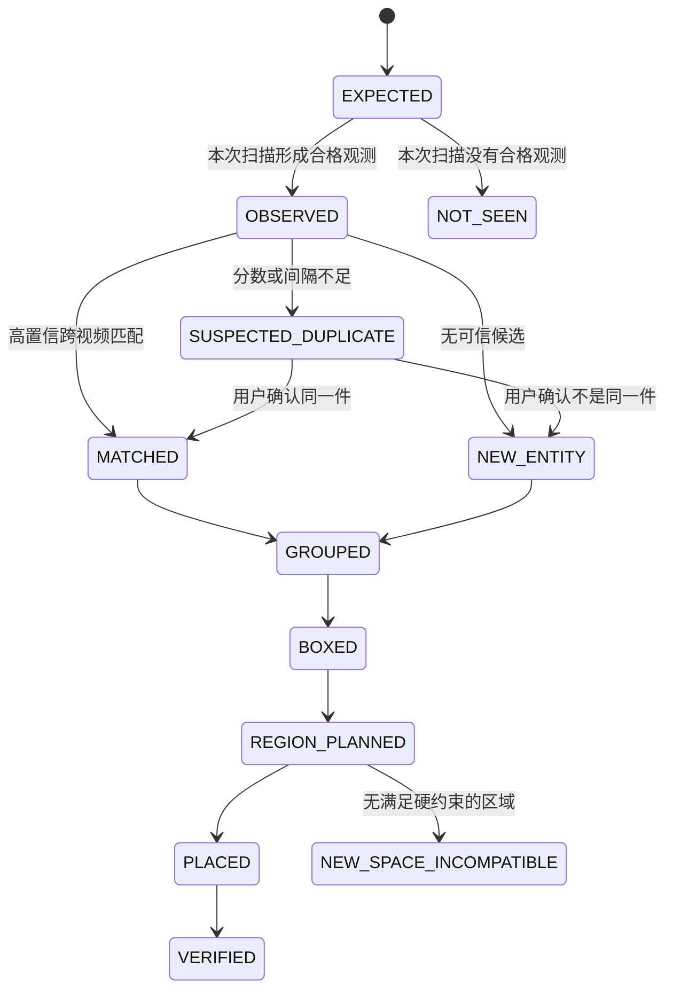
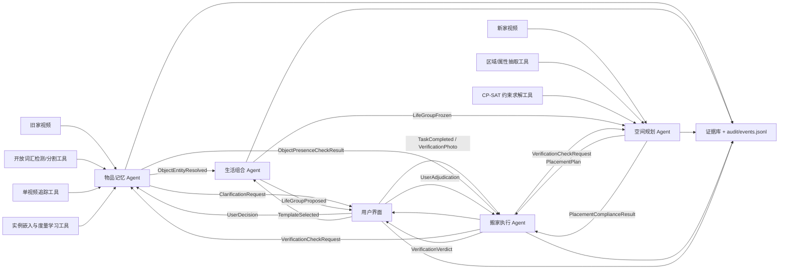

# AI 搬家复原 Agent：产品与技术设计 v0.3

> 队伍：念头通达
>
> 赛事：NVIDIA DGX Spark 黑客松（2026-07-12 ～ 2026-07-22）
>
> 文档日期：2026-07-15
>
> 当前阶段：七日冲刺范围冻结（v0.3 = 赛事评分对齐修订）
>
> 配套执行文件：[《七日落地切片与验收手册 v0.3》](./AI搬家复原Agent_七日落地切片_v0.3.md)

## v0.3 决策摘要

v0.2 替代了“尽量先做简单盘点、布局以后再说”的保守路线；v0.3 在其上完成与赛事官方六项评审标准的对齐（对齐方法沿用海事线 v0.3 的评分对齐矩阵，见 §4.4）。冻结以下裁决：

1. 七日主线必须打通**同一次搬家任务内的跨视频物体实例重识别**，不能只做逐视频检测或依赖人工合并。
2. 七日主线必须打通**面向新家区域的自动布局**，不能只生成泛化建议；“区域”是正式产品粒度，不追求厘米级坐标。
3. 用户只在跨视角匹配进入不确定区间时做一次“同一件 / 不是同一件”的二选一确认；主流程不得依赖逐件人工整理。
4. 生活组合优先自动推断；没有足够证据时提供候选模板，由用户选择，不伪装成已经理解隐性习惯。
5. 每个物体、组合和布局结论必须保留截图、物品框、时间戳、模型/配置版本和用户修改记录。
6. 产品必须显式呈现 `NOT_SEEN`（未看到）、`SUSPECTED_DUPLICATE`（疑似重复）和 `NEW_SPACE_INCOMPATIBLE`（新空间不适配）。
7. 模型指标、DGX Spark 角色、隐私边界、非技术队员分工和七日硬门槛均进入主计划，不作为最后补写材料。
8. **官方六项评审标准每一项都有明确得分载体与文档锚点**（§4.4 评分对齐矩阵）；载体分三档——必须得分载体 / 有条件增强 / 明确可舍弃——裁剪争议以矩阵按档仲裁，不允许“全部不可裁剪”式的假优先级。
9. **双生态各一个主链模型是必须档**：NVIDIA = Nemotron VL 区域属性抽取，Stepfun = Step-Audio 2 mini 拍摄语音旁白理解（能力路径 A1，时间盒约束，不阻塞主链），两者必须在最终演示中真实运行。Step-Audio-TTS-3B 播报与 Nemotron 9B 文案为有条件增强；语音理解质量不达标时以 Step-Audio 2 mini 文本输出模式生成任务卡朗读稿兜底（Stepfun 开源文本旗舰为 321B 级 MoE，128GB 统一内存不可行，不存在独立文本模型兜底）。模型依赖钉版冲突由三套隔离环境解决（§9.2）。
10. 评审的“演示效果”评的是**成品视频**而不是原始录屏：V1 交付 3～4 分钟分镜成片，核心闭环压在 90 秒内；“本地优先”的宣称必须有断网高光镜头背书。
11. 赛事征文（十日谈）按项目纪律（AGENTS.md）**每日强制更新**，D9 汇编；不是赛末补写材料。
12. 搬家执行 Agent 的 `VERIFIED` 结论必须经**验收复核消息族**闭环（§5.2）：物品记忆 Agent 出具“出现”结论、空间规划侧出具“摆放合规”结论，两者同时通过才 `VERIFIED`——**物品出现在照片里但放错位置不是 `VERIFIED`**；请求、双结果、裁决、用户裁决均为独立不可变消息（correlation/causation/producer/payload_hash），不允许由前端或人工口头判定；该往返消息链同时是“智能体融合”评分的协同证据。

---

## 1. 执行摘要

本项目定位为：

> **帮助家庭在搬家后优先恢复关键生活秩序的、本地优先、多 Agent 搬家复原系统。**

系统通过旧家多段引导视频建立“物品实体库”和“生活组合图”，识别不同视角、不同视频中出现的同一件物品；用户只处理少量不确定匹配。搬入新家后，系统从新房视频中构建床、桌面、柜体、插座附近等可用区域图，使用确定性约束求解器把生活组合自动分配到合适区域，再生成箱单、拆箱顺序、工人任务卡和最终验收清单。

产品承诺不是“把新家像素级复刻成旧家”，而是：

> **不复制旧房的形状，尽量保留用户已经形成的生活关系。**

英文定位：

> **A local-first moving restoration agent that remembers verified object relationships across videos and turns them into executable, region-level unpacking plans for the new home.**

---

## 2. 用户、场景与范围

### 2.1 目标用户

首要用户是购买搬家及拆箱服务的家庭；首要付费方假设是希望降低返工与沟通成本、并销售高端拆箱服务的搬家公司。

比赛主场景固定为：

> 一户家庭从旧卧室搬入新卧室。系统记住床头、桌面和充电区的关键物品关系，帮助搬家人员优先恢复第一晚所需的生活秩序。

### 2.2 七日 MVP 的固定规模

| 项目 | 固定范围 |
|---|---|
| 搬家任务 | 1 个旧卧室 → 1 个新卧室 |
| 旧家输入 | 同一任务内至少 3 段引导视频，包含不同视角和部分遮挡 |
| 新家输入 | 1 段引导视频或等价关键帧集合 |
| 锚点物品 | 冻结评测集 15 件；系统允许 12～20 件 |
| 生活组合 | 3 个主组合，至少覆盖床头、桌面/充电、收纳中的两类 |
| 新家区域 | 至少 5 个候选区域 |
| 布局单元 | 至少 5 个：3 个生活组合 + 至少 2 个独立锚点物品 |
| 用户确认 | 跨视频疑似重复时二选一；组合证据不足时选择候选模板 |
| 最终输出 | 物品实体库、生活组合、箱单、区域布局、任务卡、验收记录 |

### 2.3 关键定义

**跨视频物体重识别**在本项目中指：

- 同一次搬家任务内；
- 在有限时间内拍摄的旧家视频，以及可选的新家验收视频；
- 对外观相似但实例不同的家庭物品进行实体级区分；
- 把同一物品的多个观测合并为一个 `ObjectEntity`；
- 不宣称跨家庭、跨月份、任意环境的通用商品身份识别。

**自动布局**在本项目中指：

- 自动识别或生成新房候选区域；
- 根据支撑面、容量、电源、邻近关系、生活组合和使用偏好进行约束求解；
- 输出“床头右侧表面”“书桌近插座区”“衣柜下层”等区域级结果；
- 不输出厘米级位置，不生成可施工的室内设计图。

### 2.4 明确不做

- 不做全屋、全品类、隐藏物品的无漏检承诺。
- 不声称 AI 能从图像直接读懂用户全部习惯。
- 不做家具采购、装修风格生成或精确三维室内设计。
- 不做医疗、儿童照护、无障碍或居家安全保证。
- 不把贵重物品、药品或应急用品的摆放建议描述为安全结论。
- 不要求消费者购买 DGX Spark。
- 不把逐件人工确认包装成自动化。

---

## 3. 产品闭环

```mermaid
flowchart LR
    A["旧家引导拍摄"] --> B["物品观测与单视频轨迹"]
    B --> C["跨视频实体重识别"]
    C --> D{"匹配是否确定"}
    D -- "确定" --> E["物品实体库"]
    D -- "疑似重复" --> Q["用户二选一"]
    Q --> E
    E --> F["生活组合图"]
    F --> G{"组合证据是否充分"}
    G -- "充分" --> H["自动组合"]
    G -- "不足" --> T["候选模板选择"]
    T --> H
    H --> I["箱单与组合装箱"]
    I --> J["新家引导拍摄"]
    J --> K["新家区域图"]
    K --> L["约束求解式自动布局"]
    L --> M{"存在可行解"}
    M -- "是" --> N["拆箱与摆放任务卡"]
    M -- "否" --> X["新空间不适配"]
    N --> O["完成拍照与验收"]
    O --> P["可回放审计记录"]
```



### 3.1 七步用户旅程

| 步骤 | 用户动作 | 系统结果 | 用户可见证据 | 正式异常路径 |
|---|---|---|---|---|
| 1. 旧家扫描 | 按引导拍摄 3 段视频 | 关键帧、物品框、单视频轨迹 | 拍摄覆盖率与漏拍提醒 | `NOT_SEEN` |
| 2. 身份复原 | 等待自动处理 | 跨视频物品实体库 | 每个实体的多视角截图 | `SUSPECTED_DUPLICATE` |
| 3. 最小确认 | 只处理不确定项 | 冻结实体身份 | 两张截图二选一 | 用户选择被永久记录 |
| 4. 生活组合 | 查看自动组合 | 组合图及箱单 | 原场景截图、关系边和解释 | 候选模板选择 |
| 5. 新家扫描 | 按引导拍摄新卧室 | 可用区域图 | 区域截图、区域属性 | 区域缺失或不可用 |
| 6. 自动布局 | 查看求解结果 | 组合到区域的分配 | 约束、得分和替代区域 | `NEW_SPACE_INCOMPATIBLE` |
| 7. 执行验收 | 按任务卡摆放并拍照 | 完成状态与差异记录 | 旧家证据、新家完成图、修改历史 | `NOT_SEEN` 或未完成 |

### 3.2 物品和任务状态



---

## 4. 验收真值与成功标准

### 4.1 冻结数据集

七日内建立两个互不混用的搬家任务：

- **开发任务 A**：用于调阈值、训练轻量投影头、修改规则和 UI。
- **冻结任务 B**：在阈值与配置冻结后才运行，用于最终验收和演示保险。

开发任务 A 内部按完整视频划分训练视角与验证视角；冻结任务 B 的答案由数据主责封存，技术主责在首次正式运行前不得查看。任务 B 只用于预注册配置的最终评估和确定性复跑，不参与模型或阈值选择。

每个任务至少包含：

1. 三段旧家视频；
2. 十五件人工编号的锚点物品；
3. 每件锚点物品至少出现在三段视频中的两段，至少十件出现在全部三段；
4. 至少三组外观相似但实例不同的困难负样本；
5. 至少两个部分遮挡或视角变化明显的正样本；
6. 三个由用户预先确认的生活组合；
7. 一个包含至少五个候选区域的新卧室；
8. 至少五个布局单元及其人工确认的期望区域和硬约束。

连续视频帧不得随机拆到开发集和冻结集两侧。划分单位是完整搬家任务或完整房间，避免相邻帧泄漏。

### 4.2 七日硬指标

数值是比赛工程起始线，不代表通用产品质量。样本较小时必须同时报告绝对数量。

| 能力 | 七日验收线 | 说明 |
|---|---:|---|
| 旧家锚点召回 | 15 件中至少 12 件被看到并建档 | `NOT_SEEN` 必须可解释到视频覆盖证据 |
| 跨视频实体完整合并 | 15 件中至少 13 件的全部已标注观测被正确归为同一实体 | 每件至少跨 2 段视频；按实体而不是按帧计数 |
| 高置信错误合并 | 0 件 | 把两件不同物品合为一件属于最高优先级错误 |
| `Recall@1` | ≥85% | 只统计存在真匹配且裁剪质量合格的查询 |
| 用户二选一率 | ≤20%，即 15 件最多 3 件 | 主演示场景最多出现 1 次确认 |
| 用户确认后身份正确率 | 100% | 用户裁决形成永久正/负约束 |
| 生活组合接受 | 3 组中至少 2 组无需重建 | 轻微改名不算重建 |
| 自动区域建议接受 | 至少 5 个布局单元中的 4 个无需修改 | 3 个生活组合 + 至少 2 个独立物品，即 ≥80% |
| 硬约束违反 | 0 次 | 电源、支撑面、容量、禁放关系等 |
| 无可行解识别 | 预置不适配案例 100% 输出 `NEW_SPACE_INCOMPATIBLE` | 不得强行给出漂亮答案 |
| 扫描到任务卡 | ≤5 分钟 | 以最终演示分辨率与模型配置测量 |
| 自动布局求解 | P95 ≤2 秒 | 不含视觉模型处理时间 |
| 证据可追溯率 | 100% | 结论可追溯到截图、框、时间和配置 |
| 重复运行确定性 | 冻结输入连续 3 次实体与布局结果一致 | 生成式文案可不同，事实不得漂移 |
| Spark 稳定性 | 连续 30 分钟无崩溃、无 OOM | 峰值内存不得超过 80% |

### 4.3 不能用来替代成功标准的指标

- 大量相邻帧上的检测准确率；
- 只展示一张漂亮的新家渲染图；
- VLM 自评“组合合理”；
- 人工提前整理好实体 ID 后再运行；
- 只在开发任务 A 上反复调到成功；
- 没有保存输入、配置和 trace 的现场演示。

### 4.4 赛事评分对齐矩阵（v0.3 新增）

赛事官方评审标准共六项。载体分三档，发生容量、下载或兼容性问题时按档裁决，**不允许“全部不可裁剪”式的假优先级**：

- **必须得分载体**：砍掉 = 直接丢掉对应权重，与主干同级；
- **有条件增强**：有时间盒，超时按预案降级并如实记录，不算丢分；
- **明确可舍弃**：升级路径，默认不做，做了才宣称。

| 评审标准 | 权重 | 必须得分载体 | 有条件增强 | 明确可舍弃 |
|---|---:|---|---|---|
| 项目实用性、行业落地价值与技术创新性 | 25% | “第一晚生活秩序”痛点 + 用户访谈；跨视频实例重识别 + 生活组合图 + 约束求解布局的组合创新（§1–§3、§10） | 搬家公司 B2B2C 叙事细化 | — |
| 智能体融合与模型优化技术深度 | 25% | 四 Agent 协同 trace 可回放（结构化消息链：MEM→UI 二选一 + EXEC 发起的验收复核消息族，含 correlation/causation/producer/payload_hash）；SF1-L1 投影头度量学习（§5、§6.4、手册 S3/S7/SF1） | SF1-L2 TensorRT 部署对比、SF1-L3 工作点消融 | — |
| 项目完整性 | 20% | 旧家视频→实体库→组合→区域→布局→任务卡→验收→审计回放全闭环；切片验收证据体系（§3、§8、手册 S8） | 六界面全量打磨、一键重置演示 | — |
| 平台适配性 | 15% | **每生态各一个真实进入主链的模型**：NVIDIA = Nemotron VL 区域属性抽取（S5 必经产出方），Stepfun = Step-Audio 2 mini 旁白理解；Spark 单机“训练+推理”（投影头）；权重只从 ModelScope 拉取（§9、手册 SP0/A1/SF1） | TTS-3B 播报镜头、Nemotron 9B 任务卡文案 | NVFP4 量化、TAO 微调、NvDINOv2 换骨干 |
| 演示效果（Demo 视频） | 10% | 3～4 分钟成品分镜：90 秒主闭环 + 架构与双生态 trace 动画 + 断网高光 + 指标与边界收尾（§11、手册 V1） | 调优对比段、语音能力段 | — |
| 赛事征文（十日谈） | 5% | `docs/journal/DAY-XX.md` 每日强制更新（AGENTS.md 纪律），D9 汇编 `docs/十日谈_念头通达.md`（手册 E1） | — | — |

> 解读：第 2、4 两项合计 40% 的**必须档**是三个载体——协同 trace（含验收复核消息族）、SF1-L1 投影头、双生态各一个主链模型。双生态“出场”指真实进入产品主链，不是演示片尾放个 logo；但它不等于 Stepfun/NVIDIA 的每个候选模型都必须保留——TTS 与 9B 文案是增强，超时就按预案降。另需清醒：本选题在第 1 项的“行业落地价值”叙事上先天弱于 ToB 深场景，必须靠第 2、3 项的工程深度和完整性补分——访谈证据（§10.2）必须做实。口径红线：材料中“TAO”字样只允许在真的执行过 TAO 训练/部署流程后出现，社区 checkpoint 转 TensorRT 的正确口径是“TensorRT 部署”。

---

## 5. 系统架构

### 5.1 Agent 的操作性定义

本项目中，一个组件只有同时满足以下条件才称为 Agent：

1. 维护独立状态；
2. 拥有独立数据源或能力；
3. 使用版本化结构消息；
4. 可由事件或其他 Agent 请求触发；
5. 失败时可输出明确状态而不伪造结果。

检测器、追踪器、VLM、约束求解器和二维码生成器都是 Agent 的工具，不单独包装成 Agent。

### 5.2 四 Agent 主链

| Agent | 独立状态 | 主要职责 | 不拥有的权力 |
|---|---|---|---|
| 物品记忆 Agent | `ObjectEntity`、`Observation`、永久正/负匹配约束 | 视频处理、单视频轨迹、跨视频重识别、疑似重复请求 | 不推断最终生活习惯，不决定新家位置 |
| 生活组合 Agent | 物品关系图、组合候选、用户模板选择 | 从空间关系和功能属性推断生活组合与装箱组合 | 不覆盖实体身份，不声称理解不可见习惯 |
| 空间规划 Agent | 新家 `RegionGraph`、约束、求解结果 | 区域识别、兼容性判断、自动布局和不适配解释 | 不输出精确坐标，不违反硬约束迁就文案 |
| 搬家执行 Agent | 箱、任务、完成状态、验收图 | 生成箱单、优先级、任务卡、二维码和验收流程；验收照片提交后向物品记忆 Agent 请求“物品是否出现”、向空间规划 Agent 请求“摆放是否合规”，两者都通过才汇总出 `VERIFIED` | 不篡改上游实体、组合和布局事实；不自行做实例匹配或摆放判断 |

审计与证据存储是确定性基础服务，不是第五个 Agent。

Agent 协同不是单向流水线：物品记忆 Agent 向 UI 发起二选一请求（`ClarificationRequest`），搬家执行 Agent 在验收阶段发起**验收复核消息族**——一次往返包含四条独立不可变消息，各有唯一权责，共享 `correlation_id`，并携带 `causation_id`、`producer`、`payload_hash`（`backend/schemas/core.py` 为契约权威）：

1. `VerificationCheckRequest`（EXEC 发出）：任务、预期实体、**目标区域与预期关系**、验收照片；
2. `ObjectPresenceCheckResult`（MEM 返回）：只回答“物品是否出现在照片中”，逐实体带匹配分与证据——**出现 ≠ 摆对，MEM 无权判定摆放**；
3. `PlacementComplianceResult`（SPACE/确定性校验器返回）：只回答“目标区域与关系约束是否满足”；
4. `VerificationVerdict`（EXEC 汇总）：presence 与 compliance **同时通过**才 `VERIFIED`；物品出现但放错区域 = `FAILED(MISPLACED)`，匹配分低于阈值 = `NEEDS_USER`。用户裁决是第五条独立消息 `UserAdjudication`，接受错位摆放走 `USER_OVERRIDDEN` 并记录原因。

结果消息覆盖不全或 `correlation_id` 不符是协议错误，直接拒绝，不得静默降级成结论。全部跨 Agent 消息追加写入 `audit/events.jsonl`，回放时校验 `payload_hash`；**协同 trace 是“智能体融合”评分项的主要证据，必须档载体**（§4.4）。

### 5.3 组件图



### 5.4 确定性与生成式边界

- 物体检测、分割和视觉嵌入由视觉模型完成。
- VLM 可以提出物品属性、生活组合和区域属性候选，但候选必须带证据。
- 实体合并由硬门控、匹配分数、全局一致性和冻结阈值共同决定。
- 用户裁决覆盖模型，并形成不可被后续模型推翻的约束。
- 区域分配由 CP-SAT 等确定性求解器完成；LLM/VLM 不直接写最终位置。
- 任务文案可由本地语言模型润色，但物品、箱号、区域和优先级必须来自结构化事实。
- 任何生成式文本失败时，结构化任务卡仍应可渲染。

---

## 6. 核心技术设计

### 6.1 引导拍摄与关键帧

旧家每段视频采用固定引导：

1. 房间入口全景；
2. 顺时针缓慢环拍；
3. 床头、桌面和收纳区各一次近景；
4. 对相似物品进行短暂停留；
5. 结束前显示覆盖提示。

关键帧选择同时考虑：

- 清晰度；
- 视角变化；
- 检测数量变化；
- 遮挡比例；
- 与已选关键帧的视觉差异。

原始视频保留只用于当前任务；用于训练和验收的裁剪必须去除 EXIF、地址、人脸、证件和其他敏感信息。

### 6.2 单视频轨迹优先

跨视频重识别前先形成可靠的单视频 `Tracklet`：

1. 开放词汇检测器输出候选框；
2. 可用时使用实例分割去除背景；
3. 追踪器在连续帧内维持临时 ID；
4. 对模糊、过小、严重遮挡的裁剪降权；
5. 每条轨迹只保留质量最高的若干视角作为原型。

这样可以把数百帧压缩为少量稳定轨迹，避免直接在帧级做全连接匹配。

### 6.3 跨视频实体重识别

#### 6.3.1 每条轨迹的特征

每个 `Tracklet` 保存：

- 多视角实例嵌入及其质量权重；
- 类别与候选同义词；
- 颜色、材质、形状、文字/图案等属性；
- 相对尺寸等级；
- 原房间区域和邻近物体；
- 与其他轨迹同帧共现的互斥关系；
- 截图、框、时间戳和来源视频。

轨迹原型不是单张裁剪，而是最高质量视角的加权集合。匹配时取集合间最大相似度、平均相似度和最差视角一致性，降低单一视角误判。

#### 6.3.2 硬门控

满足任一条件时禁止自动合并：

- 两个轨迹在同一时刻同帧共现；
- 用户已经确认“不是同一件”；
- 类别、尺寸或材质存在高置信强冲突；
- 一个候选合并会违反同一视频内的一物一轨约束；
- 证据裁剪质量低于最低线。

#### 6.3.3 匹配分数

候选分数使用可解释的加权组合：

```text
S(a,b) = w_instance × S_instance
       + w_semantic × S_semantic
       + w_attribute × S_attribute
       + w_context × S_context
       + w_geometry × S_geometry
```

- `S_instance`：实例嵌入的多视角相似度；
- `S_semantic`：类别和同义词一致性；
- `S_attribute`：颜色、材质、纹理、文字等属性；
- `S_context`：邻近物体和生活区域关系；
- `S_geometry`：相对尺寸与形状一致性。

权重、阈值和归一化方式必须写入版本化配置，不得为演示临时改数值。

#### 6.3.4 全局关联

处理顺序：

1. 使用实例嵌入召回每条轨迹的 Top-K 候选；
2. 应用硬门控删除不可能匹配；
3. 计算综合分数；
4. 在每对视频间使用匈牙利算法或最小费用匹配形成一对一候选；
5. 使用带互斥约束的实体聚类合并跨视频结果；
6. 对全局不一致的合并撤销并进入不确定队列。

#### 6.3.5 三段式决策

| 条件 | 系统状态 | 行为 |
|---|---|---|
| 最佳分数 ≥ `T_match` 且与第二名间隔 ≥ `M_match` | `MATCHED` | 自动合并 |
| 所有候选分数 ≤ `T_new` | `NEW_ENTITY` | 自动建立新实体 |
| 其他情况 | `SUSPECTED_DUPLICATE` | 展示两组证据，让用户二选一 |

二选一界面只允许：

- “是同一件”；
- “不是同一件”。

用户结果形成永久约束并进入 trace。主流程 KPI 不是“可以人工修好”，而是二选一率不超过 20%。

### 6.4 轻量域内调优

七日内不从零训练通用重识别模型，采用：

1. 冻结视觉骨干建立基线；
2. 用开发任务 A 的多视角正样本和相似物品负样本训练轻量投影头；
3. 优先使用 supervised contrastive loss 或 triplet loss；
4. 困难负样本必须包含同色、同类别、不同实例的物品；
5. 只使用开发任务 A 的任务级验证结果选择最终模型和阈值，并在首次运行任务 B 前登记；
6. 在冻结任务 B 上按预注册顺序比较基线与调优结果，只报告结论，不再据此调参、选 epoch 或替换主模型。

这既体现 Spark 上的训练能力，也避免七天内全量微调导致主链失控。

### 6.5 生活组合图

生活组合不是自由文本，而是图结构：

```text
ObjectEntity --[NEAR / CO_USED / SAME_SURFACE / REQUIRES_POWER / STORED_WITH]--> ObjectEntity
LifeGroup --[ANCHORED_TO]--> ObjectEntity
```

候选边来自：

- 旧家同一区域和相对邻近关系；
- 多段视频中的稳定共现；
- 物品功能和使用频率候选；
- 电源、支撑面和收纳方式；
- 用户已经确认的关系。

自动组合必须至少有两类证据，例如“多视频稳定邻近 + 功能互补”。只有语义想象、没有视觉或用户证据时不得自动成组。

证据不足时提供少量模板：

- 床头睡前组合；
- 桌面工作/学习组合；
- 充电组合；
- 入口随身物品组合；
- 日常护理组合。

模板只决定候选关系，不绕过物品身份和区域约束。

### 6.6 新家区域图

系统不求完整三维重建，而是从新家视频建立可执行区域图：

```text
Room
├── Anchor: Bed
│   ├── Region: BedsideLeftSurface
│   └── Region: BedsideRightSurface
├── Anchor: Desk
│   ├── Region: DeskTopNearOutlet
│   └── Region: DeskDrawer
└── Anchor: Closet
    ├── Region: ClosetUpper
    └── Region: ClosetLower
```

每个 `Region` 至少保存：

- 支撑类型：表面、抽屉、柜层、地面、墙面；
- 粗容量：小、中、大；
- 是否靠近电源；
- 邻近锚点：床、桌、门、窗、柜；
- 可达性等级；
- 可见性/隐私等级；
- 截图、多边形或物品框证据；
- 当前占用和冲突关系。

区域图允许 VLM 提议属性，但硬约束字段必须经过规则校验。例如，未检测到插座证据时不能自动标记 `near_power=true`。

### 6.7 约束求解式自动布局

对每个生活组合 `g` 和候选区域 `r` 定义二元变量：

```text
x[g,r] = 1  表示生活组合 g 被分配到区域 r
```

#### 硬约束

- 每个必须摆放的组合恰好分配到一个区域；
- 区域支撑类型必须兼容物品；
- 区域容量不得超限；
- `requires_power` 的组合只能进入有电源证据的区域；
- 必须同放的物品不得被拆开；
- 用户禁止的区域不得使用；
- 同一区域内互斥物品不得共存。

#### 软目标

- 最大化旧家关系保留度；
- 最大化生活组合与区域功能匹配；
- 最大化与旧家锚点角色的相似度；
- 最小化拆分组合和跨区域移动；
- 优先满足使用频率和拆箱优先级；
- 在同分时优先选择证据质量更高的区域。

目标函数使用整数缩放后的权重，保证求解可复现：

```text
maximize Σ x[g,r] × (
    W_role × role_similarity
  + W_relation × relation_preservation
  + W_access × accessibility_fit
  + W_evidence × evidence_quality
  - W_split × split_penalty
)
```

求解状态映射：

| 求解器状态 | 产品状态 | 用户呈现 |
|---|---|---|
| `OPTIMAL` | `PLAN_READY` | 显示首选区域与依据 |
| `FEASIBLE` | `PLAN_READY` | 显示可行方案及未满足的软偏好 |
| `INFEASIBLE` | `NEW_SPACE_INCOMPATIBLE` | 列出冲突硬约束，不强行给方案 |
| `UNKNOWN` / 超时 | `PLANNER_ERROR` | 明确技术错误，不伪装为空间不适配 |

### 6.8 箱单、任务卡和验收

任务卡必须由结构化字段生成，至少包含：

- `task_id`；
- 生活组合名称；
- 旧家证据缩略图；
- 物品实体及数量；
- 箱号和随机二维码；
- 新家目标区域及区域证据；
- 拆箱优先级；
- 约束摘要；
- 完成勾选和验收照片。

二维码只保存随机任务 ID，不直接写入“首饰”“证件”等敏感物品名称。

最终验收由验收复核消息族（§5.2）驱动，任务状态允许三种落点：

- `VERIFIED`：`VerificationVerdict` 为 VERIFIED——即物品记忆 Agent 确认全部预期物品出现（presence）**且**空间规划侧确认目标区域与关系满足（compliance），两者缺一不可。**物品出现在照片里但放错位置不是 `VERIFIED`**，是 `FAILED(MISPLACED)`，任务停在 `PLACED` 等待重做或用户裁决；
- `NOT_SEEN`：预期物品未在验收照片中出现（MEM 的 presence 结论，不是前端判断）；
- `USER_OVERRIDDEN`：用户通过 `UserAdjudication` 接受与计划不符的摆放或主动改变建议区域，并记录原因。

---

## 7. 数据契约与审计

### 7.1 核心对象

| 对象 | 必要字段 |
|---|---|
| `Observation` | `observation_id`、`video_id`、`timestamp_ms`、`bbox`、`crop_ref`、`quality`、`model_version` |
| `Tracklet` | `tracklet_id`、`observation_ids`、`prototype_refs`、`embedding_ref`、`attributes` |
| `ObjectEntity` | `entity_id`、`tracklet_ids`、`label`、`identity_state`、`confidence`、`evidence_refs` |
| `ClarificationRequest` | `request_id`、`candidate_a`、`candidate_b`、`reason_codes`、`decision` |
| `VerificationCheckRequest` | 消息基字段（`message_id`、`correlation_id`、`causation_id`、`producer`、`payload_hash`）+ `task_id`、`expected_entity_ids`、`target_region_id`、`expected_relation_edges`、`photo_refs`；**不携带结论回写位** |
| `ObjectPresenceCheckResult` | 消息基字段 + `request_id`、`presences[{entity_id, present, match_score, evidence_refs}]`、`reason_codes`（MEM 出具，只判“出现”） |
| `PlacementComplianceResult` | 消息基字段 + `request_id`、`compliances[{entity_id, region_ok, relations_ok, violated_constraints}]`、`reason_codes`（SPACE 出具，只判“摆放”） |
| `VerificationVerdict` | 消息基字段 + `request_id`、`presence_result_id`、`compliance_result_id`、`verdict(VERIFIED/FAILED/NEEDS_USER)`、`reason_codes`（EXEC 汇总） |
| `UserAdjudication` | 消息基字段 + `verdict_id`、`decision(accept_override/reject_redo)`、`note`（用户裁决，独立不可变） |
| `LifeGroup` | `group_id`、`entity_ids`、`relation_edges`、`source`、`evidence_refs` |
| `Region` | `region_id`、`anchor`、`support_type`、`capacity_class`、`attributes`、`evidence_refs` |
| `PlacementPlan` | `plan_id`、`assignments`、`hard_constraints`、`soft_scores`、`solver_status` |
| `MoveTask` | `task_id`、`box_id`、`group_id`、`region_id`、`priority`、`status` |
| `AuditEvent` | `event_id`、`event_type`、`actor`、`input_refs`、`output_refs`、`config_version`、`created_at` |

所有结构必须带 `schema_version`。任何阈值或模型变化必须生成新的配置版本，不能覆盖旧结果。

### 7.2 示例：实体匹配结果

```json
{
  "schema_version": "1.0",
  "entity_id": "obj_bedside_lamp_01",
  "identity_state": "MATCHED",
  "tracklet_ids": ["v1_t08", "v2_t11", "v3_t04"],
  "confidence": 0.91,
  "decision": {
    "mode": "automatic",
    "best_score": 0.91,
    "second_best_score": 0.63,
    "threshold_version": "reid-v3"
  },
  "evidence_refs": [
    "evidence/v1_t08_001.jpg",
    "evidence/v2_t11_003.jpg",
    "evidence/v3_t04_002.jpg"
  ]
}
```

### 7.3 审计事件

所有跨 Agent 消息、自动裁决和用户操作追加写入：

```text
results/jobs/<job_id>/audit/events.jsonl
```

禁止覆盖旧事件。实体、组合和布局的当前状态由事件重放得到，或由带版本的快照加事件尾部恢复。

每个最终结论都必须回答：

1. 使用了哪些视频和时间段？
2. 对应哪些截图和物品框？
3. 使用了哪个模型和配置版本？
4. 是否经过用户修改？
5. 修改前后分别是什么？
6. 为什么没有选择第二候选？

---

## 8. 界面信息架构

七日 MVP 只做六个核心界面：

| 界面 | 首要任务 | 必须出现的信息 |
|---|---|---|
| 1. 搬家任务首页 | 查看阶段和下一步 | 扫描、确认、规划、执行、验收进度 |
| 2. 旧家扫描结果 | 检查覆盖和实体 | 物品多视角证据、`NOT_SEEN`、处理进度 |
| 3. 疑似重复队列 | 快速二选一 | 两组截图、原因码、“同一件 / 不是同一件” |
| 4. 生活组合与箱单 | 查看组合关系 | 组合证据、模板来源、箱号、优先级 |
| 5. 新家区域布局 | 查看自动分配 | 区域卡、约束、替代区域、`NEW_SPACE_INCOMPATIBLE` |
| 6. 工人任务与验收 | 执行和留痕 | 每张任务卡、二维码、完成图、修改历史 |

错误状态必须直接说人话：

- `NOT_SEEN`：**“这件物品没有在本次视频中被清楚看到，请检查是否漏拍或被遮挡。”**
- `SUSPECTED_DUPLICATE`：**“这两组画面可能是同一件物品，请确认。”**
- `NEW_SPACE_INCOMPATIBLE`：**“新房暂时没有同时满足这些条件的区域：靠近电源、可放置在表面、容纳整个组合。”**

界面不得只显示一个不可解释的百分比。

---

## 9. DGX Spark 与模型策略

### 9.1 Spark 的真实角色

比赛架构中，Spark 承担：

- 多段视频的批量关键帧、检测、分割和嵌入计算；
- 轻量度量学习投影头训练；
- VLM 的物品/区域属性候选抽取；
- TensorRT 推理优化与基线对比；
- Step-Audio 系列的语音旁白理解与条件 TTS 播报（能力路径 A1）；
- 本地离线处理和完整审计数据生成。

商业叙事中，Spark 类设备位于搬家公司门店或本地服务节点，而不是要求每个家庭购买。

### 9.2 模型能力栈

具体模型 ID 在 `SP0` 后冻结；权重必须按项目纪律只在 Spark 上从 ModelScope 拉取。

| 能力 | 首选路径 | 七日训练/优化 |
|---|---|---|
| 开放词汇检测 | Grounding DINO（社区 checkpoint）；SF1-L2 走 ONNX→TensorRT **部署**（口径不称 TAO；TAO 微调是明确可舍弃的升级路径，做了才宣称） | 冻结词表和阈值，必要时只微调检测头 |
| 实例分割 | 与检测框配套的轻量分割 | 只用于改善裁剪，不让分割阻塞主链 |
| 实例嵌入 | DINOv2 冻结骨干 + 投影头度量学习（SF1-L1，Spark 单机训练）；NvDINOv2 为可舍弃的换骨干路径 | 冻结骨干，训练小型投影头或末层 |
| 单视频追踪 | ByteTrack/等价确定性追踪器 | 不训练，调关联阈值 |
| 属性与区域抽取 | **Nemotron-Nano-12B-v2-VL（NVIDIA 生态主链载体）**：探针通过后为 S5 区域/物品属性候选的必经产出方；探针未过前的规则+检测类别兜底是降级路径，须 P1 上报且演示口径不得称 VLM 在场 | 结构化输出；不逐帧调用 |
| 自动布局 | OR-Tools CP-SAT | 冻结约束和整数权重 |
| 语音旁白理解 | Stepfun Step-Audio 2 mini（能力路径 A1：拍摄旁白→物品语义标签候选，候选证据不改写实体身份） | 不训练；SP0 探针 + A1 时间盒，与主链解耦 |
| 任务卡语音播报 | Stepfun Step-Audio-TTS-3B（条件路径：SP0 30 分钟时间盒探针 `PASS` 才纳入演示） | 不训练 |
| 任务文案 | 结构模板为主，本地语言模型可润色（语音两级质量不达标时，Step-Audio 2 mini 文本输出模式生成任务卡朗读稿，为双生态出场兜底载体） | 不得修改事实字段 |

口径红线：把社区 checkpoint 转成 TensorRT engine 的正确说法是“TensorRT 部署”，**不是“TAO 路线”**——“TAO”字样只允许在真的执行过 TAO 训练/部署流程后出现在任何材料里（TAO 官方流程覆盖 Grounding DINO 微调→ONNX→TensorRT，作为明确可舍弃的升级路径记录在案）。NVIDIA 生态的主链出场载体是 Nemotron VL 属性抽取，不靠 TAO 字样撑场面。模型依赖钉版冲突（Step-Audio `transformers==4.49.0` vs Nemotron VL `>4.53,<4.54`）由三套隔离环境解决（`scripts/spark_bootstrap.sh env`，`configs/env_*.txt`）。Step-Audio 2 mini 与 Step-Audio-TTS-3B 在 ModelScope 开源、有 Spark/aarch64 可行性证据（海事线已核实），实际可用性以 SP0 实测为准。

**双生态出场是评分硬载体**（§4.4）：NVIDIA 与 Stepfun 各至少一个模型必须在最终演示中真实运行；型号、版本与生态归属（`ecosystem: nvidia / stepfun / deterministic`）写入 `configs/models.yaml`，SP0 实测后冻结。降级只允许在同生态内就近换型号或沿 A1 降级阶梯（旁白理解 → TTS 播报 → Step-Audio 2 mini 文本输出）下移，不允许移出生态。注意阶梯的适用边界：第三级覆盖的是“模型能加载但语音理解/合成质量不达标”；若两个音频模型在 Spark 上连加载都失败，按 SP0 纪律在 Stepfun 生态内就近换型号并按 P1 上报，不得静默放弃双生态载体。

### 9.3 平台纪律

- 本会话首次使用 Spark 前运行 `./scripts/spark_healthcheck.sh`；只有 `✅ SPARK CLEAN` 才继续。
- 每次加载模型前运行 `ssh spark 'free -h'` 并报告内存。
- 代码只在本地编辑，通过 `scripts/deploy.sh` 部署。
- 权重只在 Spark 上从 ModelScope 拉取，禁止通过 SSH/rsync 传大文件。
- 超过一分钟的任务必须 `nohup` 后台运行并写日志。
- 服务只绑定 loopback 或启用认证。
- 远端只保留可随时丢弃的运行副本；小型指标和结果及时拉回。

### 9.4 隐私与安全

家庭视频会暴露户型、门锁、证件、照片、贵重物品和日常习惯，属于高敏感输入。

比赛期间执行：

- 只使用队员摆拍或明确授权的房间；
- 上传前去除 EXIF、地址、定位、人脸、证件和门锁信息；
- 不在远程 Spark 存放真实家庭隐私数据、凭据或 `.env`；
- Spark 只处理脱敏夹具，原始私人视频留在受控本地；
- 任务二维码使用随机 ID；
- 验收产物只保留必要裁剪，不提交完整家庭视频到 Git；
- 产品界面提供任务结束后删除原始素材的明确动作。

---

## 10. 商业闭环与团队验证

### 10.1 初始商业路径

```text
消费者购买“生活复原拆箱服务”
        ↓
搬家公司引导旧家扫描并生成任务
        ↓
拆箱团队按组合和区域执行
        ↓
消费者验收，搬家公司减少沟通与返工
```

搬家公司可能获得的价值：

- 高端拆箱服务溢价；
- 降低“东西都在但摆错了”的返工；
- 降低交接依赖某位资深员工；
- 任务进度、证据和责任边界可追踪。

这些是待验证假设，不能在没有访谈和实验时写成已经实现的商业成果。

### 10.2 七日内的非技术验证

由非技术队员主责：

- 访谈至少 3 个近期搬家家庭；
- 访谈至少 1 位搬家工人、整理师或相关从业者；
- 为开发任务 A 和冻结任务 B 建立人工真值；
- 检查任务卡能否在 10 秒内看懂；
- 记录用户不愿拍摄的区域和物品；
- 冻结最终故事和演示旁白；
- 对每个生活组合给出“接受 / 修改 / 拒绝”结果。

技术队员不能代替用户给模型的组合打满分。

---

## 11. 演示视频设计（成品 3～4 分钟，核心闭环 ≤90 秒）

评审的“演示效果 10%”评的是**成品视频**（流畅、清晰、逻辑严谨、直观呈现核心价值），不是原始录屏。成片分镜如下，90 秒主闭环是中心段落：

| 段落 | 时长 | 内容 |
|---|---:|---|
| 90 秒主闭环 | ~90 s | 下方主闭环分镜表（含问题冷开场） |
| 架构与双生态 | ~25 s | 四 Agent 架构图 + 一条真实协同 trace 动画（消息链：记忆→二选一→组合→规划→执行→验收复核消息族）；模型清单动画（NVIDIA：Nemotron VL + TensorRT 部署；Stepfun：Step-Audio 系列）；“单机训练 + 推理” |
| 断网高光 | ~10 s | Spark 出站封锁特写 + 全链继续运行（“本地优先”背书） |
| 调优对比 | ~20 s | SF1 三层证据：投影头前后 `Recall@1`/误合并对比（L1）、TensorRT 延迟条（L2）、工作点曲线一瞥（L3） |
| 语音能力段（条件） | ~10 s | A1：拍摄旁白→物品语义标签；或 TTS 播报一张任务卡（探针 `PASS` 才纳入，否则以任务卡特写替代） |
| 指标与边界收尾 | ~15 s | 真实延迟/内存指标上屏；“区域级建议、人工可覆盖、不做安全结论”边界声明 |

主闭环 90 秒分镜：

| 时间 | 画面 | 要证明的事情 |
|---:|---|---|
| 0–10 秒 | 旧家与新家对照，第一晚找不到熟悉物品 | 情感问题真实且易懂 |
| 10–25 秒 | 三段旧家视频中的同一盏灯/水杯被合成一个实体 | 跨视频实例重识别 |
| 25–35 秒 | 一组相似物品进入“疑似重复”，用户二选一 | 不确定性诚实且交互极轻 |
| 35–48 秒 | 系统形成床头生活组合和箱单 | 从识别走向生活关系 |
| 48–63 秒 | 新家区域图出现，CP-SAT 自动选择床头右侧和桌面近插座区 | 自动布局不是生成文案 |
| 63–77 秒 | 工人任务卡、箱号和二维码 | 输出可执行 |
| 77–85 秒 | 完成照片、`VERIFIED` 与完整证据链 | 闭环和可追溯 |
| 85–90 秒 | Spark 本地处理、调优前后指标和离线标识 | NVIDIA 平台价值 |

演示必须同时保留：

- 一个成功自动匹配；
- 一个二选一不确定案例；
- 一个自动区域布局；
- 一个显式失败状态的快速镜头；
- 一条从原视频到任务完成的 trace（含验收复核反向请求的协同动画）；
- 断网状态下继续运行的镜头；
- NVIDIA 与 Stepfun 双生态模型真实出场的画面；
- SF1 调优前后对比镜头。

制作纪律：现场程序必须可运行，预录素材只作剪辑用；画面上的每个指标都有对应 `metrics.json`；不用剪辑掩盖人工修改；D6 冻结分镜，Day 7 只录制和剪辑（详见手册 V1）。

---

## 12. 对外表达边界

推荐说法：

> **搬家最难的不只是把东西运过去，而是把熟悉的生活重新拼起来。我们的本地 AI 在同一次搬家任务中识别跨视频的同一件物品，建立经用户确认的生活组合，再把它们自动分配到新家合适的区域，生成搬家人员可以直接执行的任务。**

禁止说法：

- “AI 完全理解了这个家庭的生活习惯。”
- “任何房间、任何物品都能准确复原。”
- “自动生成最佳且唯一正确的新家布局。”
- “能够保证老人、儿童或药品摆放安全。”
- “市场上没有类似产品或基础能力。”

---

## 13. 参考能力与实现依据

- [NVIDIA TAO：Grounding DINO](https://docs.nvidia.com/tao/tao-toolkit/latest/text/cv_finetuning/pytorch/object_detection/grounding_dino.html)
- [NVIDIA TAO Toolkit Overview](https://docs.nvidia.com/tao/tao-toolkit/latest/text/overview.html)
- [Google OR-Tools：CP-SAT Solver](https://developers.google.com/optimization/cp/cp_solver)
- [Yembo：AI moving surveys and inventory](https://yembo.ai/)
- [Polycam：on-device floor plans](https://poly.cam/floor-plans)
- Stepfun Step-Audio 2 mini / Step-Audio-TTS-3B：ModelScope 开源（Spark/aarch64 可行性证据沿用海事线核实结论，实际可用性以 SP0 实测为准）

这些链接只证明相邻能力和工具链存在，不证明本项目的跨视频实体闭环或生活复原效果已经完成；最终结论只以冻结任务 B 的本地验收结果为准。
