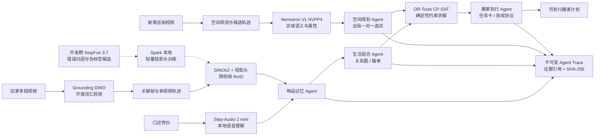

# AI 搬家复原 Agent

## 从像素、声音到可执行任务卡：把旧家的生活关系迁移到新家

> 队伍：念头通达
>
> 技术介绍稿｜NVIDIA DGX Spark 黑客松
>
> 本稿聚焦选题的技术定义、系统架构、实现路径与已验证结果；项目故事、完整产品简介及演示视频由其他材料承接。

## 参赛技术摘要

我们选择的不是“看图盘点家具”，而是一个更难也更真实的问题：**怎样让 AI 在多段视频之间记住同一件物品，理解物品之间的生活关系，再把这些关系迁移为新家的可执行布局。**

系统以 DGX Spark 为本地 AI 中枢，使用 Grounding DINO 与 DINOv2 建立跨视频物品记忆，以 Step-Audio 2 mini 理解拍摄旁白，以 NVIDIA Nemotron-Nano-12B-v2-VL-NVFP4-QAD 理解新家区域，再由 OR-Tools CP-SAT 在容量、支撑类型、同放、互斥等硬约束下生成布局和任务卡。四个 Agent 通过带因果引用与 SHA-256 载荷哈希的不可变消息协作；生成式模型只提出候选，确定性门控、独立评分器和用户裁决负责最终收口。

在冻结英雄场景中，系统把 **3306 个原始 ReID 实体候选收敛为 20 件可信物品**，将模型疑问压缩为最多 **4 个高价值确认**；从新家视频的 **2278 条空间观测**中形成 **168 个候选区域**，自动选出 **5 个最终区域**，独立评分 **5/5**；最终生成 **5 个搬运箱和 5 张任务卡，覆盖 20/20 件物品**。整个演示运行时保持 Spark 本地执行、零云依赖，所有结论均可回放、可追溯、可复核。

## 1. 选题：搬家不是物体运输，而是一次“生活状态迁移”

传统搬家解决的是“东西有没有运到”，但用户真正失去的往往是已经形成的生活秩序：书和文具原本在同一个学习区，杯子和饮品总是一起使用，护理用品应该在洗漱区域被优先恢复。现有视觉模型擅长回答“这一帧里有什么”，却很少继续回答下面四个问题：

1. 三段视频里的这几个物体，究竟是不是同一件？
2. 哪些物品构成稳定的生活组合，而不只是一个扁平清单？
3. 新家有哪些真实可用的区域，哪些区域满足容量、支撑和关系约束？
4. 模型的结论如何变成搬家人员能执行、用户能复核的任务？

因此，项目把“搬家复原”重新定义为一条可计算链路：

```text
跨视频实例身份
    → 可信物品记忆
    → 生活关系图
    → 新家区域图
    → 约束求解布局
    → 箱单与任务卡
    → 可回放的执行证据
```

项目不追求把旧房的像素复制到新房，而是保留更有价值的东西：**物品身份、共同使用关系、摆放意图和每个结论背后的证据。**

## 2. 总体架构：让模型看见可能性，让系统决定相信什么



这套架构最重要的原则是：

> **生成式模型负责扩大候选空间，确定性系统负责收口；用户裁决拥有最高优先级，任何模型不得覆写。**

Nemotron 可以提出“这里可能是书桌或柜面”，Step-Audio 可以提出“旁白中的杯子可能属于饮品组合”，StepFun 调优代理可以提出“这组碎片可能来自同一实例”；但最终身份合并、区域选择、布局分配与验收状态，都必须通过硬门控、冻结阈值、独立评分或用户确认。系统拒绝让一个大模型同时“出题、作答、判卷”。

## 3. 四 Agent 协同：不是把流水线换成四个名字

项目只把同时具备独立状态、独立职责、版本化消息和明确失败状态的组件称为 Agent。检测器、VLM、求解器都是 Agent 的工具，而不是为了数量包装成 Agent。

| Agent | 独立状态与职责 | 明确不能做的事 |
|---|---|---|
| 物品记忆 Agent（MEM） | 管理观测、轨迹、跨视频实体、正负匹配约束和疑似重复请求 | 不推断最终生活习惯，不决定新家位置 |
| 生活组合 Agent（GROUP） | 将可信物品组织为生活关系图、组合和箱单 | 不覆盖实体身份，不把语义想象冒充用户习惯 |
| 空间规划 Agent（SPACE） | 构建新家区域图、执行全局选区并提供布局约束 | 不输出无证据的精确尺寸，不为文案绕过硬约束 |
| 搬家执行 Agent（EXEC） | 把布局生成任务卡，并协调完成后的双路验收 | 不自行判断物品身份或摆放合规性 |

Agent 之间只交换不可变结构消息。每条消息包含 `message_id`、`correlation_id`、`causation_id`、`producer` 和 `payload_hash`；回放时重新计算 SHA-256，任何篡改、断链、角色越权或结果缺失都会失败关闭。

验收协议还实现了真正的反向协同：EXEC 同时向 MEM 请求“物品是否出现”，向 SPACE 请求“是否位于目标区域并满足关系”，随后进行确定性 fan-in。只有 presence 与 compliance 同时通过，任务才可能成为 `VERIFIED`。这两个分支已拆到独立进程与独立 trace fragment 中，不是同一函数换两个角色名。

## 4. 实现路径：从视频噪声一路编译到搬家动作

### 4.1 多模态输入：视频负责“看见”，旁白负责补充意图

旧家输入由三段不同视角的视频和一段口述旁白组成，新家输入是一段空房巡拍视频。

- OpenCV 完成视频接入、关键帧采样、时间戳映射和证据裁剪；每个观测都保留来源视频、帧号、边界框、模型版本与质量分。
- Grounding DINO 以开放词汇方式召回物品。词表被当作“召回网”而不是分类标签，易混概念分批扫描，避免长词表之间相互抑制。
- Step-Audio 2 mini 在 Spark 本地将旁白切为 30 个语音段并生成零样本转写草稿，经听校合并为 25 条结构化事实。语音只提供名称、归属和组合意图候选，不直接修改物品身份。

### 4.2 跨视频物品记忆：从帧级检测到实例级身份

直接比较每一帧会造成平方级噪声，因此系统先把连续观测压缩为单视频 `Tracklet`，再进行跨视频 ReID：

1. 用质量门过滤过小、模糊、严重遮挡的裁剪，并为每条轨迹保留多个高质量视角；
2. 使用冻结 DINOv2 骨干提取实例嵌入，再接入 Spark 本地训练的轻量投影头；
3. 综合实例相似度、语义、属性和相对几何形成可解释分数；
4. 先应用同帧共现、类别冲突、用户负约束等硬门，再用确定性 Hungarian 一对一分配和带互斥约束的跨视频聚合；
5. 高置信结果自动合并，低分结果建立新实体，中间不确定带只生成二选一请求。

正式英雄链中的原始 ReID 仍有长尾碎片，因此下游不直接消费 3306 个原始实体。可信投影门只依据数据所有者确认的轨迹证据生成 20 件稳定物品，并把 677 条底层疑问压缩为最多 4 个真正影响任务的确认问题。**不确定性没有被藏起来，而是被隔离、压缩并显式交给正确的人。**

### 4.3 AutoTune-v1：云端模型做教练，Spark 做训练场，冻结真值只做裁判

为避免“调参靠感觉”，项目构建了一条开发期自动调优回路：

```text
StepFun 3.7 错误归因
    → 446 对不确定难样本判断
    → 117 个伪身份 / 511 个训练样本
    → DGX Spark 本地训练投影头
    → 18 组工作点代理扫描
    → 冻结人工 GT 中检与终检
```

StepFun 3.7 只接收脱敏物品裁剪和模型自己的分组，不接收家庭原视频，也不接收人工身份真值。它负责指出“纯嵌入漂移、局部特写碎裂、低质量 crop”等错误类型，并为不确定带提供伪标签候选；训练、工作点搜索和最终推理全部在 Spark 本地完成。冻结人工 GT 不参与训练、不送云、不进入内循环，只在预先限定的两次判卷中使用。

最终，域内投影头将 Recall@1 从 **0.8031 提升到 0.8083**，完整合并保持 **14/20**，高置信误合并保持 **0**；更重要的是，调优后的嵌入空间允许在不增加高置信误合并的前提下把原始澄清从 **1379 降到 677（-51%）**。它没有制造“奇迹数字”，却把错误在哪里、为什么错、下一步该优化什么变成了可复现证据。

### 4.4 新家空间理解：从 2278 条观测到 5 个可用区域

新家侧不做昂贵且脆弱的厘米级三维重建，而是构建面向搬家动作的区域图。每个区域包含支撑类型、相对容量、邻近锚点、电源证据状态和可追溯画面。

1. 新家视频首先产生 2278 条空间观测，并整理为 168 个候选轨迹；
2. 每条轨迹最多选取 3 个独立目标视角，交给 Spark 本地 Nemotron VL 提取区域语义与属性；
3. 低信息候选直接隔离，语义票与检测器持续支撑分别计分，避免“看得久”冒充“看得准”；
4. 全局一对一分配保证书桌、梳妆台面、墙架、抽屉柜面和展示柜来自互不重复的物理实例；
5. 生产器只读取产品侧 anchor contract，独立评分器只读取另一份语义真值，两者通过文件与字段边界隔离。

最终 168 个候选自动收敛为 5 个区域，`needs_user=0`；独立评分得到 **5/5 精确语义匹配、0 多余区域、0 支撑类型错误、0 容量错误**。未知电源状态保持 `UNKNOWN` 并按失败安全方式处理，不会被生成式文本补成“靠近插座”。

### 4.5 确定性布局：VLM 不直接决定东西放在哪里

生活组合 Agent 将 20 件可信物品组织为 3 个生活组合和 2 个独立收纳单元；空间规划 Agent 提供 5 个可用区域。二者在 OR-Tools CP-SAT 中汇合：

- 硬约束：支撑类型、相对容量、电源证据、同放、互斥、用户禁放；
- 软目标：生活关系保留度、区域功能匹配、可达性和证据质量；
- 可复现性：整数权重、固定随机种子、单 worker 求解；
- 失败语义：不可行时输出 `NEW_SPACE_INCOMPATIBLE` 和具体冲突，绝不强行生成一个“看起来合理”的答案。

冻结英雄场景得到 `PLAN_READY`，生成 5 个搬运箱和 5 张结构化任务卡，覆盖 20/20 件物品。每张卡都明确箱单、目标区域、物品、约束摘要和验收项；即使语言模型不可用，事实字段和任务卡仍然可以确定性渲染。

## 5. 技术栈

| 层级 | 技术与模型 | 在系统中的真实职责 |
|---|---|---|
| 计算平台 | NVIDIA DGX Spark、GB10 Blackwell、128GB 统一内存、aarch64 | 唯一 GPU 执行场；承担视觉推理、VLM 服务、语音理解与投影头训练 |
| 视觉接入 | Python、OpenCV、NumPy | 视频解码、关键帧、质量评估、裁剪、观测与时间戳映射 |
| 开放词汇感知 | Grounding DINO | 旧家物品与新家锚点的开放词汇候选召回 |
| 实例记忆 | DINOv2、轻量投影头、确定性 Hungarian、跨视频聚合 | 多视角嵌入、实例匹配、硬门控与不确定性分流 |
| 视觉语言模型 | NVIDIA Nemotron-Nano-12B-v2-VL-NVFP4-QAD、vLLM、Docker | 新家区域语义与属性提取；OpenAI 兼容接口仅绑定 `127.0.0.1` |
| 语音理解 | Stepfun Step-Audio 2 mini、PyTorch、Transformers 隔离环境 | 本地旁白转写与语义候选，不直接改写事实字段 |
| 开发期调优代理 | StepFun 3.7 Flash | 脱敏 crop 错误归因、难样本判断和伪标签候选；不进入演示运行时 |
| 规划与决策 | OR-Tools CP-SAT | 在硬约束下生成可复现布局与替代区域 |
| Agent 与数据契约 | Pydantic v2、JSON/JSONL、YAML、SHA-256 | 版本化 schema、不可变事件、配置冻结、内容寻址和 trace 回放 |
| 编排与交付 | Python CLI、阶段状态文件、静态成果页、内容寻址 bundle | 断点续跑、阶段新鲜度检查、结果汇总与证据交付 |
| 验证 | pytest、独立 scorer、预注册验收门 | 单元/协议/全链回归，生产器与评分器职责隔离 |

## 6. DGX Spark 深度适配：不是“能跑”，而是把平台能力压进主链

Nemotron 的 BF16/Transformers 路线在真实图文 crop 工况下只有 **1.7 tok/s**，单次 128-token 属性抽取约需 75 秒，无法支撑百次级批量任务。项目将模型切换到官方 NVFP4-QAD 权重与 NVIDIA vLLM 容器，在 GB10 Blackwell 原生 FP4 路径上完成部署：

- 图文吞吐从 **1.7 tok/s 提升到 25.4 tok/s，约 15 倍**；
- 单次 128-token 属性抽取从约 **75 秒缩短到约 5 秒**；
- 单 tile 将视觉前缀从 1280 token 降到 256 token，KV Cache 足迹缩小约 4.4 倍；
- BF16 路线保留为已验证 fallback，任务卡事实链不依赖生成式文案；
- vLLM 服务只绑定 loopback，演示运行时无需公网和云端 API。

工程架构同时针对跨境网络和统一内存 OOM 做了失败设计：本地 Mac 是控制面，Spark 是可替换执行面；代码单向部署，长任务后台运行，结果按小型证据包拉回；模型加载前检查内存，模型权重只在 Spark 上从 ModelScope 获取，演示运行时与交付 bundle 不依赖云端凭据。远程节点可以断线，但任务、日志和证据链不能随之消失。

## 7. 已验证结果

| 技术环节 | 冻结英雄场景结果 | 这项结果证明什么 |
|---|---:|---|
| 语音理解 | 30 个语音段 → 25 条听校事实 | Step-Audio 已在 Spark 本地进入真实输入链 |
| 可信库存 | 3306 个原始 ReID 实体 → 20 件可信物品 | 下游不会直接消费模型噪声 |
| 人机协同 | 677 条底层疑问 → 最多 4 个高价值确认 | 用户只处理真正影响任务的歧义 |
| 生活组合 | 3 个生活组合 + 2 个独立收纳单元 | 5 个搬运箱覆盖 20/20 件物品 |
| 自动空间 | 2278 条观测 → 168 个候选 → 5 个区域 | 生产门 PASS，0 个区域需要人工填写 |
| 独立空间评分 | 5/5，额外预测 0 | 生产器没有自己给自己判分 |
| 约束布局 | `PLAN_READY`，5 个布局单元 | 生成式候选已被编译为确定性可执行方案 |
| 任务交付 | 5 张任务卡，覆盖 20/20 | 识别结果真正变成搬家动作 |
| Agent 协同 | MEM → GROUP → SPACE → EXEC，trace replay `PASS` | 四角色交接、因果链与载荷哈希均可复核 |
| 证据封装 | 44 个阶段产物进入内容寻址 bundle | 输入、配置、输出和展示入口形成同一交付边界 |
| Nemotron 推理 | 1.7 → 25.4 tok/s | NVFP4 + vLLM 图文主路约 15× 加速 |
| AutoTune-v1 | R@1 0.8031 → 0.8083；高置信误合并 0；澄清 -51% | 云端教练 + Spark 训练 + 独立裁判的闭环真实有效 |

## 8. 技术创新点

### 8.1 从“识别物品”升级为“迁移生活关系”

系统处理的最小单元不是类别标签，而是带多视角证据的物品实体、实体之间的生活关系，以及关系在新空间中的可行落点。它把多模态感知、图结构记忆和约束规划连成了一个完整问题。

### 8.2 模型—符号混合，而不是让大模型包办一切

Grounding DINO、DINOv2、Step-Audio 与 Nemotron 负责感知和候选生成；Hungarian、硬门控、CP-SAT、Pydantic 契约和独立 scorer 负责一致性与最终决策。每个模块只做自己擅长的部分，错误可以定位，结论可以重放。

### 8.3 可验证的多 Agent，而不是不可解释的聊天群

四个 Agent 拥有明确权责，消息带生产者、因果引用与内容哈希。验收采用 MEM/SPACE 双路独立判断和 EXEC 汇总，协议错误直接失败关闭。协作过程本身就是可提交、可复核的技术产物。

### 8.4 自主调优与独立判卷解耦

StepFun 3.7 可以分析错误、提出伪标签和搜索方向，却不能接触冻结人工真值，也不能给自己的结果打分。训练在 Spark 本地完成，GT 只在预算固定的中检与终检出现。这让“自主调优”仍然具备科研式可重复性。

### 8.5 本地优先不是口号，而是运行时边界

最终演示主链不调用云端：视频、语音、视觉语言推理、轻量训练、约束求解和审计均在 DGX Spark 上完成。云端模型只在开发期作为受限教练使用，家庭原视频和人工身份真值不进入该回路。

## 9. 诚实边界

当前成果证明的是一个**比赛级、可复现、可审计的受控搬家规划闭环**，而不是“任何家庭、任何房间都能零确认完成”。以下边界在对外材料中应继续保留：

- 原始 ReID 终检为完整合并 14/20、Recall@1 0.8083，未达到预注册的 16/20 与 0.90；因此英雄主链使用经过确认的可信投影，不把长尾碎片伪装成已经解决。
- 新家规划采用相对容量和区域关系，不输出厘米级尺寸、承重或通行安全结论。
- 儿童触及、湿区用电和通道绊倒等风险规则保留为研发能力，但当前证据不足，不进入正式比赛展示，也不构成安全认证。
- 搬后照片的 MEM/SPACE 双路验收协议已经实现；正式英雄场景尚未采集真实摆放照片，因此不宣称物理复原已经完成验收。
- AutoTune-v1 的提升只代表当前受控域内结果，不外推为跨家庭泛化能力。

这些限制不是项目的“免责声明尾巴”，而是系统设计的一部分：**不知道时保持未知，证据不足时请求确认，约束冲突时明确拒绝。**

## 10. 给评委的一句话

> **这不是一个会描述房间的多模态模型，而是一台把视觉证据编译成搬家动作、把模型不确定性压缩成少量人类决策、并且能解释每一次结论的本地 AI 中枢。**

---

## 附：内部证据索引（整合公开材料时可删除）

- 正式成果入口：`results/hero/s1-auto-final-v1/index.html`
- 正式主链配置：`configs/hero_pipeline_s1_final.yaml`
- 可信库存指标：`results/hero/s1-auto-final-v1/inventory/metrics.json`
- 生活组合指标：`results/hero/s1-auto-final-v1/group/metrics.json`
- 自动空间指标：`results/hero/s1-auto-final-v1/spatial/metrics.json`
- 独立空间评分：`results/hero/s1-auto-final-v1/spatial_score/metrics.json`
- 布局结果：`results/hero/s1-auto-final-v1/layout/plan.json`
- Agent 回放：`results/hero/s1-auto-final-v1/audit/replay-report.json`
- AutoTune 判卷台账：`results/autotune/GT_USAGE.md`
- Nemotron 实测：`docs/NEMOTRON_SPARK_SERVING.md`
- Step-Audio 本地誊写：`results/hero_s1/a1_transcribe/manifest.json`
