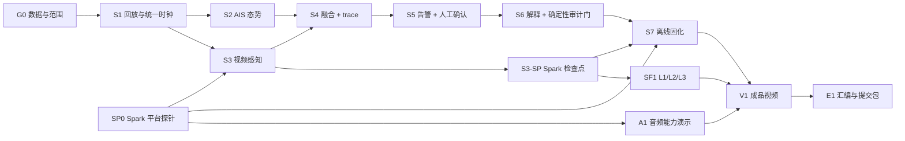

# 海事离线 AI 中枢：D2–D9 开发执行计划

> 计划区间：2026-07-14 至 2026-07-21（D2–D9）
>
> D10：2026-07-22，仅保留最终复验、日志收口与提交
>
> 正式范围基线：[《项目定义与验证计划 v0.4》](./海事离线AI中枢_项目定义与验证计划_v0.4.md)
>
> 正式交付控制文件：[《实施切片与验收手册 v0.4》](./海事离线AI中枢_实施切片与验收手册_v0.4.md)
>
> 本文用途：把 v0.4 的切片、依赖、验收和降级规则映射到实际日历，不新增项目范围

---

## 1. 排期裁决

### 1.1 文档优先级

1. 项目目标、MVP 边界、4+1 Agent 口径，以《项目定义与验证计划 v0.4》为准。
2. 切片依赖、Definition of Done、验收门槛和降级顺序，以《实施切片与验收手册 v0.4》为准。
3. 本文只负责日期、并行责任面、日终硬门和延期处理。若与 v0.4 冲突，先修改正式 v0.4，再调整本文，不用日程表暗改范围。

### 1.2 当前真实基线

截至 2026-07-14 建立本计划时：

- 已冻结 4+1 Agent 架构、解释审计边界、TTS 时间盒和十日谈规则；
- 仓库仍以文档、远程安全脚本和空工程骨架为主；
- G0、SP0、S1–S7、S3-SP、SF1、A1 尚无 `PASS` 验收证据；
- 尚未完成 Spark 模型推理、训练、90 秒闭环或 `results/acceptance/` 首批证据。

因此，原手册的“72 小时主干 + D4–D10 评分切片”不能被理解为已经完成的赛程进度。本计划采用四责任面并行：

- D2–D5：追回主干关键路径，并同步启动评分切片；
- D6–D7：定量评估、性能复验、全链路彩排和冻结；
- D8–D9：成品视频、十日谈汇编和提交包；
- D10：只做最终复验与提交，不预留新功能开发。

### 1.3 不可裁剪与条件项

| 级别 | 内容 | 排期规则 |
|---|---|---|
| 主干 | G0、SP0、S1–S7、S3-SP | 必须按依赖通过；`DEGRADED` 不得写成完成 |
| 评分硬载体 | S4–S5 协同 trace、S6 解释 + 确定性审计门、SF1 L1/L2/L3、NVIDIA + Stepfun 双生态出场 | 与主干同级，不因延期删除 |
| 成品硬载体 | A1、V1、E1 | A1 明示未同步边界；V1 必须是成品视频；E1 每日更新 |
| 条件增强 | O1、O2 | D2 做准入裁决；无同步合法输入即退出融合主张 |
| P2 | TTS、可选同模型复核 pass | TTS 仅在 Step-Audio 2 mini 通过后给 30 分钟；复核 pass 仅 D7 全绿后才可考虑，默认不排期 |

---

## 2. 日历总览

| 日期 | 赛程日 | 主阶段 | 当日硬里程碑 |
|---|---:|---|---|
| 07-14 | D2 | 生死门与平台门 | G0、SP0 有正式结论；S1 核心骨架和验收工具就位 |
| 07-15 | D3 | 单模态主干 | S1、S2、S3、S3-SP 通过；SF1 场景隔离数据划分冻结 |
| 07-16 | D4 | 融合与人工闭环 | S4、S5、S6 在单一冻结场景端到端通过；SF1-L1 后台训练启动 |
| 07-17 | D5 | Spark 固化与评分切片 | S7 三次 90 秒回放；SF1-L1/L2、A1 完成验收 |
| 07-18 | D6 | 定量与性能 | ≥10 encounter 报告、SF1-L3 曲线、30 分钟稳定性与内存复验 |
| 07-19 | D7 | 全链路冻结 | 一键启动/重置彩排 3/3；配置、场景和分镜冻结 |
| 07-20 | D8 | V1 成品视频 | 3–4 分钟成片完成并全片复核 |
| 07-21 | D9 | E1 与提交包 | 十日谈汇编稿、评分矩阵自检和提交候选包就绪 |

> 这是一份团队并行排期，不是单人累计工时表。若只有一名主力，必须在 D2 现场重新冻结甘特，但仍不得绕过切片依赖或删除评分硬载体。

---

## 3. 关键路径与责任面

| 责任面 | D2–D5 主责 | D6–D9 主责 | 必须复核 |
|---|---|---|---|
| 海事与数据 | G0、授权、场景、阈值、A1 来源 | encounter 标注、失败边界、对外表述 | G0、S2、S4、S5、A1 |
| AIS / 融合 | S1、S2、S4、trace 契约 | 定量关联报告、故障回归 | S1、S2、S4 |
| 感知与 Spark | SP0、S3、S3-SP、SF1、A1、S7 | L3、性能、内存、稳定性 | SP0、S3、SF1、S7 |
| UI / 助手与演示 | S1 可视骨架、S5、S6、S7 | 彩排、V1、E1、提交包 | S5、S6、S7、V1、E1 |

D2 启动会必须把四个责任面落实到具体姓名，并为每个切片指定一名不同于主责的复核人；“大家一起负责”不算责任分配。

---

## 4. 分日执行步骤

### D2 · 07-14：先过 G0 / SP0，再进入 S1

**目标：** 今天结束前把“数据是否成立”和“Spark 路线是否成立”从讨论变成证据。

1. 开 15 分钟启动会，冻结四责任面主责、复核人、唯一主场景和当日验收时点。
2. 海事与数据责任面执行 G0：
   - 登记 AIS、视频、本船状态、相机参数、时间基准、授权和专家标注；
   - 交付 `fixtures/manifest.yaml`、`docs/数据契约_v0.1.md`、`configs/scenario_demo.yaml` 与专家说明；
   - 同步音频和天气只做准入判断，不等待它们阻塞主线。
3. 感知与 Spark 责任面并行执行 SP0：
   - 本会话首次连接前运行 `./scripts/spark_healthcheck.sh`，只有退出码 0 且以 `✅ SPARK CLEAN` 开头才可继续；
   - 每次加载模型前记录 `free -h`；长于一分钟的任务使用 `nohup` 和日志；
   - 依次完成 NVIDIA 检测、解释模型、VLM 与 Step-Audio 2 mini 的最小可复现探针，记录版本、量化、延迟、加载时间和峰值内存；
   - Step-Audio 2 mini 通过后，TTS 最多占用一个 30 分钟 wall-clock 窗口；结果只能是 `PASS`、`TIMEBOX_EXPIRED` 或 `FAIL`。
4. G0 通过后，AIS / 融合与 UI 责任面立即启动 S1：
   - 建立推荐工程目录、`EventEnvelope`、`ReplayClock`、输入适配器和最小页面；
   - 优先实现 `scripts/accept.sh <slice_id>`，让后续每片从第一天就自动留证；
   - 预置本地 PMTiles 演示底图。
5. 日终共同验收并更新 `DAY-02.md`；每项实质改动独立提交。

**日终硬门：**

- G0 必须为 `PASS`，或已经正式触发 FVessel 保险路径并按岸基场景边界重新完成 G0；
- SP0 必须给出 NVIDIA 与 Stepfun 双生态可复现推理证据；TTS 结果不影响 SP0；
- S1 核心契约、回放命令和验收脚本必须就位，完整 S1 验收最迟在 D3 第一个工作段完成。

**失败处理：**

- 自有同步场景不成立：当场切 FVessel，不重开选题，不手工伪造 AIS 点位；
- 健康检查告警或退出 2：停止使用 Spark 并报告；G0 与本地 S1 可继续，但 SP0 不得标记通过；
- 模型不适配：按同生态小模型/量化、降分辨率、错峰加载的顺序降级，不引入第三方模型生态。

### D3 · 07-15：完成 S1，S2 / S3 并行，立即做 S3-SP

**目标：** 冻结单模态事实层，为融合和训练同时解除依赖。

1. 第一工作段完成 S1 的三次确定性回放、断网启动、损坏输入隔离和时间轴验收。
2. S1 `PASS` 后立即分叉：
   - AIS / 融合责任面完成 S2：pyais 冻结夹具、TrackStore、新鲜度、ENU、CPA/TCPA、身份富化、本地 MapLibre；
   - 感知与 Spark 责任面完成 S3：TAO 基线 + ByteTrack、时间戳、方位映射、失败状态和冻结小样本；
   - UI 责任面只消费稳定数据契约，不绑定具体模型输出。
3. 同步冻结 SF1 训练/验证划分：按完整视频段或场景隔离，登记片段清单和校验值，禁止随机拆连续帧。
4. S3 本地通过后 4 小时内通过 `scripts/deploy.sh` 执行 S3-SP，记录 Spark FPS、延迟和峰值内存；结果拉回本地。
5. 对 S1、S2、S3、S3-SP 分别共同验收、提交和更新 `DAY-03.md`。

**日终硬门：**

- S1、S2、S3、S3-SP 均有独立 `PASS` 证据；
- CPA/TCPA 至少 5 个独立参考案例达到门槛；未达标时如实记录，但 S2 不得解锁 S4；
- S3 主 encounter 连续覆盖，Spark 性能门已实测；
- SF1 场景隔离划分冻结，训练开始后不得换验证集。

**失败处理：**

- S2 数值不达标：不得进入 S4，先修单位、坐标或时间问题；
- S3 性能不达标：立即按分辨率、抽帧、类别集合、单目标场景顺序降级并在 Spark 复验；
- 相机未标定：自有场景不得自动关联，切换有标定的 FVessel 场景完成主干验证。

### D4 · 07-16：S4 → S5 → S6，SF1-L1 并行发射

**目标：** 形成第一条真实的多 Agent 协同、人工确认和可核验解释闭环。

1. S3-SP 与场景隔离划分通过后，感知责任面优先在 Spark 后台发射 SF1-L1；训练日志、资源采样和失败状态必须持续拉回。
2. AIS / 融合责任面完成 S4：
   - 时间与方位硬门控、一对一匹配、证据分量和五种关联状态；
   - 主 encounter 的态势→融合→视觉复核→融合消息 100% 写入 `agent_trace.jsonl`；
   - 交付按 encounter 回放 trace 的最小脚本。
3. S4 通过后，UI / 助手责任面完成 S5：版本化阈值、事件状态机、告警、两次内人工确认、SQLite 状态与追加式审计。
4. S6 的 schema、确定性审计门和注入测试可与 S4/S5 并行开发，但端到端验收必须读取 S5 的真实冻结告警：
   - `ExplanationDraft` 与 `AuditResult` 分离；
   - 确定性告警立即上屏，未审草稿 0 上屏；
   - 20/20 对抗注入拦截，伪造 `audit_status` 不能点亮徽章；
   - 完整解释在 8 秒总预算内通过或明确回退。
5. 分片验收、提交并更新 `DAY-04.md`。

**日终硬门：**

- S4、S5、S6 至少在一个冻结 encounter 上端到端 `PASS`；
- trace 主链完整率 100%，告警和人工动作进入 trace 终段；
- 确定性告警 P95 ≤2 秒；经审计解释 ≤8 秒、≤150 token；
- SF1-L1 已在 Spark 后台运行并有本地可追溯日志。

**失败处理：**

- S4 证据不足：缩到单一专家确认 encounter，不虚构普适准确率；
- S6 时间不足：先完成纯确定性审计门和一个冻结告警的端到端解释，再扩场景；不得从计划中删除 S6；
- L1 训练失败：记录负结果，继续保证 L2 与 L3，不换验证集制造提升。

### D5 · 07-17：S7 固化 + SF1-L1/L2 + A1

**目标：** 在 Spark 上把主干变成可重复演示，并补齐当天评分硬载体。

1. S6 通过后部署 S7；首次连接仍先做健康检查，加载模型前记录 `free -h`。
2. 形成检测引擎→解释 LLM→按需 VLM/音频的全模型内存基线，保持峰值低于物理内存 80%。
3. 预置模型和数据后封锁出站流量但保留 SSH，验证本地 PMTiles 与核心链路无外部 API 依赖。
4. 从同一入口连续跑 3 次 90 秒闭环，随后跑 30 分钟稳定性；采集 P50/P95、FPS、内存、错误与降级次数。
5. 并行完成 SF1：
   - L1 在同一冻结验证集上评测，绝对值与相对值同时报告；
   - L2 导出 TensorRT，引擎化前后比较，并回填 S3 后复验 S3-SP。
6. 并行完成 A1：Step-Audio 2 mini 对公开真实声号和背景噪声分类，报告样本量、混淆矩阵、宏 F1、背景误报；界面全程标注“与主场景未同步”。
7. 拉回全部小型结果，验收、提交并更新 `DAY-05.md`。

**日终硬门：**

- S7 三次 90 秒回放 3/3 成功，事件顺序和最终状态一致；
- 30 分钟无崩溃、无 OOM、无单调内存泄漏；
- SF1-L1/L2 与回填后的 S3-SP 有真实结果；
- A1 有真实留出样本报告，双生态模型在最终路径中均有可复现证据。

**失败处理：**

- 内存或性能不达标：降低模型/分辨率、抽帧、按需错峰加载，不牺牲确定性告警主链；
- L1 尚未收敛：保留训练记录并在 D6 第一工作段收口，禁止把中间结果写成完成；
- A1 类别不足：缩小类别集合并披露，不能用合成纯净声号替代真实样本。

### D6 · 07-18：定量评估、L3 与稳定性复验

**目标：** 把单案例演示升级为可量化、可解释的项目证据。

1. 先清理 D5 遗留的唯一 P0；若主干仍未通过，暂停所有条件增强。
2. 用 FVessel 扩展到至少 10 个 encounter，报告正确、错误、未匹配、模糊和高置信错误绑定绝对数量。
3. 后台执行 SF1-L3 工作点矩阵：分辨率 × 置信阈值 × 处理帧率/跟踪持续帧；输出召回、误报、延迟曲线。
4. 将 L3 结论写回版本化 `configs/thresholds.yaml`，重跑受影响的 S3/S4 验收。
5. 复跑 30 分钟稳定性和全模型内存基线，补齐测试与故障注入矩阵。
6. 形成 P0/P1/P2 缺陷清单；验收、提交并更新 `DAY-06.md`。

**日终硬门：**

- ≥10 encounter 定量报告完成，高置信错误身份绑定为 0；
- SF1-L3 曲线完成；L1/L2/L3 至少一层有正收益才标记 SF1 `PASS`，若三层均无正收益则如实标记 `DEGRADED` 或 `FAIL` 并保留完整证据；
- 关键配置、代码、模型和输入版本均能从证据目录复原。

**失败处理：**

- L1 负收益：不换样本，主叙事切到 L2/L3 并分析原因；
- 指标不达标：冻结更保守工作点，明确能力边界，不在看到结果后移动验收定义；
- O1/O2 只有在主干全绿且 D2 准入材料完整时才可占用剩余时间。

### D7 · 07-19：三次彩排、缺陷清零与演示冻结

**目标：** 结束功能开发，把系统冻结成可交付演示。

1. 从干净状态验证一个命令启动、一个命令重置。
2. 按 V1 分镜连续彩排 3 次：离线状态→AIS→视觉→融合/trace→告警→解释审计→人工确认→审计留痕。
3. 每次核对主场景 trace 100% 可回放、关键指标上屏、A1 未同步标签和责任边界。
4. 只修 P0/P1 缺陷；每次修复后重跑对应切片与全链路冒烟。
5. 冻结 demo 代码提交、场景、模型清单、阈值、启动命令和 V1 分镜；保留一份成功录屏作为 D8 保险素材。
6. 更新 `DAY-07.md`。

**日终硬门：**

- 一键启动/重置彩排 3/3 成功；
- 90 秒闭环、trace、S6 审计、SF1 三层、A1 和内存门均有可引用证据；
- D8 不再安排功能开发。

**全绿后唯一可选项：**

只有 G0、SP0、S1–S7、S3-SP、SF1 L1/L2/L3、A1 全部 `PASS`，trace 100%、90 秒 3/3、峰值内存 <80% 时，才可评估同模型复核 pass；默认仍不启用。任一项不满足，直接跳过。

### D8 · 07-20：V1 成品视频

**目标：** 把已验证证据压缩成 3–4 分钟清晰故事，不再扩项目范围。

1. 上午锁定旁白、字幕、镜头清单和真实指标引用。
2. 录制问题、4+1 架构与真实 trace 动画、90 秒闭环、断网证明、SF1 三层对比、A1 和责任边界。
3. 下午/晚间剪辑、配音、字幕和画面审校。
4. TTS 只有 SP0 中的 TTS 探针状态为 `PASS` 才能入镜；否则使用人工旁白或字幕，不重试模型探针。
5. 全片复核：无“自动避碰”“IMO 认证”“已达 24/7 生产可靠性”等越界表述；A1 未同步标签全程清楚。
6. 成片与项目文件形成至少两份本地小型副本，提交元数据并更新 `DAY-08.md`。

**日终硬门：**

- 3–4 分钟视频可从头到尾播放，声音、字幕、指标和边界清晰；
- 成片中的每个能力主张都能指向验收证据；
- 最低兜底为 D7 成功录屏 + 字幕旁白，不允许空缺 V1。

### D9 · 07-21：E1 汇编、评分自检与提交候选包

**目标：** 让 07-22 只剩最终复验和提交，不再依赖内容生产。

1. 汇编 `DAY-00.md` 至 `DAY-09.md` 到 `docs/十日谈_念头通达.md`，保持“准备与生死门→切片推进→调优→固化”叙事线。
2. 所有失败、降级、未验证边界和 L1 负结果如实保留；不得把计划写成成果。
3. 按项目定义 §2.4 六项评分矩阵逐项建立“主张→证据路径→状态→缺口”对照表。
4. 按手册 §20 核对提交包：主场景、启动/重置、trace、S6、Spark 指标、SF1、双生态、A1、V1、十日谈、能力边界。
5. 复核模型/数据来源、许可、版本、敏感文件与凭据排除；确认远端没有唯一成果。
6. 建立 D10 最终检查清单、唯一提交候选和已知问题清单；更新 `DAY-09.md`。

**日终硬门：**

- 提交候选包就绪，除 D10 最终日志和正式提交动作外无缺项；
- 十日谈汇编稿覆盖 D0–D9，所有数字可追溯；
- 未通过项明确标记，不用口头承诺补齐证据。

---

## 5. 每日固定运行节奏

1. **开工前 10 分钟：** 更新切片看板，只保留 `NOT_STARTED / IN_PROGRESS / PASS / FAIL / DEGRADED / BLOCKED`；每片写主责、复核人、进入条件和下一证据。
2. **进入 Spark 前：** 本会话首次连接先健康检查；加载任何模型前记录 `free -h`；长任务用 `nohup`；代码只在本地编辑并用 `scripts/deploy.sh` 部署。
3. **切片边界 10–15 分钟：** 从标准入口跑正常路径和失败路径，检查 `metrics.json`、测试、版本与用户可见结果；只有 `PASS` 才解除下游依赖。
4. **证据先于汇报：** 统一保存到 `results/acceptance/<slice>/<run_id>/`；远端小型日志、adapter 和指标先用 `scripts/pull_results.sh` 拉回。
5. **提交纪律：** 每个有意义切片独立 Git commit；不得提交权重、凭据、原始敏感数据或 `.env`。
6. **收工前 10 分钟：** 更新当天 `DAY-XX.md`，记录 commit、证据、失败与第二天最小可验收结果。

---

## 6. 自动重排规则

| 触发条件 | 自动动作 | 禁止动作 |
|---|---|---|
| D2 自有场景未过 G0 | 切 FVessel，改为岸基验证叙事 | 手工移动点位伪造融合 |
| Spark 健康检查非 clean | 停止远端工作，继续安全的本地切片并排障 | 带告警继续加载模型 |
| S3-SP 性能不达标 | 立刻按正式降级序列复验 | 把问题拖到 S7 |
| 无同步音频或天气 | O1/O2 退出融合主张；保留 A1 | 用不同步数据冒充融合 |
| 进度落后 | 先删除 O1/O2、TTS、同模型复核和 UI 装饰，再缩主干到单一冻结场景 | 删除 S6、trace、SF1 或双生态出场 |
| L1 无提升 | 如实报告，转以 L2/L3 为调优主证据 | 换验证集、挑有利样本 |
| D7 彩排未全绿 | 继续修 P0/P1，使用已成功录屏保 V1 | 新增功能或启动复核 pass |

---

## 7. 07-21 交付状态定义

到 D9 收工时，项目应达到“可提交候选”而不是“口头接近完成”：

- 主干 G0、SP0、S1–S7、S3-SP 有独立验收记录；
- 主场景 90 秒闭环在 Spark 上连续 3/3 成功，并有断网、性能和内存证据；
- S4–S6 的跨 Agent trace、人工确认和确定性审计链可回放；
- SF1 L1/L2/L3 报告、双生态模型清单和 A1 记录齐全；
- V1 3–4 分钟成片完成；
- `DAY-00` 至 `DAY-09` 与十日谈汇编稿齐全；
- 评分矩阵自检、已验证/未验证能力表和已知问题清单齐全；
- 所有小型成果已回到本地，提交候选不含权重、凭据或敏感原始数据。

D10（07-22）只执行：最终健康检查与冒烟、补齐 `DAY-10.md`、回填十日谈最终状态、核对提交回执。若 D9 仍在开发核心能力，说明本计划已经失守，必须按证据如实降级提交范围。
