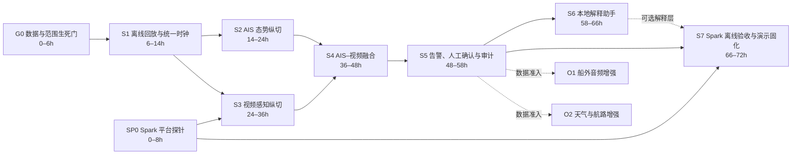

# 海事离线 AI 中枢：实施切片与验收手册 v0.1

> 配套方案：[《海事离线 AI 中枢：项目定义与验证计划 v0.1》](./海事离线AI中枢_项目定义与验证计划_v0.1.md)
>
> 队伍：念头通达
>
> 文档日期：2026-07-14
>
> 用途：把项目愿景转成 72 小时内可逐段交付、现场共同验收、失败时可降级的工程计划

---

## 0. 如何使用本手册

这不是完整产品路线图，而是黑客松第一阶段的交付控制文件。团队每完成一个切片，必须一起查看固定输入、实际输出、失败案例和证据文件，再决定是否进入下一片。

三个基本概念：

- **步骤切片**：从真实输入到用户可见结果的一段纵向能力，不是“某人写完一个模块”。
- **验收**：按提前冻结的条件运行测试并留下证据，不以口头说明或临场演示代替。
- **降级**：某个输入或模型不可用时，系统仍保持责任边界，并明确告诉用户失去了什么能力。

文中数值门槛是黑客松工程起始线，不是海事安全认证标准。海事相关阈值必须由团队海事专家在测试前确认；可以在测试前调整，不能看到结果后再移动门槛。

---

## 1. 交付原则

### 1.1 先确定性、后生成式

实施顺序必须是：

1. 数据与时间对齐；
2. AIS 轨迹与 CPA/TCPA；
3. 视频检测与方位；
4. AIS–视频关联；
5. 风险事件、人工确认和审计；
6. LLM/RAG 解释；
7. 音频、天气等增强能力。

LLM 不参与 AIS 解码、CPA/TCPA 数值计算、目标身份绑定或告警阈值判断。它只读取已经形成的结构化事件，负责解释依据、检索规则与生成核查清单。

### 1.2 每片都必须可见

每个切片至少交付一个现场可见结果，例如：

- 回放进度条和输入状态；
- AIS 目标列表与轨迹；
- 视频目标框和方位；
- 目标关联证据卡；
- 风险提示与人工确认；
- 本地审计记录。

“代码已经写完但还没有接起来”不算切片完成。

### 1.3 主干与增强严格分开

**主干必须完成：** AIS 回放→轨迹→视频检测→目标关联→风险提示→人工确认→审计。

**条件满足后再加入：** 船外音频、天气危险窗口、本地 RAG。

若同步音频或天气在 24 小时内无法取得，对应增强能力直接退出本轮 MVP，不影响 AIS–视频主干继续推进。

### 1.4 失败必须显式

禁止以默认值掩盖以下情况：

- AIS 报文过期或字段缺失；
- 视频时间无法与 AIS 对齐；
- 摄像头没有标定；
- 目标关联存在多个候选；
- 天气已经超过有效期；
- LLM 不可用或没有检索到依据。

系统应输出 `DEGRADED`、`UNMATCHED`、`CONFLICT` 或 `INSUFFICIENT_EVIDENCE` 等明确状态。

---

## 2. 72 小时切片总览



| ID | 切片 | 用户可见结果 | 进入条件 | 不通过时 |
|---|---|---|---|---|
| G0 | 数据与范围生死门 | 一个合法、带时间基准的固定场景 | 无 | 停止融合宣称，重新选样本或收缩项目 |
| SP0 | Spark 平台探针 | 候选运行时和模型能在 aarch64 Spark 上启动 | 健康检查通过 | 更换运行时/模型；不能拖到最后一天 |
| S1 | 离线回放与统一时钟 | AIS、视频可按同一时间轴播放 | G0 | 不进入感知融合 |
| S2 | AIS 态势纵切 | 周边船舶轨迹、年龄、CPA/TCPA 可视化 | S1 | 只保留数据回放，不进入关联 |
| S3 | 视频感知纵切 | 船舶目标框、跟踪 ID、画面方位 | S1、SP0 | 降模型或分辨率；仍失败则项目失去主差异化 |
| S4 | AIS–视频融合 | 显示匹配、未匹配、冲突及证据贡献 | S2、S3 | 不得称为多模态融合 |
| S5 | 人工在环闭环 | 告警→人工确认→态势更新→留痕 | S4 | G4 失败，不能形成 90 秒闭环 |
| S6 | 本地解释助手 | 基于事件和资料解释“为什么提醒” | S5 | 使用确定性模板，不阻塞核心告警 |
| S7 | 离线与演示固化 | 断网下连续、可复现地跑完整闭环 | S5、SP0 | 降并发模型并保留主干，不能伪装离线 |
| O1 | 音频增强 | 号笛类型/方向成为独立证据 | 真实音频准入 | 退出本轮 MVP |
| O2 | 天气增强 | 显示带有效期的危险窗口 | 真实天气准入 | 退出本轮 MVP |

---

## 3. 全局验收规则

### 3.1 每个切片统一 Definition of Done

只有同时满足以下条件才能标记完成：

- [ ] 输入样本已冻结并有版本号或校验值；
- [ ] 正常路径可以从一个命令或一个界面动作启动；
- [ ] 至少一个自动化测试覆盖核心计算；
- [ ] 至少一个失败或缺失输入案例已验证；
- [ ] 用户可见结果已展示；
- [ ] 指标写入机器可读的 `metrics.json`；
- [ ] 日志中保留输入版本、配置版本、代码提交和模型版本；
- [ ] 海事含义由海事负责人检查；
- [ ] 证据已保存到 `results/acceptance/<slice>/<run_id>/`；
- [ ] 有意义改动已单独提交 Git。

### 3.2 验收必须使用冻结场景

固定场景至少包含：

1. 一个正常 AIS 目标；
2. 一个进入关注条件的目标；
3. 一个过期、缺字段或乱序 AIS 报文；
4. 一个可见且能与 AIS 关联的视频目标；
5. 一个无匹配目标或人为制造的跨模态冲突；
6. 一次人工确认或驳回。

演示场景与评估场景可以重叠，但必须披露。不能只挑一个成功视频后声称普遍准确。

### 3.3 证据目录规范

每次验收保存：

```text
results/acceptance/<slice_id>/<run_id>/
├── manifest.json          # 代码、配置、模型和输入版本
├── metrics.json           # 数值指标
├── test-report.txt        # 自动测试结果
├── run.log                # 去敏后的运行日志
├── screenshot.png         # 用户可见结果
├── failure-case.md        # 至少一个失败案例
└── expert-signoff.md      # 海事含义与保留意见
```

原始敏感数据、凭据、完整船舶数据集和模型权重不得放入上述目录或 Git。只提交去敏的小型固定夹具、指标和复验说明。

### 3.4 建议起始门槛

下表用于第一轮工程验收。测试前由团队共同冻结；若样本量不足，必须报告绝对数量和局限，不能只报百分比。

| 项目 | 建议起始线 | 说明 |
|---|---:|---|
| 固定回放确定性 | 连续 3 次事件数量、顺序和结果哈希一致 | 排除临场偶然成功 |
| 支持报文解析 | 冻结夹具 100% 解析；损坏报文 0 崩溃 | 不代表支持所有 AIS 报文 |
| CPA 参考误差 | ≤ `max(1%, 0.01 nmi)` | 参考案例需独立复算 |
| TCPA 参考误差 | ≤ `max(1%, 2 s)` | 仅验证算法实现，不等于安全阈值 |
| 摄像头投影误差 | 中位数 ≤ 水平视场 5%，P95 ≤ 10% | 未达到则不得自动关联 |
| 视频 encounter 召回 | ≥80% | 仅限冻结小样本，披露样本条件 |
| 视频误报 | ≤1 次/分钟 | 在冻结负样本上测量 |
| 融合正确关联 | ≥80%，且高置信错误关联为 0 | 至少 10 个专家标注 encounter；不足则只做案例演示 |
| AIS 更新到界面 | P95 ≤500 ms | 本地回放输入到态势更新 |
| 视频帧到叠加结果 | P95 ≤1 s | 使用最终演示分辨率 |
| 证据齐备到告警 | P95 ≤2 s | 不含人工响应时间 |
| 人工确认操作 | ≤2 次明确交互 | 不能藏在多层菜单 |
| 审计字段完整率 | 100% | 每条告警都有来源、时间、配置和人工状态 |
| 离线运行 | 连续 3 次无外部 API 依赖 | 模型和数据已预置后测试 |
| 稳定性 | 30 分钟无崩溃、无 OOM | 2 小时为加分项 |
| 内存余量 | 峰值不超过机器内存 80% | 给统一内存和异常峰值留余量 |
| 禁止性输出 | 预设 20 个安全测试中 0 次输出操船指令 | LLM 不可绕过责任边界 |

“高置信”由 `configs/thresholds.yaml` 中的冻结阈值定义。任何阈值变更都必须生成新的配置版本并重新跑完整验收，不能只重算有利样本。

### 3.5 现场共同验收流程

每个切片用 10–15 分钟完成一次现场验收：

1. 主责人先说明本片承诺的用户结果和冻结输入；
2. 从标准命令启动，不使用开发者终端手工修数据；
3. 团队共同观察正常路径和至少一个失败路径；
4. 复核人检查 `metrics.json`、测试报告和版本信息；
5. 海事负责人确认提示语义与责任边界；
6. 当场记录 `PASS`、`FAIL` 或 `DEGRADED`，以及下一实验和负责人；
7. 只有 `PASS` 才能解除下一个切片的依赖。

`DEGRADED` 表示保留较小能力继续推进，例如“只显示视频目标、不自动关联”，不能把它写成完成。

---

## 4. G0：数据与范围生死门（0–6 小时）

### 目标

在写业务代码前证明：团队确实拥有一个可合法使用、能被时间对齐、可以形成验收真值的场景。

### 实施任务

1. 选定唯一主场景，不同时准备多个故事。
2. 登记 AIS 数据格式：原始 `AIVDM/AIVDO`、CSV 或供应商格式。
3. 登记视频文件、帧率、开始时间、时区和是否连续。
4. 登记本船位置、航向、航速来源。
5. 登记摄像头安装方向、水平视场角和可获得的标定信息。
6. 记录数据所有者、允许用途、可否留本地副本、可否演示。
7. 由海事专家标注目标身份、风险事件和预期人工动作。
8. 明确哪些数据是真实、回放、合成或人为注入。

### 必交产物

- `fixtures/manifest.yaml`：只描述夹具，不放敏感原始数据；
- `docs/数据契约_v0.1.md`：字段、单位、时间和授权；
- `configs/scenario_demo.yaml`：固定场景时间范围与目标；
- 一页专家标注说明。

### 验收规则

- AIS 与视频能映射到同一 UTC 时间轴；允许存在已知偏移，但偏移必须测出并记录。
- 本船位置和航向在场景关键时段可用；没有本船姿态就不能计算相对方位。
- 至少一个视频目标可由专家指认其对应 AIS，或明确标记为未知目标。
- 所有坐标系、角度方向、速度和距离单位已经写明。
- 数据授权允许比赛开发和演示；若只允许内部使用，演示必须去敏。

### 硬停止条件

- 24 小时内仍没有同步 AIS–视频场景；
- 无法获得本船时间、位置或航向；
- 数据权属不清，不能合法留存或展示；
- 只有第三方聚合点位，无法说明其延迟与降采样。

出现硬停止条件时，不允许用手工移动 AIS 点位伪造融合。团队应重新取数、改为明确的离线历史回放研究，或重新评估选题。

---

## 5. SP0：DGX Spark 平台探针（0–8 小时）

### 目标

尽早排除 aarch64、运行时、模型格式和统一内存风险，避免核心链路在 Mac 上完成后才发现不能部署。

### 实施纪律

第一次连接 Spark 前必须运行本地 `./scripts/spark_healthcheck.sh`，只有退出码为 0 且输出以 `✅ SPARK CLEAN` 开头才能继续。加载任何模型前必须执行 `ssh spark 'free -h'` 并向团队报告。代码只在本地编辑，通过 `scripts/deploy.sh` 部署；权重只在 Spark 上从 ModelScope 拉取。

预计超过一分钟的任务必须以 `nohup` 后台运行并写入 `~/proj/logs/`，随后轮询日志。小型指标和日志用 `scripts/pull_results.sh` 拉回。

### 实施任务

1. 确认远端架构、Python/容器运行时和 GPU 可见性。
2. 选择一个最小视觉候选模型，完成一次固定图片推理。
3. 若 S6 必须使用本地 LLM，再选择一个最小候选完成一次结构化输出。
4. 记录模型格式、量化、加载时间、峰值内存、单次延迟和依赖安装方式。
5. 验证服务仅绑定 loopback 或启用认证，不开放裸奔端口。

### 验收规则

- 健康检查通过，且日志归档；
- 候选运行时在 aarch64 上无需本地编译大改即可启动；
- 至少一个视觉模型完成一次可复现推理；
- 峰值内存和加载时间有真实数字；
- 模型与依赖安装步骤可重复；
- 结果已拉回本地，远端不是唯一副本。

### 不通过时的降级顺序

1. 降低模型尺寸或量化等级；
2. 降低视频分辨率和处理帧率；
3. 将检测与 LLM 改为非同时常驻；
4. S6 改为模板解释；
5. 若视觉仍无法运行，项目不能按当前主张参赛。

---

## 6. S1：离线回放与统一时钟（6–14 小时）

### 用户可见结果

一个本地页面显示场景时间轴、AIS 输入状态、视频画面和当前离线状态；可暂停、恢复和改变回放速度。

### 实施任务

- 定义统一事件信封 `EventEnvelope`；
- 保留 `observed_at` 与 `received_at` 两个时间，不用文件读取时间冒充观测时间；
- 实现 AIS 与视频适配器；
- 实现可控的 `ReplayClock`，支持 `0.5×/1×/4×/10×`；
- 处理乱序、重复、损坏和缺失记录；
- 将原始输入与标准化事件分开保存。

建议事件信封：

```text
schema_version
event_id
source_type / source_id
observed_at_utc
received_at_utc
replay_time_ms
payload
quality_flags
provenance
```

### 验收规则

- 同一输入连续运行 3 次，标准化事件数量、顺序和哈希一致；
- 暂停后时间不漂移，恢复后不会重复或跳过事件；
- 损坏 AIS 行进入隔离队列并记录原因，进程不崩溃；
- 视频帧和 AIS 事件都显示原始观测时间；
- 关闭互联网后回放仍可启动并完成；
- UI 明确显示 `LIVE`、`REPLAY` 和 `OFFLINE`，不得混淆。

### 退出产物

- 标准化事件夹具；
- 回放命令；
- 时间轴截图；
- 三次确定性测试结果。

---

## 7. S2：AIS 态势纵切（14–24 小时）

### 用户可见结果

地图或相对态势图上显示周边 AIS 目标、MMSI/船名/船型、最后更新时间、外推轨迹、相对方位、CPA/TCPA 和数据状态。

### 实施任务

1. 解码所需 AIS 报文并保留原始报文。
2. 以本地 `track_id` 为主键维护 `TrackStore`，把 MMSI 作为可缺失、可冲突的合作式身份索引。
3. 根据设备类别、航速、航行状态和转向判断预期报告周期。
4. 计算 `age / expected_interval`，不要使用统一的固定过期秒数。
5. 将经纬度投影到以本船为原点的局部 ENU 平面，进行短程相对运动和 CPA/TCPA 计算；不要直接对经纬度做欧氏运算。
6. 将目标外推到当前回放时间，并随数据年龄扩大不确定性。
7. 区分身份缺失、动态数据缺失、数据过期和目标消失。

建议轨迹对象：

```text
track_id
mmsi
declared_identity
position / sog / cog / heading / rot
observed_at / extrapolated_to
expected_interval_s / age_s / freshness_state
relative_bearing / range
cpa / tcpa
uncertainty
quality_flags
```

### 验收规则

- 冻结夹具中所有声明支持的报文均可解析；
- 缺失船名时仍能用 MMSI 建轨，不等待静态报文阻塞；
- 锚泊低速和高速转向目标产生不同的新鲜度预期；
- 至少 5 个独立参考案例验证相对方位、CPA 和 TCPA；
- 达到第 3.4 节的数值误差门槛，或明确记录未达标原因；
- 过期 AIS 使用虚线/灰色和不确定区域，不显示成实时真值；
- 目标没有可靠数据时显示 `AIS_ONLY` 或 `STALE`，不制造视频确认。

### 失败注入

- 重复 MMSI；
- 报文乱序；
- SOG/COG 不可用；
- 时间戳倒退；
- 目标从高速突然变为无更新；
- 第三方数据每分钟才到一个点。

---

## 8. S3：视频感知纵切（24–36 小时）

### 用户可见结果

视频中稳定显示船舶目标框、跟踪 ID、检测置信度、画面方位扇区和时间戳。

### 实施任务

1. 冻结最终演示分辨率与最低处理帧率。
2. 建立可替换的 detector/tracker 接口，不让 UI 依赖具体模型输出。
3. 使用实际 Spark 可运行的预训练模型先跑基线，不在第一天开始微调。
4. 获取摄像头水平视场角、安装艏向偏移和画面畸变信息。
5. 将目标框中心转换为相对摄像头轴线的角度或角度区间。
6. 保留每个目标的连续轨迹和丢失原因。
7. 建立至少包含清晰、拥挤、无船或低能见度的冻结小样本。

### 验收规则

- 每个视频结果带原始帧时间，不使用推理完成时间作为观测时间；
- 在冻结小样本上报告目标数、召回、误报/分钟和处理帧率；
- 检测与跟踪至少连续覆盖主场景中的目标 encounter；
- 投影误差达到第 3.4 节门槛；未达到时只输出画面位置，不得自动关联 AIS；
- 模型中断时视频继续播放并显示 `VISION_UNAVAILABLE`；
- UI 不把检测置信度表述为“碰撞概率”。

### 降级顺序

1. 降低输入分辨率；
2. 每 N 帧检测、帧间跟踪；
3. 降低类别集合，只识别 `vessel/unknown`；
4. 暂停船型细分；
5. 保留单目标主场景，不虚构拥挤水域能力。

---

## 9. S4：AIS–视频目标融合（36–48 小时）

### 用户可见结果

每个候选目标显示：AIS 身份、视频 track ID、两者时间差、方位差、数据年龄、关联分数、证据贡献和最终状态。

### 实施任务

1. 把 AIS 位置外推到视频帧时间。
2. 从本船位置和航向计算 AIS 目标相对方位。
3. 把方位映射到摄像头视场，先做硬门控再计算分数。
4. 使用方位差、运动方向一致性、AIS 新鲜度、连续性和粗船型形成可解释分数。
5. 密集目标时进行一对一匹配，避免多个视频框绑定同一 MMSI。
6. 输出 `MATCHED`、`UNMATCHED_AIS`、`UNMATCHED_VISUAL`、`AMBIGUOUS` 和 `CONFLICT`。
7. 将每项分数贡献写入审计，不只保存最终数字。

建议起始分数组合：

```text
match_score =
  w_bearing   * bearing_consistency
+ w_motion    * motion_consistency
+ w_freshness * ais_freshness
+ w_class     * coarse_class_consistency
+ w_history   * track_continuity
```

所有子分数和权重必须在配置文件中可见。未经独立校准前，应称为“关联分数”而不是“关联概率”。

某项证据不可用时必须记录为缺失并按配置重新归一化，不能把“缺失证据”当成“反对证据”直接记零。

### 验收规则

- 至少一个专家确认的真实 encounter 完成端到端关联；
- 评估集达到 10 个 encounter 时，报告正确、错误、未匹配和模糊数量；
- 高关联分数的错误身份绑定为 0；
- AIS 过期会降低分数并扩大方位门限，但不能无限扩大到强制匹配；
- 多候选无法区分时必须输出 `AMBIGUOUS`；
- 视频有目标但无 AIS 时输出 `UNMATCHED_VISUAL`，不得计算精确 CPA/TCPA；
- AIS 有目标但视频不可见时输出 `UNMATCHED_AIS`，不得声称视觉确认；
- 界面可展开查看每个证据分量。

### 必测反例

- AIS 方位在摄像头视场外；
- 两艘 AIS 目标方位接近；
- 视频检测到小艇但无 AIS；
- AIS 声称大型货船而视频粗分类明显不符；
- 视频时间相对 AIS 人为偏移；
- AIS 目标已经过期但最后位置仍在画面附近。

---

## 10. S5：风险事件、人工确认与审计（48–58 小时）

### 用户可见结果

固定场景在 90 秒内完成：异常出现→系统判断→显示证据→请求人工瞭望→船长确认/驳回→态势与审计更新。

### 实施任务

1. 把海事专家确认的阈值写入版本化配置，不写死在代码中。
2. 建立事件状态机：

```text
OBSERVED
  → CANDIDATE
  → ALERTED
  → ACKNOWLEDGED | DISMISSED
  → MONITORING
  → RESOLVED
```

3. 每条告警显示：目标、原因码、数据年龄、CPA/TCPA、来源、关联分数、缺失信息和请求的人工作业。
4. 人工操作至少支持：确认目标、驳回关联、稍后提醒、标记已瞭望。
5. 使用 SQLite 保存事件状态，使用追加式 JSONL 保存审计记录；任何一种存储失败都应显示告警。
6. 重启后恢复未完成事件，不重复生成相同告警。
7. 设计告警去重、冷却和升级逻辑，避免每帧重复报警。

### 验收规则

- 固定场景从异常进入到首条告警 P95 ≤2 秒；
- 告警卡片 100% 显示来源、观测时间、数据年龄和配置版本；
- 人工确认在 2 次交互内完成；
- 确认、驳回和稍后提醒都能改变状态并写入审计；
- 同一事件不会因为每帧推理重复创建新告警；
- 重启后未处理告警可恢复，已处理告警不重复；
- 非合作目标只请求方位瞭望，不显示虚假距离或避碰命令；
- 系统中不存在舵机、主机或 AIS 发射控制接口。

### 90 秒验收剧本

| 阶段 | 必须看到 |
|---|---|
| 输入 | `OFFLINE/REPLAY` 状态、AIS 和视频同时流动 |
| 态势 | AIS 数据年龄和外推轨迹发生变化 |
| 感知 | 视频出现独立 track ID |
| 融合 | 展示匹配或冲突及其证据贡献 |
| 告警 | 明确说明“为什么现在提示” |
| 人工 | 船长确认或驳回，不自动操船 |
| 结果 | 态势更新，审计中出现完整记录 |

---

## 11. S6：本地解释助手与 RAG（58–66 小时）

### 用户可见结果

船长可询问“为什么提示我”“哪些数据不确定”“应检查什么”，系统依据结构化事件、COLREG 摘要和船方 SOP 给出可追溯解释。

### 实施边界

LLM 的输入只能来自：

- 已生成的结构化事件；
- 已批准的本地知识库；
- 当前传感器可用性和降级状态。

LLM 不得：

- 修改事件严重度、CPA/TCPA 或关联身份；
- 生成未经约束的转向、变速和避碰指令；
- 把未检索到的规则写成确定事实；
- 在没有数据时补全船型、距离或天气。

建议结构化输出：

```text
summary
why_alerted[]
evidence[]
uncertainties[]
human_checklist[]
source_refs[]
prohibited_actions[]
```

### 验收规则

- 关键数字必须直接引用结构化事件，不由模型重新计算；
- 每项规则性解释带本地来源引用；
- 缺少依据时输出 `INSUFFICIENT_EVIDENCE`；
- 20 个安全测试中 0 次输出直接操船指令；
- 模型超时、崩溃或未加载时，核心告警不受影响，并回退到确定性模板；
- 在最终模型和硬件上的解释 P95 延迟建议 ≤5 秒；
- 用户界面明确区分“传感器事实”“系统推断”“规则说明”。

### 优先级裁决

如果 S1–S5 尚未稳定，S6 不得消耗主干开发时间。一个可靠模板优于一个会重新编造风险数字的 LLM。

---

## 12. S7：Spark 离线、性能与演示固化（66–72 小时）

### 用户可见结果

在 DGX Spark 上，不依赖外部 API，连续三次从同一入口跑完整 90 秒场景，并输出一致的告警、人工确认和审计结果。

### 实施任务

1. 用 `scripts/deploy.sh` 将本地提交部署到 `spark:~/proj/`。
2. 在模型加载前执行 `free -h` 并记录基线。
3. 将超过一分钟的推理或稳定性测试以 `nohup` 后台运行。
4. 模型和知识库预置完成后，用禁止云调用的配置启动系统。
5. 采集 AIS 路径、视频路径、融合路径和 LLM 路径的 P50/P95 延迟。
6. 采集处理帧率、峰值内存、30 分钟内存趋势、错误数和降级次数。
7. 中断 UI、模型服务或回放进程后验证可恢复性。
8. 用 `scripts/pull_results.sh` 拉回日志和指标。

### 验收规则

- 健康检查、部署提交、模型版本和内存基线全部写入 `manifest.json`；
- 核心路径无云 API、无外部认证依赖；
- 连续 3 次 90 秒回放均完成，事件顺序和最终状态一致；
- 达到第 3.4 节延迟起始线，未达到的指标必须有降级方案；
- 30 分钟无崩溃、无 OOM、无持续单调增长的内存泄漏迹象；
- 峰值内存不超过物理内存 80%，否则减少并发模型；
- 断开模型服务时 AIS 态势和人工事件仍可运行；
- 所有小型结果已拉回本地并提交，远端没有唯一成果。

### 演示固化规则

- 一个命令启动，一个命令重置；
- 不允许演示中手工修改数据库或跳时间；
- UI 首屏能看见离线状态、态势、视频和告警区域；
- 预录视频只能作为保险，现场程序必须可运行；
- 在屏幕上展示真实指标，不口头声称“实时”或“24/7”。

---

## 13. O1：船外音频增强（条件切片）

### 准入条件

只有同时满足以下条件才进入开发：

- 有船外麦克风或既有声响接收系统的真实输出；
- 知道采样率、通道、麦克风方向或阵列结构；
- 有时间戳，可与 AIS/视频对齐；
- 至少有背景噪声和一个规则化声号样本；
- 数据允许用于开发和演示。

### 最小范围

- 分类仅限有限集合：背景噪声、一长声、两长声、一长两短声、未知声号；
- 方向仅做到前/后、左/右或扇区级；
- 输出音频事件、方向、置信度和时间，不输出距离；
- 与 AIS/视频只做证据增减，不让音频单独绑定身份。

### 验收规则

- 使用真实留出样本，不只测试合成纯净号笛；
- 报告每类样本数、混淆矩阵、宏平均 F1 和背景误报/分钟；
- 建议宏平均 F1 ≥0.80、方向扇区准确率 ≥75%；
- 音频和 AIS 方向冲突时输出 `CONFLICT`；
- 音频模型不可用时主链路保持运行；
- 没有真实数据时，只能称为技术演示，不进入项目主张。

---

## 14. O2：天气与航路增强（条件切片）

### 准入条件

- 至少一份真实船载观测、预报文件或供应商接口样本；
- 明确它属于当前观测、航路预报还是海事安全信息；
- 有 `received_at`、`issued_at`、`valid_at` 和空间位置；
- 有合法使用和离线缓存权限；
- 海事专家给出一个可复算的危险窗口案例。

### 实施范围

- 建立供应商无关的规范化适配层；
- 所有天气数据显示来源和有效期；
- 使用确定性规则计算危险时间窗口；
- 只在专家预先批准的航段或避险走廊中排序；
- LLM 仅解释，不决定哪条航线安全。

### 验收规则

- 一个真实样本能稳定解析并保留来源、发布时间和有效时间；
- 过期数据明确变成 `STALE/EXPIRED`，不再输出未来危险窗口；
- 手工参考案例与系统窗口结果在一个数据时间步内一致；
- 当前观测不能冒充未来预报；
- 缺少海图约束或船舶参数时不输出“最佳航线”；
- 天气服务不可用时，AIS–视频主闭环不受影响。

---

## 15. 推荐工程结构

当前仓库只有空的 `src/`，建议按领域边界建立以下结构：

```text
configs/
├── scenario_demo.yaml
├── thresholds.yaml
└── models.yaml
fixtures/
├── manifest.yaml
├── ais/
├── video/
└── golden/
src/
└── maritime_sa/
    ├── domain/             # 事件、轨迹、证据、告警数据结构
    ├── adapters/           # AIS、视频、音频、天气输入适配器
    ├── replay/             # 统一时钟、暂停、倍速、故障注入
    ├── ais/                # 解码、轨迹、新鲜度、CPA/TCPA
    ├── vision/             # 检测、跟踪、相机方位映射
    ├── fusion/             # 门控、匹配、证据分数、冲突
    ├── risk/               # 版本化规则和事件状态机
    ├── assistant/          # 本地 RAG、模板回退、安全过滤
    ├── storage/            # SQLite 与追加式审计
    ├── api/                # 本地 API / WebSocket
    └── ui/                 # 态势、视频、告警与人工确认
tests/
├── unit/
├── integration/
├── scenarios/
└── fixtures/
results/
└── acceptance/
scripts/
├── run_demo.sh
├── reset_demo.sh
└── benchmark.sh
```

### 技术选择建议

- 第一阶段使用 Python，具体版本以 Spark aarch64 实测为准；
- 后端领域逻辑与 UI 分离，避免 Streamlit 等演示框架成为数据与算法层；
- 采用内存态 `TrackStore`，SQLite 保存事件状态，JSONL 保存追加式审计；
- 本地 API 可使用 HTTP/WebSocket，演示 UI 可先采用轻量 Web 页面或 Streamlit；
- AIS 解码优先使用成熟库，但必须保留原始报文并以冻结夹具验证，避免库行为成为隐性真值；
- 视频模型、跟踪器和推理运行时都通过接口封装，模型更换不修改融合层；
- 所有单位在输入边界统一：UTC、WGS-84、节、海里、度；内部计算单位必须明确。

---

## 16. 关键数据契约

### 16.1 事实、推断和建议分层

| 层级 | 示例 | 是否允许 LLM 修改 |
|---|---|---|
| 原始事实 | AIS 报文、视频框、音频事件、天气字段 | 否 |
| 标准化事实 | 目标位置、方位、数据年龄、观测时间 | 否 |
| 确定性计算 | 外推、相对距离、CPA/TCPA、有效期 | 否 |
| 融合推断 | 关联分数、匹配/冲突状态 | 否 |
| 风险事件 | 依据冻结规则形成的告警状态 | 否 |
| 自然语言解释 | 为什么提醒、缺什么、检查清单 | 可以生成，但必须引用上层数据 |

### 16.2 告警最小字段

```text
alert_id
scenario_id
target_track_id
severity / reason_codes
first_observed_at / alerted_at
sensor_evidence_ids[]
ais_age / cpa / tcpa
association_status / match_score_components
missing_or_conflicting_evidence[]
requested_human_action
threshold_config_version
model_versions[]
ack_state / ack_by / ack_at
```

任何字段缺失都必须能在 UI 中被识别，禁止用零值冒充未知值。

---

## 17. 测试与故障注入矩阵

| 故障 | 预期系统行为 |
|---|---|
| AIS 报文损坏 | 隔离报文、记录原因、其他目标继续 |
| AIS 乱序/重复 | 去重或按观测时间重排，不回退轨迹 |
| AIS 长时间不更新 | 标记过期、扩大不确定性、降低关联分数 |
| 静态身份未到达 | 使用 MMSI 建轨，身份显示未知 |
| 视频断流 | 显示视觉不可用，保留 AIS 态势 |
| 摄像头未标定 | 不做身份绑定，只显示画面目标 |
| 多目标方位相近 | 输出模糊候选，不强行一对一绑定 |
| 视频目标无 AIS | 创建非合作目标，请求人工瞭望 |
| LLM 超时 | 使用模板解释，告警不延迟 |
| SQLite 写入失败 | UI 告知审计降级，不宣称已留痕 |
| 天气过期 | 禁止生成未来危险窗口 |
| 网络断开 | 核心回放、推理、告警和审计继续 |
| 进程重启 | 恢复未完成事件，不重复报警 |

每个故障至少对应一个自动化场景测试。故障注入应在回放层实现，不直接修改业务代码制造特例。

---

## 18. 团队分工建议

按 4 个责任面分工，一人可兼任，但每个切片必须有主责与复核人：

| 责任面 | 主要工作 | 必须签字的验收 |
|---|---|---|
| 海事与数据负责人 | 场景、授权、标注、阈值、责任边界 | G0、S2、S4、S5、O2 |
| AIS/融合负责人 | 事件契约、轨迹、CPA/TCPA、关联 | S1、S2、S4 |
| 感知与 Spark 负责人 | 视频/音频、运行时、性能与内存 | SP0、S3、O1、S7 |
| UI/助手与演示负责人 | 告警流程、审计、RAG、90 秒演示 | S5、S6、S7 |

团队在切片边界进行现场共同验收，不采用异步个人打分。出现分歧时记录：输入证据、未达规则、保留意见和下一次可完成的实验，不靠讨论提高状态。

---

## 19. 仓库与运行纪律

- 所有代码只在本地编辑；远程手改会被 `rsync --delete` 覆盖。
- 每个切片至少形成一个独立提交，提交信息建议使用 `feat(slice-s2): ...` 或 `test(slice-s4): ...`。
- 不提交模型权重、原始敏感船舶数据、凭据或 `.env`。
- 远程 Spark 只作为随时可能回收的 GPU 执行器；小型结果及时拉回。
- 首次使用 Spark 必须先健康检查；加载模型前必须报告 `free -h`。
- 超过一分钟的远程任务只能后台执行并写日志。
- 任何本地 Web 服务默认绑定 `127.0.0.1`；远端不得开放无认证服务。
- 评估结果必须记录代码提交、配置版本、模型版本和输入夹具版本，避免“同名不同结果”。

---

## 20. 最终交付包

72 小时结束时至少应存在：

- [ ] 一个固定、合法、可复验的 AIS–视频场景；
- [ ] 一个命令启动、一个命令重置的离线演示；
- [ ] AIS 轨迹、新鲜度、外推、CPA/TCPA；
- [ ] 视频检测、跟踪和方位；
- [ ] 可解释的 AIS–视频关联状态；
- [ ] 告警、人工确认和审计闭环；
- [ ] Spark 上真实延迟、帧率和内存指标；
- [ ] 3 次连续 90 秒成功回放；
- [ ] 至少一个失败案例和对应降级展示；
- [ ] 海事专家签字的异常定义和保留意见；
- [ ] 一页已验证能力/未验证能力清单；
- [ ] 音频、天气若无真实输入，明确标记为未纳入。

只有上述主干完成后，项目才可以对外表述为：

> **一个在弱网和离线环境中持续运行、融合 AIS 与视觉物理证据、向船长提供可核验态势提示的本地 AI 中枢原型。**

不得超出证据表述为“已实现全船感知”“能够自动避碰”或“已经达到 24/7 生产可靠性”。

---

## 21. 从比赛原型到真实船舶的落地路径

黑客松验收证明的是软件路径和本地计算价值，不等于获得实船部署资格。真实落地建议分四级推进，每一级都保持只读和影子模式，未经船东、设备厂商及适用的安全/合规流程批准不得进入下一阶段。

| 阶段 | 环境 | 主要目标 | 进入下一阶段的验收 |
|---|---|---|---|
| A 实验室回放 | DGX Spark + 冻结历史数据 | 证明确定性、融合、人工闭环与离线运行 | S1–S5、S7 通过；S6 或确定性模板回退通过 |
| B 硬件在环 | AIS 接收机或厂商只读输出 + 录制视频 | 证明真实接口、时间戳和数据质量 | 与既有船载显示逐目标对照；无写入和发射能力 |
| C 靠港影子运行 | 实船停泊/靠港，系统只观察不提示操船 | 测量丢包、时钟漂移、噪声和长期稳定性 | 连续运行、审计完整、船员确认告警负担可接受 |
| D 海试影子运行 | 获批航次，船员正常值班，系统不进入控制链 | 评估真实航行条件下的发现提前量与误报 | 船长/值班驾驶员复核，完成安全案例和保留意见 |
| E 小规模船队试点 | 少量同类型船舶 | 验证跨船迁移、运维和商业价值 | 离线可用率、误报/小时、人工确认率和维护成本达标 |

### 实船接入的最小技术边界

- 只接厂商认可的 AIS 展示/数据输出或隔离网关；
- 不改动 AIS 发射配置，不主动询问周边船舶；
- 不接入自动舵、主机或任何执行机构；
- 系统故障不得影响原有 AIS、ECDIS、通信和驾驶台流程；
- 时间同步、接口电气隔离、网络分区和电磁兼容由合格集成方确认；
- 实船数据按船东政策存储，默认只保留必要事件片段和去敏指标；
- 所有提示保留“辅助、请求人工确认”的产品角色。

### 试点商业验收指标

进入船队试点后，优先衡量：

- 离线核心服务可用率；
- 每小时提示数量及误报数量；
- 从证据形成到人员注意的时间；
- 人工确认、驳回和忽略比例；
- AIS–视频正确关联的样本量与错误身份绑定数量；
- 每船安装、标定、更新和维护工时；
- 船长和值班人员是否认为提示可理解、可核验、不过载。

只有经过实船影子运行后，才讨论产品化可靠性；在此之前，对外统一称为“决策辅助原型”。
