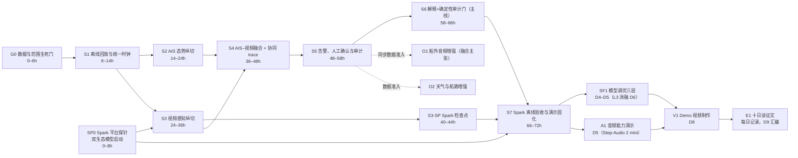

# 海事离线 AI 中枢：实施切片与验收手册 v0.4

> 配套方案：[《海事离线 AI 中枢：项目定义与验证计划 v0.4》](./海事离线AI中枢_项目定义与验证计划_v0.4.md)
>
> 日期执行表：[《D2–D9 开发执行计划（2026-07-14 至 2026-07-21）》](./海事离线AI中枢_D2-D9开发执行计划.md)
>
> 队伍：念头通达
>
> 文档日期：2026-07-14（v0.4 审计边界与 TTS 裁决固化）
>
> 用途：把项目愿景转成十天赛程内可逐段交付、现场共同验收、失败时可降级的工程计划

**v0.4 变更摘要**（v0.3 摘要见上一版文档）：S6 冻结为“确定性告警即时上屏、LLM 草稿服务端缓冲、完整解析并通过审计门后解释才上屏”，禁止未审原始 token 流；`ExplanationDraft` 与 `AuditResult` 分离，`audit_status` 只能由确定性校验器生成；共权重、异系统提示的额外推理仅可作为全绿后的**可选同模型复核 pass**，不算第二 Agent、不拥有最终审计权；SP0 任务 6 将 Step-Audio-TTS-3B 固化为 Step-Audio 2 mini 通过后才可执行的 P2 探针，从拉取命令发起到首个可播放 WAV 共用 30 分钟 wall-clock，超时即停且 D8 前不重试；TTS 仅在探针 `PASS` 后才可作为 A1/演示条件保险。

---

## 0. 如何使用本手册

这不是完整产品路线图，而是黑客松第一阶段的交付控制文件。团队每完成一个切片，必须一起查看固定输入、实际输出、失败案例和证据文件，再决定是否进入下一片。

三个基本概念：

- **步骤切片**：从真实输入到用户可见结果的一段纵向能力，不是“某人写完一个模块”。
- **验收**：按提前冻结的条件运行测试并留下证据，不以口头说明或临场演示代替。
- **降级**：某个输入或模型不可用时，系统仍保持责任边界，并明确告诉用户失去了什么能力。

文中数值门槛是黑客松工程起始线，不是海事安全认证标准。海事相关阈值必须由团队海事专家在测试前确认；可以在测试前调整，不能看到结果后再移动门槛。

---

## 1. 交付原则

### 1.1 先确定性、后生成式

实施顺序必须是：

1. 数据与时间对齐；
2. AIS 轨迹与 CPA/TCPA；
3. 视频检测与方位；
4. AIS–视频关联；
5. 风险事件、人工确认和审计；
6. 解释 Agent + 确定性引用审计门（主线，见 1.5）；
7. 检测器微调（SF1）与音频、天气等能力（D4 起）。

LLM 不参与 AIS 解码、CPA/TCPA 数值计算、目标身份绑定或告警阈值判断。它只读取已经形成的结构化事件，负责解释依据、检索规则与生成核查清单；**确定性引用校验器**再对解释做溯源校验——v0.4 裁决：溯源校验是精确匹配问题，归确定性层；LLM 草稿不能给自己盖章，也不能在校验完成前进入 UI。这是本原则的自然延伸，不是资源妥协。

### 1.2 每片都必须可见

每个切片至少交付一个现场可见结果，例如：

- 回放进度条和输入状态；
- AIS 目标列表与轨迹；
- 视频目标框和方位；
- 目标关联证据卡；
- Agent 协同时间线（trace 回放）；
- 风险提示与人工确认；
- 本地审计记录。

“代码已经写完但还没有接起来”不算切片完成。

### 1.3 主干与增强严格分开

**主干必须完成：** AIS 回放→轨迹→视频检测→目标关联→风险提示→人工确认→审计→**解释 Agent + 确定性引用审计门**（v0.4：属主干，见 1.5）。

**评分切片必须完成（D4 起）：** SF1 三层模型调优、A1 音频能力演示、V1 视频、E1 十日谈。

**条件满足后再加入（融合主张）：** 同步船外音频（O1，声学瞭望 Agent 进主融合）、天气危险窗口（O2）。

若同步音频或天气在 24 小时内无法取得，对应**融合主张**退出本轮 MVP，不影响主干推进；但音频降级为 A1 能力演示而非彻底消失——Stepfun 音频模型的出场不可裁剪（1.5）。

### 1.4 失败必须显式

禁止以默认值掩盖以下情况：

- AIS 报文过期或字段缺失；
- 视频时间无法与 AIS 对齐；
- 摄像头没有标定；
- 目标关联存在多个候选；
- 天气已经超过有效期；
- LLM 不可用或没有检索到依据。

系统应输出 `DEGRADED`、`UNMATCHED`、`CONFLICT` 或 `INSUFFICIENT_EVIDENCE` 等明确状态。

### 1.5 评分关键项不可裁剪（v0.4 修订）

赛事评审中"智能体融合与模型优化技术深度（25%）"与"平台适配性（15%）"合计 40% 的权重，完全由以下**四个载体**承接，**任何进度压力下不得裁剪，优先级等同主干**：

1. **S4–S5 协同 trace**：多智能体协同的直接证据——跨 Agent 结构化消息链（含融合与风险 Agent 向视觉瞭望 Agent 发起的复核请求）100% 落盘 `agent_trace.jsonl`、可回放、进 V1 动画。评委看到的是一条真实协同链，不是架构图上的框。
2. **S6 解释 Agent + 确定性引用审计门**：系统中 LLM 的唯一出场点，承接"可核验解释"差异化；LLM 只产出服务端 `ExplanationDraft`，审计徽章和 `AuditResult` 仅由确定性校验器生成；模板回退仅为运行时故障保险，不是计划选项。
3. **SF1 三层模型调优**：L1 领域微调（主路径）+ L2 TensorRT 推理优化 + L3 工作点消融；目标**三层至少一层正收益**；L1 无提升须如实报告负结果（诚实红线），由 L2/L3 保证调优深度证据不悬空。
4. **双生态模型出场**：NVIDIA（TAO 检测器、Nemotron 系列）与 Stepfun 各至少一个模型在最终演示中真实运行（Stepfun **主选 Step-Audio 2 mini**；Step-Audio-TTS-3B 仅在 SP0 限时探针 `PASS` 后成为平台适配保险），型号与版本写入 `configs/models.yaml`。

主干（S1–S5、S7）保障"项目完整性 20%"与"实用性 25%"；若主干与评分关键项发生资源冲突，按项目定义 §2.4 评分矩阵的权重损失量化后再裁决，不凭直觉砍 LLM。

---

## 2. 十天切片总览（72 小时主干 + D4–D10 评分切片）



| ID | 切片 | 用户可见结果 | 进入条件 | 不通过时 |
|---|---|---|---|---|
| G0 | 数据与范围生死门 | 一个合法、带时间基准的固定场景 | 无 | 切换 FVessel 保险数据源（岸基场景），不重开选题 |
| SP0 | Spark 平台探针 | NVIDIA 与 Stepfun 各至少一个模型在 aarch64 Spark 上启动 | 健康检查通过 | 同生态内就近换型号；不能拖到最后一天 |
| S1 | 离线回放与统一时钟 | AIS、视频可按同一时间轴播放 | G0 | 不进入感知融合 |
| S2 | AIS 态势纵切 | MapLibre 态势图：轨迹、年龄、CPA/TCPA、船库富化 | S1 | 只保留数据回放，不进入关联 |
| S3 | 视频感知纵切 | 船舶目标框、跟踪 ID、画面方位 | S1、SP0 | 降模型或分辨率；仍失败则项目失去主差异化 |
| S3-SP | Spark 检查点 | S3 冻结样本在 Spark 上复跑验收达标 | S3 | 立即触发 S3 降级序列，不得推迟到 S7 |
| S4 | AIS–视频融合 | 显示匹配、未匹配、冲突及证据贡献（含船库/VLM 分量）；**跨 Agent 消息链落盘 `agent_trace.jsonl`** | S2、S3 | 不得称为多模态融合 |
| S5 | 人工在环闭环 | 告警→人工确认→态势更新→留痕；trace 延伸到告警与人工动作 | S4 | G4 失败，不能形成 90 秒闭环 |
| S6 | 解释+确定性审计门（主线，不可裁剪） | 解释"为什么提醒"+ 审计徽章（确定性校验），未过门不上屏 | S5 | 运行时故障才回退模板；计划层面不可移除 |
| S7 | 离线与演示固化 | iptables 断网证明下连续、可复现地跑完整闭环 | S5、S6、S3-SP、SP0 | 降并发模型并保留主干，不能伪装离线 |
| SF1 | 模型调优三层（不可裁剪） | 同一冻结验证集（场景隔离划分）上的三层调优证据 | S3-SP、检测训练集就绪、场景隔离划分完成 | L1 减 epoch→只调检测头→负结果如实报告；L2/L3 无论如何交付 |
| A1 | 音频能力演示 | Step-Audio 2 mini 对公开真实声号的分类演示 | 公开真实录音就绪 | 先缩小类别集合；**仅当 SP0 TTS 探针已 `PASS`** 时，Stepfun 出场才可由 TTS 条件兜底 |
| V1 | Demo 视频制作 | 3–4 分钟成品视频 | S7、SF1 | 用 S7 录屏 + 旁白的简版兜底 |
| E1 | 十日谈征文 | 每日日志 + D9 汇编成文 | 即日启动 | 无（成本极低，无裁剪理由） |
| O1 | 音频增强（融合主张） | 号笛类型/方向成为独立证据（声学瞭望 Agent 进主融合） | 同步真实音频准入 | 降级为 A1 能力演示 |
| O2 | 天气增强 | 显示带有效期的危险窗口 | 真实天气准入 | 退出本轮 MVP |

---

## 3. 全局验收规则

### 3.1 每个切片统一 Definition of Done

只有同时满足以下条件才能标记完成：

- [ ] 输入样本已冻结并有版本号或校验值；
- [ ] 正常路径可以从一个命令或一个界面动作启动；
- [ ] 至少一个自动化测试覆盖核心计算；
- [ ] 至少一个失败或缺失输入案例已验证；
- [ ] 用户可见结果已展示；
- [ ] 指标写入机器可读的 `metrics.json`；
- [ ] 证据七件套由 `scripts/accept.sh <slice_id>` 一条命令自动收集（S1 起提供，摊薄验收仪式成本）；
- [ ] 日志中保留输入版本、配置版本、代码提交和模型版本（含生态归属：NVIDIA / Stepfun / 确定性）；
- [ ] 海事含义由海事负责人检查；
- [ ] 证据已保存到 `results/acceptance/<slice>/<run_id>/`；
- [ ] 有意义改动已单独提交 Git。

### 3.2 验收必须使用冻结场景

固定场景至少包含：

1. 一个正常 AIS 目标；
2. 一个进入关注条件的目标；
3. 一个过期、缺字段或乱序 AIS 报文；
4. 一个可见且能与 AIS 关联的视频目标；
5. 一个无匹配目标或人为制造的跨模态冲突；
6. 一次人工确认或驳回。

演示场景与评估场景可以重叠，但必须披露。不能只挑一个成功视频后声称普遍准确。

### 3.3 证据目录规范

每次验收保存：

```text
results/acceptance/<slice_id>/<run_id>/
├── manifest.json          # 代码、配置、模型和输入版本
├── metrics.json           # 数值指标
├── test-report.txt        # 自动测试结果
├── run.log                # 去敏后的运行日志
├── agent_trace.jsonl      # 跨 Agent 消息链（S4 起）
├── screenshot.png         # 用户可见结果
├── failure-case.md        # 至少一个失败案例
└── expert-signoff.md      # 海事含义与保留意见
```

原始敏感数据、凭据、完整船舶数据集和模型权重不得放入上述目录或 Git。只提交去敏的小型固定夹具、指标和复验说明。

### 3.4 建议起始门槛

下表用于第一轮工程验收。测试前由团队共同冻结；若样本量不足，必须报告绝对数量和局限，不能只报百分比。

| 项目 | 建议起始线 | 说明 |
|---|---:|---|
| 固定回放确定性 | 连续 3 次事件数量、顺序和结果哈希一致 | 排除临场偶然成功 |
| 支持报文解析 | 冻结夹具 100% 解析；损坏报文 0 崩溃 | 不代表支持所有 AIS 报文 |
| CPA 参考误差 | ≤ `max(1%, 0.01 nmi)` | 参考案例需独立复算 |
| TCPA 参考误差 | ≤ `max(1%, 2 s)` | 仅验证算法实现，不等于安全阈值 |
| 摄像头投影误差 | 中位数 ≤ 水平视场 5%，P95 ≤ 10% | 未达到则不得自动关联 |
| 视频 encounter 召回 | ≥80% | 仅限冻结小样本，披露样本条件 |
| 视频误报 | ≤1 次/分钟 | 在冻结负样本上测量 |
| 融合正确关联 | ≥80%，且高置信错误关联为 0 | 至少 10 个专家标注 encounter；不足则只做案例演示 |
| **协同 trace 完整性** | 主场景 encounter 的跨 Agent 消息链 100% 落盘并可回放 | 含融合→视觉复核请求与响应；S4 起生效 |
| AIS 更新到界面 | P95 ≤500 ms | 本地回放输入到态势更新 |
| 视频帧到叠加结果 | P95 ≤1 s | 使用最终演示分辨率 |
| 证据齐备到告警 | P95 ≤2 s | 不含人工响应时间 |
| 人工确认操作 | ≤2 次明确交互 | 不能藏在多层菜单 |
| 审计字段完整率 | 100% | 每条告警都有来源、时间、配置和人工状态 |
| 确定性告警事实上屏 | P95 ≤2 s | 不等待 LLM 或审计门 |
| 经审计解释完整上屏 | ≤8 s | 从解释请求起算，包含生成、一次可选重生成与审计；超时回退确定性模板；禁止未审原始 token 流上屏 |
| 解释输出预算 | ≤150 token/条 | 超限视为违规；追问再展开，不一次吐长文 |
| 引用审计门溯源 | 解释中数字/规则引用 100% 可溯源到结构化事件或知识库 | 确定性校验器构造性保证；未过门的解释不上屏 |
| 对抗注入拦截 | 20 例含伪造数字/无据引用的注入解释，拦截 20/20 | 验证审计门实现无缺陷（确定性门应为构造性通过） |
| 调优对比（SF1） | 同一冻结验证集，三层证据绝对值 + 相对值并报 | 不得换验证集；L1 负结果如实报告 |
| **训练/验证隔离（SF1）** | 划分按完整视频段/场景隔离，片段清单与登记校验值一致 | 禁止随机拆连续帧（相邻帧泄漏会虚高提升） |
| 本地底图 | 断网状态下 MapLibre 底图正常渲染（本地瓦片） | 禁止依赖在线瓦片源 |
| 离线运行 | 连续 3 次无外部 API 依赖，且 iptables 出站封锁（仅留 SSH）截图入证据 | 模型和数据已预置后测试 |
| 稳定性 | 30 分钟无崩溃、无 OOM | 2 小时为加分项 |
| 内存余量 | 峰值不超过机器内存 80% | 给统一内存和异常峰值留余量 |
| 禁止性输出 | 预设 20 个安全测试中 0 次输出操船指令 | LLM 不可绕过责任边界 |

“高置信”由 `configs/thresholds.yaml` 中的冻结阈值定义。任何阈值变更都必须生成新的配置版本并重新跑完整验收，不能只重算有利样本。

### 3.5 现场共同验收流程

每个切片用 10–15 分钟完成一次现场验收：

1. 主责人先说明本片承诺的用户结果和冻结输入；
2. 从标准命令启动，不使用开发者终端手工修数据；
3. 团队共同观察正常路径和至少一个失败路径；
4. 复核人检查 `metrics.json`、测试报告和版本信息；
5. 海事负责人确认提示语义与责任边界；
6. 当场记录 `PASS`、`FAIL` 或 `DEGRADED`，以及下一实验和负责人；
7. 只有 `PASS` 才能解除下一个切片的依赖。

`DEGRADED` 表示保留较小能力继续推进，例如“只显示视频目标、不自动关联”，不能把它写成完成。

---

## 4. G0：数据与范围生死门（0–6 小时）

### 目标

在写业务代码前证明：团队确实拥有一个可合法使用、能被时间对齐、可以形成验收真值的场景。

### 实施任务

1. 选定唯一主场景，不同时准备多个故事。
2. 登记 AIS 数据格式：原始 `AIVDM/AIVDO`、CSV 或供应商格式。
3. 登记视频文件、帧率、开始时间、时区和是否连续。
4. 登记本船位置、航向、航速来源。
5. 登记摄像头安装方向、水平视场角和可获得的标定信息。
6. 记录数据所有者、允许用途、可否留本地副本、可否演示。
7. 由海事专家标注目标身份、风险事件和预期人工动作。
8. 明确哪些数据是真实、回放、合成或人为注入。

### 必交产物

- `fixtures/manifest.yaml`：只描述夹具，不放敏感原始数据；
- `docs/数据契约_v0.1.md`：字段、单位、时间和授权；
- `configs/scenario_demo.yaml`：固定场景时间范围与目标；
- 一页专家标注说明。

### 验收规则

- AIS 与视频能映射到同一 UTC 时间轴；允许存在已知偏移，但偏移必须测出并记录。
- 本船位置和航向在场景关键时段可用；没有本船姿态就不能计算相对方位。
- 至少一个视频目标可由专家指认其对应 AIS，或明确标记为未知目标。
- 所有坐标系、角度方向、速度和距离单位已经写明。
- 数据授权允许比赛开发和演示；若只允许内部使用，演示必须去敏。

### 硬停止条件

- 24 小时内仍没有同步 AIS–视频场景；
- 无法获得本船时间、位置或航向；
- 数据权属不清，不能合法留存或展示；
- 只有第三方聚合点位，无法说明其延迟与降采样。

出现硬停止条件时，不允许用手工移动 AIS 点位伪造融合。**保险路径**：切换到 FVessel 公开基准数据集（26+ 段视频 + 同步 AIS CSV + 完整相机参数文件 + 逐秒检测/跟踪/融合真值，长江武汉段岸基相机采集，IEEE TITS 2023 论文配套公开）。切换的含义与边界：

- "本船"退化为**位置已知、艏向固定的岸基相机**——这是空间关联算法的更简单特例，主干技术（外推、方位关联、打分、状态机）完全复用；对外叙事须如实说明"岸基场景验证，船载为落地目标"。
- FVessel 的 AIS 是接收机实采（Class-B），非互联网聚合 API，不违反 §2.2 禁令；但它是已解码 CSV，**S2 的 AIVDM 原始报文解码夹具仍须使用自有 AIS 数据**——两个数据源互补，不互替。
- FVessel 的逐秒融合真值同时解决 3.4 节"至少 10 个专家标注 encounter"的评估集难题：**自有数据做 demo 叙事场景，FVessel 做定量评估集**。
- 授权：学术公开数据集，比赛开发与演示用途在 G0 登记表中记录来源与许可条款。

因此 G0 硬停止不再导向"重新评估选题"，而是导向"切换保险数据源并调整叙事"。

---

## 5. SP0：DGX Spark 平台探针（0–8 小时）

### 目标

尽早排除 aarch64、运行时、模型格式和统一内存风险，避免核心链路在 Mac 上完成后才发现不能部署。

### 实施纪律

第一次连接 Spark 前必须运行本地 `./scripts/spark_healthcheck.sh`，只有退出码为 0 且输出以 `✅ SPARK CLEAN` 开头才能继续。加载任何模型前必须执行 `ssh spark 'free -h'` 并向团队报告。代码只在本地编辑，通过 `scripts/deploy.sh` 部署；权重只在 Spark 上从 ModelScope 拉取。

预计超过一分钟的任务必须以 `nohup` 后台运行并写入 `~/proj/logs/`，随后轮询日志。小型指标和日志用 `scripts/pull_results.sh` 拉回。

### 实施任务

1. 确认远端架构、Python/容器运行时和 GPU 可见性。
2. 优先使用 NGC 官方 aarch64 容器镜像（PyTorch / TensorRT / vLLM）规避依赖编译；容器版本写入 `models.yaml`。
3. 视觉候选：拉取 NVIDIA TAO 预训练检测器（DINO 系），完成一次固定图片推理并导出/验证 TensorRT 引擎路径。
4. LLM 候选：从 ModelScope 拉取解释 Agent 默认模型（Nemotron-3-Nano-30B-A3B NVFP4；备选 Nemotron Nano 9B v2 官方 DGX Spark NIM 容器），完成一次 ≤150 token 结构化输出并记录解码速率。
5. VLM 候选：拉取 Nemotron Nano 12B v2 VL（NVFP4-QAD），完成一次单图描述推理。
6. **Stepfun 出场验证（v0.4 裁决）**：
   - **P0 主任务**：从 ModelScope 拉取 Step-Audio 2 mini（必测），完成一次可复现音频分类推理并按任务 7 留证；它是 Stepfun 出场的主路径。
   - **P2 TTS 限时探针**：只有 Step-Audio 2 mini 主任务已 `PASS` 才可启动 Step-Audio-TTS-3B。30 分钟 wall-clock 从模型拉取命令发起时开始，下载、加载、推理到首个可播放告警 WAV 共用同一计时；预计超过一分钟时仍须遵守 `nohup` + 日志纪律。
   - **停止条件**：30 分钟内产出可播放 WAV、可复现命令、日志及模型版本/加载时间/峰值内存记录则标记 `PASS`；到时未完成立即终止并标记 `TIMEBOX_EXPIRED`，其他错误标记 `FAIL`。两者均不使 SP0 失败，且 D8 前不得重试。
   - **保险资格**：只有 `PASS` 的 TTS 探针才可进入 A1 降级或 V1 条件镜头；`TIMEBOX_EXPIRED` / `FAIL` 均退出主线，不得以“可能可用”表述。
7. 记录每个模型的格式、量化、加载时间、峰值内存、单次延迟和依赖安装方式，全部写入 `configs/models.yaml`（含生态归属字段）。
8. 验证服务仅绑定 loopback 或启用认证，不开放裸奔端口。

### 验收规则

- 健康检查通过，且日志归档；
- 候选运行时在 aarch64 上无需本地编译大改即可启动（容器优先）；
- **NVIDIA 与 Stepfun 双生态各至少一个模型在 Spark 上完成一次可复现推理**（Stepfun 以 Step-Audio 2 mini 为准；TTS 探针必须留下 `PASS` / `TIMEBOX_EXPIRED` / `FAIL` 记录，但不作为门槛）；
- 解释 Agent 候选的实测解码速率满足"150 token ≤8 s"预算，否则立即换同生态更小/更稀疏型号；
- 峰值内存和加载时间有真实数字；
- 模型与依赖安装步骤可重复；
- 结果已拉回本地，远端不是唯一副本。

### 不通过时的降级顺序

1. 降低模型尺寸或量化等级；
2. 降低视频分辨率和处理帧率；
3. 将检测与 LLM 改为非同时常驻；
4. S6 改为模板解释；
5. 若视觉仍无法运行，项目不能按当前主张参赛。

---

## 6. S1：离线回放与统一时钟（6–14 小时）

### 用户可见结果

一个本地页面显示场景时间轴、AIS 输入状态、视频画面和当前离线状态；可暂停、恢复和改变回放速度。

### 实施任务

- 定义统一事件信封 `EventEnvelope`；
- 保留 `observed_at` 与 `received_at` 两个时间，不用文件读取时间冒充观测时间；
- 实现 AIS 与视频适配器；
- 实现可控的 `ReplayClock`，支持 `0.5×/1×/4×/10×`；
- 处理乱序、重复、损坏和缺失记录；
- 将原始输入与标准化事件分开保存；
- 实现 `scripts/accept.sh <slice_id>`：一条命令自动收集验收七件套到 `results/acceptance/`（摊薄后续所有切片的验收成本）；
- 预置本地底图夹具：下载演示水域的 PMTiles 离线瓦片包到 `fixtures/tiles/`，供 S2 断网渲染。

建议事件信封：

```text
schema_version
event_id
source_type / source_id
observed_at_utc
received_at_utc
replay_time_ms
payload
quality_flags
provenance
```

### 验收规则

- 同一输入连续运行 3 次，标准化事件数量、顺序和哈希一致；
- 暂停后时间不漂移，恢复后不会重复或跳过事件；
- 损坏 AIS 行进入隔离队列并记录原因，进程不崩溃；
- 视频帧和 AIS 事件都显示原始观测时间；
- 关闭互联网后回放仍可启动并完成；
- UI 明确显示 `LIVE`、`REPLAY` 和 `OFFLINE`，不得混淆。

### 退出产物

- 标准化事件夹具；
- 回放命令；
- 时间轴截图；
- 三次确定性测试结果。

---

## 7. S2：AIS 态势纵切（14–24 小时）

### 用户可见结果

地图或相对态势图上显示周边 AIS 目标、MMSI/船名/船型、最后更新时间、外推轨迹、相对方位、CPA/TCPA 和数据状态。

### 实施任务

1. 解码所需 AIS 报文并保留原始报文（解码库锁定 pyais：成熟、纯 Python、aarch64 无忧、正确处理 Type 5 多句报文；以冻结夹具验证，不把库行为当隐性真值）。
2. 以本地 `track_id` 为主键维护 `TrackStore`，把 MMSI 作为可缺失、可冲突的合作式身份索引。
3. 根据设备类别、航速、航行状态和转向判断预期报告周期。
4. 计算 `age / expected_interval`，不要使用统一的固定过期秒数。
5. 将经纬度投影到以本船为原点的局部 ENU 平面，进行短程相对运动和 CPA/TCPA 计算；不要直接对经纬度做欧氏运算。
6. 将目标外推到当前回放时间，并随数据年龄扩大不确定性。
7. 区分身份缺失、动态数据缺失、数据过期和目标消失。
8. 实现**身份富化工具（AIS 态势 Agent 内部，v0.3 更名）**：MMSI → 十万级船舶库查询 → 注册船型/尺寸 → 输出 `fleet_class_prior` 字段供 S4 打分（查询失败输出 `ENRICH_UNAVAILABLE`，不阻塞轨迹）。
9. 态势界面直接采用 MapLibre + WebSocket（复用现有前端资产），底图加载 `fixtures/tiles/` 本地 PMTiles；不使用 Streamlit 作为主界面。

建议轨迹对象：

```text
track_id
mmsi
declared_identity
position / sog / cog / heading / rot
observed_at / extrapolated_to
expected_interval_s / age_s / freshness_state
relative_bearing / range
cpa / tcpa
uncertainty
quality_flags
```

### 验收规则

- 冻结夹具中所有声明支持的报文均可解析；
- 缺失船名时仍能用 MMSI 建轨，不等待静态报文阻塞；
- 锚泊低速和高速转向目标产生不同的新鲜度预期；
- 至少 5 个独立参考案例验证相对方位、CPA 和 TCPA；
- 达到第 3.4 节的数值误差门槛，或明确记录未达标原因；
- 过期 AIS 使用虚线/灰色和不确定区域，不显示成实时真值；
- 目标没有可靠数据时显示 `AIS_ONLY` 或 `STALE`，不制造视频确认；
- 断网状态下 MapLibre 本地底图正常渲染，无任何在线瓦片请求（浏览器网络面板留证）；
- 身份富化结果作为独立字段展示（注册船型 vs AIS 声明船型），不覆盖 AIS 原始声明。

### 失败注入

- 重复 MMSI；
- 报文乱序；
- SOG/COG 不可用；
- 时间戳倒退；
- 目标从高速突然变为无更新；
- 第三方数据每分钟才到一个点。

---

## 8. S3：视频感知纵切（24–36 小时）

### 用户可见结果

视频中稳定显示船舶目标框、跟踪 ID、检测置信度、画面方位扇区和时间戳。

### 实施任务

1. 冻结最终演示分辨率与最低处理帧率。
2. 建立可替换的 detector/tracker 接口，不让 UI 依赖具体模型输出。
3. 使用 NVIDIA TAO 预训练检测器（DINO 系，SP0 已验证）+ ByteTrack 跑基线，不在第一天开始微调；基线模型与权重版本冻结，作为 SF1 微调的对照组。
4. 获取摄像头水平视场角、安装艏向偏移和画面畸变信息。
5. 将目标框中心转换为相对摄像头轴线的角度或角度区间。
6. 保留每个目标的连续轨迹和丢失原因。
7. 建立至少包含清晰、拥挤、无船或低能见度的冻结小样本。

### 验收规则

- 每个视频结果带原始帧时间，不使用推理完成时间作为观测时间；
- 在冻结小样本上报告目标数、召回、误报/分钟和处理帧率；
- 检测与跟踪至少连续覆盖主场景中的目标 encounter；
- 投影误差达到第 3.4 节门槛；未达到时只输出画面位置，不得自动关联 AIS；
- 模型中断时视频继续播放并显示 `VISION_UNAVAILABLE`；
- UI 不把检测置信度表述为“碰撞概率”。

### 降级顺序

1. 降低输入分辨率；
2. 每 N 帧检测、帧间跟踪；
3. 降低类别集合，只识别 `vessel/unknown`；
4. 暂停船型细分；
5. 保留单目标主场景，不虚构拥挤水域能力。

### S3-SP：Spark 检查点（40–44 小时）

**目的**：废除"最后 6 小时大爆炸迁移"。SP0 验证的是"单张图一次推理"，S7 要的是"演示分辨率全链路 30 分钟共驻"——中间的缝隙必须在 S3 通过后立即消化，而不是留给 S7。

**规则**：

- S3 本地验收通过后 **≤4 小时内**，用 `scripts/deploy.sh` 将同一冻结样本部署到 Spark，复跑 S3 全部验收项；
- 记录 Spark 上的处理帧率、单帧延迟、检测引擎峰值内存，与本地数字并排写入 `metrics.json`；
- 任一门槛未达标，**立即**触发 S3 降级序列并在 Spark 上复验，不得推迟；
- 本地 M 系列 ARM64 与 Spark aarch64 同架构，轮子级兼容问题应已在本地暴露——此检查点主要拦截 GPU 运行时与性能层面的差异。

---

## 9. S4：AIS–视频目标融合与协同 trace（36–48 小时）

### 用户可见结果

每个候选目标显示：AIS 身份、视频 track ID、两者时间差、方位差、数据年龄、关联分数、证据贡献和最终状态；跨 Agent 消息链写入 `agent_trace.jsonl` 并可回放。

### 实施任务

1. 把 AIS 位置外推到视频帧时间。
2. 从本船位置和航向计算 AIS 目标相对方位。
3. 把方位映射到摄像头视场，先做硬门控再计算分数。
4. 使用方位差、运动方向一致性、AIS 新鲜度、连续性和粗船型形成可解释分数。
5. 密集目标时进行一对一匹配，避免多个视频框绑定同一 MMSI。
6. 输出 `MATCHED`、`UNMATCHED_AIS`、`UNMATCHED_VISUAL`、`AMBIGUOUS` 和 `CONFLICT`。
7. 将每项分数贡献写入审计，不只保存最终数字。
8. **协同 trace 落盘（v0.3 新增，一等验收产物）**：S4 起所有跨 Agent 消息（轨迹/富化消息、观测消息、复核请求与响应、仲裁结论）以结构化记录追加写入 `agent_trace.jsonl`，每条消息含 `trace_id`、`encounter_id`、发起 Agent、接收 Agent、消息类型、请求原因、时间戳；配套一个最小回放脚本（按 encounter 过滤并按时间重放消息链）。

建议起始分数组合：

```text
match_score =
  w_bearing   * bearing_consistency
+ w_motion    * motion_consistency
+ w_freshness * ais_freshness
+ w_class     * coarse_class_consistency
+ w_history   * track_continuity
```

所有子分数和权重必须在配置文件中可见。未经独立校准前，应称为“关联分数”而不是“关联概率”。

`coarse_class_consistency` 由两路独立证据构成：

- **船库先验**：AIS 态势 Agent 的身份富化工具输出的注册船型/尺寸（确定性，来自十万级船舶库）；
- **视觉粗分类（v0.3 显式化为跨 Agent 协同）**：由**融合与风险 Agent 在 `AMBIGUOUS`/`CONFLICT` 或高价值 encounter 时，向视觉瞭望 Agent 发起结构化复核请求**（消息含 encounter_id、候选列表、请求原因）；视觉瞭望 Agent 调用内部 VLM 工具（Nemotron Nano 12B v2 VL）后以结构化消息返回粗船型判断——**按 encounter 触发一次，不逐帧调用**。这是"一个 Agent 的发现触发另一个 Agent"的直接证据，请求与响应全部落 trace。VLM 结论只作为证据分量参与打分，不得单独绑定身份，VLM 不可用时该分量记为缺失并重新归一化。

某项证据不可用时必须记录为缺失并按配置重新归一化，不能把“缺失证据”当成“反对证据”直接记零。

### 验收规则

- 至少一个专家确认的真实 encounter 完成端到端关联；
- 评估集达到 10 个 encounter 时，报告正确、错误、未匹配和模糊数量；
- 高关联分数的错误身份绑定为 0；
- AIS 过期会降低分数并扩大方位门限，但不能无限扩大到强制匹配；
- 多候选无法区分时必须输出 `AMBIGUOUS`；
- 视频有目标但无 AIS 时输出 `UNMATCHED_VISUAL`，不得计算精确 CPA/TCPA；
- AIS 有目标但视频不可见时输出 `UNMATCHED_AIS`，不得声称视觉确认；
- 界面可展开查看每个证据分量；
- **主场景 encounter 的跨 Agent 消息链（态势→融合→复核请求→视觉→融合）100% 写入 `agent_trace.jsonl`，并可用回放脚本重现**。

### 必测反例

- AIS 方位在摄像头视场外；
- 两艘 AIS 目标方位接近；
- 视频检测到小艇但无 AIS；
- AIS 声称大型货船而视频粗分类明显不符；
- 视频时间相对 AIS 人为偏移；
- AIS 目标已经过期但最后位置仍在画面附近。

---

## 10. S5：风险事件、人工确认与审计（48–58 小时）

### 用户可见结果

固定场景在 90 秒内完成：异常出现→系统判断→显示证据→请求人工瞭望→船长确认/驳回→态势与审计更新。

### 实施任务

1. 把海事专家确认的阈值写入版本化配置，不写死在代码中。
2. 建立事件状态机：

```text
OBSERVED
  → CANDIDATE
  → ALERTED
  → ACKNOWLEDGED | DISMISSED
  → MONITORING
  → RESOLVED
```

3. 每条告警显示：目标、原因码、数据年龄、CPA/TCPA、来源、关联分数、缺失信息和请求的人工作业。
4. 人工操作至少支持：确认目标、驳回关联、稍后提醒、标记已瞭望。
5. 使用 SQLite 保存事件状态，使用追加式 JSONL 保存审计记录；任何一种存储失败都应显示告警。
6. 重启后恢复未完成事件，不重复生成相同告警。
7. 设计告警去重、冷却和升级逻辑，避免每帧重复报警。
8. （可选加分，不阻塞）语音播报：告警文本经**船长助手 Agent 的 TTS 适配器**（Step-Audio-TTS-3B）生成语音播报；TTS 失败或超时静默降级为纯视觉告警，不得影响告警时延。
9. （可选加分）**协同时间线视图**：界面按事件展示 `agent_trace` 消息链；时间不够时保底为 JSONL + 回放脚本，V1 以动画呈现。

### 验收规则

- 固定场景从异常进入到首条告警 P95 ≤2 秒；
- 告警卡片 100% 显示来源、观测时间、数据年龄和配置版本；
- 人工确认在 2 次交互内完成；
- 确认、驳回和稍后提醒都能改变状态并写入审计；
- 同一事件不会因为每帧推理重复创建新告警；
- 重启后未处理告警可恢复，已处理告警不重复；
- 非合作目标只请求方位瞭望，不显示虚假距离或避碰命令；
- 系统中不存在舵机、主机或 AIS 发射控制接口；
- **告警生成与人工确认动作作为 trace 终段消息写入 `agent_trace.jsonl`**（与审计 JSONL 分开保存，互为印证）。

### 90 秒验收剧本

| 阶段 | 必须看到 |
|---|---|
| 输入 | `OFFLINE/REPLAY` 状态、AIS 和视频同时流动 |
| 态势 | AIS 数据年龄和外推轨迹发生变化 |
| 感知 | 视频出现独立 track ID |
| 融合 | 展示匹配或冲突及其证据贡献（如触发复核请求，协同时间线可见） |
| 告警 | 明确说明“为什么现在提示” |
| 人工 | 船长确认或驳回，不自动操船 |
| 结果 | 态势更新，审计中出现完整记录 |

---

## 11. S6：解释 Agent + 确定性引用审计门（58–66 小时，主线，不可裁剪）

### 用户可见结果

船长可询问“为什么提示我”“哪些数据不确定”“应检查什么”，系统依据结构化事件、COLREG 摘要和船方 SOP 给出可追溯解释；每条生成式解释附带**审计徽章**——确定性引用校验门通过才上屏；故障时仅显示明确标记的确定性模板回退。

### 架构与设计裁决（v0.4）

- **解释 Agent（船长助手 Agent 的生成侧）**：默认 Nemotron-3-Nano-30B-A3B（NVFP4，MoE 稀疏激活、解码快，契合带宽约束）；备选 Nemotron Nano 9B v2（官方 DGX Spark NIM 容器）。按告警触发，输出 ≤150 token；`ExplanationDraft` 只在服务端缓冲，追问再展开，禁止将未审原始 token 流发送到 UI。
- **确定性引用审计门（零模型）**，校验器规格：
  - 解释必须按下方 `ExplanationDraft` schema 生成，自由文本不进审计门；LLM 输出中出现 `audit_status` 一律视为 schema 违规；
  - **数字校验**：`summary` / `why_alerted[]` / `evidence[]` 中出现的每个数值必须逐字段匹配告警事件 JSON 的白名单字段（`cpa`、`tcpa`、`ais_age`、`match_score` 等）；允许白名单换算表内的确定性单位换算，禁止模型改写数值或凭空生成数字；
  - **引用校验**：`source_refs[]` 每条必须命中本地知识库条目 ID 或事件/证据 ID；
  - **授权结果**：只有校验器可生成 `AuditResult` 与 `audit_status`；UI 仅接受校验器封装的 `AuditedExplanation`，不得信任草稿内同名字段；
  - **违规处理与总时限**：第一次草稿不通过时可打回重生成一次；从解释请求开始计算的 8 秒总时限内仍未通过，则输出 `INSUFFICIENT_EVIDENCE` 并回退确定性模板（`audit_status=FALLBACK_TEMPLATE`，如实显示）。
- **上屏顺序（P0 边界）**：告警的确定性字段（目标、CPA/TCPA、数据年龄）即时上屏，不等待 LLM；UI 可显示“解释生成/校验中”状态。生成式解释必须在服务端完成完整 JSON 解析与确定性校验，`audit_status=PASSED` 或 `PASSED_AFTER_REGEN` 后才整体上屏并点亮通过徽章；`FALLBACK_TEMPLATE` 只显示确定性模板及回退标识，不冒充审计通过。不得先显示原始 token 再事后审计。
- **为什么不用第二个 LLM 审计（答辩统一口径）**：数字与引用溯源是精确匹配问题，确定性校验器给出构造性 100% 保证；LLM 审计反而引入概率性漏检，且违反 §1.1"先确定性、后生成式"。这是差异化技术判断，不是资源妥协——顺带节省 6–9 GB 常驻内存与一个待验模型。
- **可选同模型复核 pass（不进基线计划）**：只有截至 D7 的必做切片 **G0、SP0、S1–S7、S3-SP、SF1（L1/L2/L3）与 A1 全部验收通过**，且主场景 trace 100% 可回放、90 秒闭环连续 3/3 成功、峰值内存低于 80%，才可考虑启用共权重、异系统提示的额外复核。V1/E1 尚未完成不阻塞该判断，O1/O2 条件增强不纳入“全绿”集合。该步骤只能称为**可选同模型复核 pass**：它只返回修订后的 `ExplanationDraft`，不是第二 Agent、不是独立审计器、不作为多 Agent 得分载体，也不得放宽 8 秒总时限；无论是否启用，确定性引用审计门始终是唯一上屏授权者。

### 实施边界

解释 Agent 的输入只能来自：

- 已生成的结构化事件；
- 已批准的本地知识库；
- 当前传感器可用性和降级状态。

LLM 不得：

- 修改事件严重度、CPA/TCPA 或关联身份；
- 生成未经约束的转向、变速和避碰指令；
- 把未检索到的规则写成确定事实；
- 在没有数据时补全船型、距离或天气。

LLM 生成侧与确定性审计侧使用两个分离 schema：

```text
# ExplanationDraft（仅 LLM 生成；禁止 audit_status）
summary
why_alerted[]
evidence[]
uncertainties[]
human_checklist[]
source_refs[]
prohibited_actions[]

# AuditResult（仅确定性校验器生成）
audit_status          # PASSED / PASSED_AFTER_REGEN / FALLBACK_TEMPLATE
violations[]
gate_version
audited_at
draft_hash

# AuditedExplanation（服务端最终封装，UI 唯一可信输入）
draft                 # ExplanationDraft 或确定性模板
audit_result          # AuditResult
```

### 验收规则

- 关键数字必须直接引用结构化事件，不由模型重新计算；
- 每项规则性解释带本地来源引用；
- 审计门溯源通过率 100%：未过门的解释 0 条上屏；
- **对抗注入测试**：预设 20 例含伪造数字或无据引用的注入解释，审计门拦截 20/20（确定性门应构造性通过，该测试验证实现无缺陷）；
- 预设至少 1 例伪造 `audit_status=PASSED` 的草稿，必须被判定为 schema 违规；UI 端到端测试证明无法绕过服务端 `AuditResult` 自行点亮徽章；
- 缺少依据时输出 `INSUFFICIENT_EVIDENCE`；
- 20 个安全测试中 0 次输出直接操船指令；
- 模型超时、崩溃或未加载时，核心告警不受影响，并回退到确定性模板（`audit_status=FALLBACK_TEMPLATE` 如实显示）；
- 确定性告警事实上屏 P95 ≤2 秒，不等待解释；经审计解释从请求到完整上屏 ≤8 秒（包含一次可选重生成与审计），输出 ≤150 token；
- 原始 token 流、未完整解析草稿和未通过审计的解释上屏次数均为 0；
- 用户界面明确区分“传感器事实”“系统推断”“规则说明”；
- 解释请求、每次草稿结果、`AuditResult` 与徽章状态作为 trace 终段消息写入 `agent_trace.jsonl`。

### 优先级裁决（v0.4 修订）

S6 是评分关键路径（§1.5），**计划层面不可裁剪**。若 S1–S5 未稳定挤占了 S6 时间，正确动作是：先保证解释 + 审计门在**单一冻结告警**上端到端可演示（哪怕只有一个场景），再回头加固主干——而不是移除 S6。审计门本身是纯确定性代码、无模型依赖，时间压力下**先落门、后打磨解释质量**。确定性模板仅作为运行时故障保险存在。

---

## 12. S7：Spark 离线、性能与演示固化（66–72 小时）

### 用户可见结果

在 DGX Spark 上，不依赖外部 API，连续三次从同一入口跑完整 90 秒场景，并输出一致的告警、人工确认和审计结果。

### 实施任务

1. 用 `scripts/deploy.sh` 将本地提交部署到 `spark:~/proj/`。
2. 在模型加载前执行 `free -h` 并记录基线；随后逐个加载常驻模型（检测引擎→解释 LLM；VLM/音频按错峰策略验证按需加载），形成**全模型内存基线表**（每步增量 + 峰值）写入 `manifest.json`。
3. 将超过一分钟的推理或稳定性测试以 `nohup` 后台运行。
4. 模型和知识库预置完成后，用禁止云调用的配置启动系统。
5. **断网证明**：在 Spark 上以 iptables 封锁全部出站流量（仅保留 SSH 管理端口），规则清单截图进入验收证据，并在演示画面中可见——回应"你正 SSH 连着算什么离线"的质疑。
6. 验证本地 PMTiles 底图在出站封锁下正常渲染，浏览器网络面板无外部请求。
7. 采集 AIS 路径、视频路径、融合路径、解释路径和审计路径的 P50/P95 延迟。
8. 采集处理帧率、峰值内存、30 分钟内存趋势、错误数和降级次数。
9. 中断 UI、模型服务或回放进程后验证可恢复性。
10. 用 `scripts/pull_results.sh` 拉回日志和指标。

### 验收规则

- 健康检查、部署提交、模型版本（含 NVIDIA / Stepfun 生态归属）和全模型内存基线表全部写入 `manifest.json`；
- 核心路径无云 API、无外部认证依赖，且 iptables 出站封锁证据在案；
- 连续 3 次 90 秒回放均完成，事件顺序和最终状态一致；
- 达到第 3.4 节延迟起始线，未达到的指标必须有降级方案；
- 30 分钟无崩溃、无 OOM、无持续单调增长的内存泄漏迹象；
- 峰值内存不超过物理内存 80%，否则减少并发模型；
- 断开模型服务时 AIS 态势和人工事件仍可运行；
- 所有小型结果已拉回本地并提交，远端没有唯一成果。

### 演示固化规则

- 一个命令启动，一个命令重置；
- 不允许演示中手工修改数据库或跳时间；
- UI 首屏能看见离线状态、态势、视频和告警区域；
- 预录视频只能作为保险，现场程序必须可运行；
- 在屏幕上展示真实指标，不口头声称“实时”或“24/7”。

---

## 12A. SF1：模型调优切片——微调 / 推理优化 / 工作点（D4–D5，L3 消融 D6，不可裁剪）

### 目标

以三层可复核证据满足"模型调优深度"评分项，同时把检测器域适应到海事场景（雾天、低光、小目标、水面反光），**避免把整项押在一次训练的正收益上**：

| 层 | 证据 | 收益确定性 |
|---|---|---|
| **L1 领域微调（主路径）** | 同一冻结验证集上微调前后 mAP、召回、误报/分钟（整体 + 雾天/低光子集），绝对值与相对值并报 | 不确定，允许负结果 |
| **L2 推理优化** | TensorRT 引擎化前后延迟、FPS、峰值内存对比 | 近乎确定 |
| **L3 工作点消融** | 分辨率 × 置信阈值 × 处理帧率对误报/召回/延迟的曲线 | 必然产出曲线，并反哺 §3.4 阈值依据 |

目标：**三层至少一层正收益**；L1 无提升时如实报告负结果并附原因分析（诚实红线），调优叙事主轴切换为 L2+L3。训练在 Spark 上完成——"同一台机器训练 + 推理"本身即平台全栈证据。

### 准入条件

- S3-SP 检查点通过（基线模型与验证集已冻结）；
- 检测训练集就绪：FVessel 检测图像集（7625 + 3728 张带标注图像）与自有标注数据；
- **验证集划分按完整视频段/场景隔离，禁止随机拆连续帧**（FVessel 为连续视频，随机拆帧 = 相邻帧泄漏，微调提升会虚高且答辩即穿）；划分片段清单与校验值登记，训练开始后不得变更。

### 实施任务

1. **L1**：以 S3 冻结的 TAO 预训练检测器为基座，在 Spark 上启动微调（TAO Toolkit 或 NeMo/PyTorch 路线，D4 上午即发射——这是全程最长的单一任务，`nohup` 后台 + 日志轮询）。
2. 训练资源留证：`nvidia-smi` 采样、峰值内存、训练时长写入证据目录。
3. **L1 评测**：微调完成后在**同一冻结验证集**上评测：mAP、召回、误报/分钟，整体 + 雾天/低光子集，绝对值与相对值并报。
4. 选取 3–5 个错误案例做前后对比图（可直接进 V1 视频素材）。
5. **L2**：导出 TensorRT 引擎并记录引擎化前后延迟/FPS/峰值内存对比（v0.2 已含此任务，v0.3 明确其"调优证据"地位）；达标则回填 S3 检测链路，并复跑一次 S3-SP 验收确认无回归。
6. **L3**：工作点消融矩阵——在冻结验证集上批处理扫描分辨率、置信阈值、跟踪持续帧数组合，输出误报/召回/延迟曲线（Spark `nohup` 批任务，D6 上午完成；结论回写 `configs/thresholds.yaml` 的阈值依据）。
7. （可选加深，时间富余才做）解释 Agent LoRA：用 NeMo 框架对结构化输出格式做小规模 SFT，评测 JSON 合规率前后对比。

### 验收规则

- 三层证据在同一冻结验证集/同一硬件上产出；验证集划分与登记的片段清单一致（**场景隔离核验**）；
- 报告绝对数量与相对提升，样本量不足时如实披露；
- **允许 L1 负结果**：若微调无提升或劣化，如实报告并附原因分析；禁止换验证集或挑样本制造提升；
- **L2 与 L3 无论 L1 结果如何都必须交付**；
- 训练在 Spark 上完成的资源记录在案；
- 回填后 S3-SP 复验无回归。

### 降级顺序

1. L1 减少 epoch / 缩小训练子集；
2. 冻结 backbone，只微调检测头；
3. 时间耗尽仍未收敛：以已完成的训练记录 + 中间评测如实报告，不虚构最终结果；L2 + L3 顶上，调优深度证据不悬空。

---

## 12B. A1：音频能力演示（D5）

### 定位

O1（同步音频进入融合主张）的现实概率低；A1 是其**主动规划的保底路径**：用公开真实船舶声号录音演示 Step-Audio 2 mini 的声号分类能力，**明确标注"与主场景未同步"，不进入融合主张**。它同时是 Stepfun 音频模型的确定出场点（评分对齐）。

### 实施任务

1. 收集公开真实船舶声号录音（一长声、两长声、一长两短声）与真实海上背景噪声样本，登记来源与许可；禁止用合成纯净号笛单测。
2. Step-Audio 2 mini 分类推理：类别集合限定为 `背景噪声 / 一长声 / 两长声 / 一长两短声 / 未知声号`；单通道公开录音**只做类型识别，不做方向**。
3. 报告每类样本数、混淆矩阵、宏平均 F1、背景误报率。
4. 演示界面与视频中以显著标签注明"能力演示——录音与主场景未同步"。

### 验收规则

- 真实留出样本评测，样本量与局限如实披露；
- 演示与提交材料中未同步标注 100% 在场；
- 若后续取得同步音频（O1 准入达成），A1 结论可作为模型选型依据升级进 O1（声学瞭望 Agent 进主融合），但融合主张仍须按 O1 验收重新落证。

---

## 13. O1：船外音频增强（条件切片，融合主张路径）

### 准入条件

只有同时满足以下条件，声学瞭望 Agent 才进入主融合开发：

- 有船外麦克风或既有声响接收系统的真实输出；
- 知道采样率、通道、麦克风方向或阵列结构；
- 有时间戳，可与 AIS/视频对齐；
- 至少有背景噪声和一个规则化声号样本；
- 数据允许用于开发和演示。

### 最小范围

- 分类模型锁定 Step-Audio 2 mini（与 A1 同一模型，评测结论可复用）；
- 分类仅限有限集合：背景噪声、一长声、两长声、一长两短声、未知声号；
- 方向仅做到前/后、左/右或扇区级（须有真实多通道/阵列数据支撑）；
- 输出音频事件、方向、置信度和时间，不输出距离；
- 与 AIS/视频只做证据增减，不让音频单独绑定身份；
- 声学事件以结构化消息进入融合与风险 Agent，并落 `agent_trace.jsonl`。

### 验收规则

- 使用真实留出样本，不只测试合成纯净号笛；
- 报告每类样本数、混淆矩阵、宏平均 F1 和背景误报/分钟；
- 建议宏平均 F1 ≥0.80、方向扇区准确率 ≥75%；
- 音频和 AIS 方向冲突时输出 `CONFLICT`；
- 音频模型不可用时主链路保持运行；
- 没有同步真实数据时，按 A1 能力演示路径执行（12B 节），不进入融合主张。

---

## 14. O2：天气与航路增强（条件切片）

### 准入条件

- 至少一份真实船载观测、预报文件或供应商接口样本；
- 明确它属于当前观测、航路预报还是海事安全信息；
- 有 `received_at`、`issued_at`、`valid_at` 和空间位置；
- 有合法使用和离线缓存权限；
- 海事专家给出一个可复算的危险窗口案例。

### 实施范围

- 建立供应商无关的规范化适配层；
- 所有天气数据显示来源和有效期；
- 使用确定性规则计算危险时间窗口；
- 只在专家预先批准的航段或避险走廊中排序；
- LLM 仅解释，不决定哪条航线安全。

### 验收规则

- 一个真实样本能稳定解析并保留来源、发布时间和有效时间；
- 过期数据明确变成 `STALE/EXPIRED`，不再输出未来危险窗口；
- 手工参考案例与系统窗口结果在一个数据时间步内一致；
- 当前观测不能冒充未来预报；
- 缺少海图约束或船舶参数时不输出“最佳航线”；
- 天气服务不可用时，AIS–视频主闭环不受影响。

---

## 14A. V1：Demo 视频制作（D8）

评审标准中"演示效果 10%"评的是**成品视频**（流畅、清晰、逻辑严谨、直观呈现核心价值），不是原始录屏。

### 分镜脚本（3–4 分钟）

| 段落 | 时长 | 内容 |
|---|---:|---|
| 问题 | ~30 s | 外海值班的四重约束（弱网、信息分散、注意力、AIS 可伪造），一句话价值主张 |
| 架构与双生态 | ~30 s | **4+1 Agent 架构图 + 一条真实协同 trace 动画**（消息链：态势→融合→复核请求→视觉→融合→告警→人工确认）；模型清单动画（NVIDIA：TAO/Nemotron 系列；Stepfun：Step-Audio 系列）；"单机训练 + 推理" |
| 90 秒主闭环 | ~90 s | S7 固化的完整回放：离线状态→AIS 态势→视频检测→融合（协同时间线）→确定性告警即时上屏→解释生成/校验状态→经审计解释 + 审计徽章→人工确认→审计留痕 |
| 断网高光 | ~15 s | iptables 出站封锁规则特写 + 系统持续运行 |
| 调优对比 | ~20 s | SF1 三层证据：前后错误案例对比图 + 指标条（L1）、延迟/FPS 条（L2）、工作点曲线一瞥（L3） |
| 能力演示 | ~15 s | A1 声号分类（未同步标注在画面上）；TTS 播报一条告警（**条件镜头：TTS 探针状态为 `PASS` 才纳入**，否则以界面告警特写替代） |
| 指标与边界收尾 | ~20 s | 真实延迟/内存指标上屏；"辅助、人工在环、不操船"责任边界声明 |

### 制作纪律

- 现场程序必须可运行，预录素材只作剪辑用；不允许演示中手工修数据或跳时间（与 §12 演示固化规则一致）；
- 屏幕上展示真实指标，不口头声称"实时""24/7"；
- 旁白可用 Step-Audio-TTS-3B 生成部分段落（若 TTS 探针已通过；自然呼应平台叙事）；
- D7 彩排时即按分镜预演一遍，D8 只做录制与剪辑；
- 简版兜底：若 D8 时间告急，S7 三次成功回放录屏 + 字幕旁白即为最低可交付版本。

---

## 14B. E1：十日谈征文（即日启动，D9 汇编）

- 固定模板：`docs/journal/TEMPLATE.md`；2026-07-12 准备日单列为 `docs/journal/DAY-00.md`，正式十天赛程固定为 `DAY-01.md` 至 `DAY-10.md`（D1=2026-07-13，D10=2026-07-22）；汇编稿固定为 `docs/十日谈_念头通达.md`；
- 每次完成产生实质成果的工作后，更新当天 `DAY-XX.md`；同一天多次工作持续更新同一文件。四段结构固定为“今日目标 / 关键证据或截图 / 失败与教训 / 明日计划”，单次更新控制在 5–10 分钟；纯只读检查和一般问答不强制记录；
- 素材零增负：验收证据目录（`results/acceptance/`）、失败案例文件、metrics 即日志素材，直接引用；
- 今天是 D2（2026-07-14）：准备日环境与安全记入 `DAY-00.md`，2026-07-13 的安全复验与选题收敛记入 `DAY-01.md`；v0.3 架构收敛决策本身即 D2 日志素材；
- D9 将 DAY-00 至 DAY-09 汇编成文：以"准备与生死门→切片推进→调优→固化"为叙事线，如实呈现失败与降级——诚实的失败记录比顺风叙事更有征文价值；D10 最终提交前补齐 `DAY-10.md`，并把最终结果、边界和提交状态回填汇编稿；
- 责任：每个切片主责人写当日相关段落，UI/助手与演示负责人汇编。

---

## 14C. D4–D10 总排期（v0.3 修订）

| 日程 | 上午 | 下午/晚间 | 里程碑 |
|---|---|---|---|
| D4 | SF1-L1 训练发射（最长任务最先跑） | S6 审计门实现 + 对抗注入测试；协同 trace 落盘与回放脚本 | SF1 训练中；注入 20/20；trace 可回放 |
| D5 | SF1-L1 评测 + L2 引擎回填 + S3-SP 复验 | A1 音频能力演示 | SF1（L1/L2）、A1 验收 |
| D6 | FVessel 评估集扩样（≥10 encounter 定量报告）；SF1-L3 工作点消融批处理 | 30 分钟稳定性压测 + 内存基线复测 | 定量评估报告；L3 曲线 |
| D7 | 全链路彩排（一键启动/重置 ×3，按 V1 分镜预演） | 缺陷修复 + 缓冲 | 彩排通过 |
| D8 | V1 录制 | V1 剪辑与配音 | 成品视频 |
| D9 | E1 汇编成文 | 提交包按评分矩阵逐项自检 | 提交包就绪 |
| D10 | 缓冲 + 最终提交 | — | 提交完成 |

---

## 15. 推荐工程结构

当前仓库只有空的 `src/`，建议按领域边界建立以下结构：

```text
configs/
├── scenario_demo.yaml
├── thresholds.yaml
└── models.yaml             # 含 ecosystem 字段（nvidia / stepfun / deterministic）
fixtures/
├── manifest.yaml
├── ais/
├── video/
├── audio/                  # A1 公开声号录音（来源与许可登记）
├── tiles/                  # 本地 PMTiles 离线底图
└── golden/
src/
└── maritime_sa/
    ├── domain/             # 事件、轨迹、证据、告警数据结构
    ├── adapters/           # AIS、视频、音频、天气输入适配器
    ├── replay/             # 统一时钟、暂停、倍速、故障注入
    ├── ais/                # 解码（pyais）、轨迹、新鲜度、CPA/TCPA
    ├── vision/             # 检测（TAO/TensorRT）、跟踪、相机方位映射
    ├── enrich/             # 身份富化工具（AIS 态势 Agent 内部，船舶库交叉验证）
    ├── fusion/             # 门控、匹配、证据分数（含 VLM/船库分量）、冲突
    ├── risk/               # 版本化规则和事件状态机（融合与风险 Agent 的规则侧）
    ├── agents/             # Agent 契约、结构化消息 schema、协同 trace；解释 Agent
    ├── assistant/          # 本地 RAG、确定性引用校验器、模板回退、安全过滤
    ├── audio/              # 声学瞭望 Agent（Step-Audio 2 mini）、TTS 播报适配
    ├── storage/            # SQLite 与追加式审计
    ├── api/                # 本地 API / WebSocket
    └── ui/                 # MapLibre 态势、视频、告警、协同时间线与人工确认
docs/
└── journal/                # E1 十日谈每日日志
tests/
├── unit/
├── integration/
├── scenarios/
└── fixtures/
results/
└── acceptance/
scripts/
├── run_demo.sh
├── reset_demo.sh
├── accept.sh               # 一条命令收集验收七件套
├── benchmark.sh
├── replay_trace.sh         # 按 encounter 回放 agent_trace.jsonl
└── finetune_sf1.sh         # SF1 训练发射与日志轮询
```

### 技术选择建议

- 第一阶段使用 Python，具体版本以 Spark aarch64 实测为准；运行时优先 NGC 官方 aarch64 容器；
- 后端领域逻辑与 UI 分离；演示 UI 锁定 MapLibre + WebSocket（复用现有前端资产，本地 PMTiles 底图），不使用 Streamlit 作为主界面；
- 采用内存态 `TrackStore`，SQLite 保存事件状态，JSONL 保存追加式审计与协同 trace；
- AIS 解码锁定 pyais，但必须保留原始报文并以冻结夹具验证，避免库行为成为隐性真值；
- 模型全部来自 NVIDIA 与 Stepfun 官方开源生态（型号与量化见项目定义 §4.1），`models.yaml` 为唯一型号登记处，SP0 实测后冻结；
- 视频模型、跟踪器和推理运行时都通过接口封装，模型更换不修改融合层；
- 所有单位在输入边界统一：UTC、WGS-84、节、海里、度；内部计算单位必须明确。

---

## 16. 关键数据契约

### 16.1 事实、推断和建议分层

| 层级 | 示例 | 是否允许 LLM 修改 |
|---|---|---|
| 原始事实 | AIS 报文、视频框、音频事件、天气字段 | 否 |
| 标准化事实 | 目标位置、方位、数据年龄、观测时间 | 否 |
| 确定性计算 | 外推、相对距离、CPA/TCPA、有效期 | 否 |
| 融合推断 | 关联分数、匹配/冲突状态 | 否 |
| 风险事件 | 依据冻结规则形成的告警状态 | 否 |
| 自然语言解释 | 为什么提醒、缺什么、检查清单 | 可以生成，但必须引用上层数据 |
| 引用审计判定 | `AuditResult`：`audit_status`、违规项、门版本、时间与草稿哈希 | 否（仅确定性校验器产出） |

### 16.2 告警最小字段

```text
alert_id
scenario_id
target_track_id
severity / reason_codes
first_observed_at / alerted_at
sensor_evidence_ids[]
ais_age / cpa / tcpa
association_status / match_score_components
missing_or_conflicting_evidence[]
requested_human_action
threshold_config_version
model_versions[]
ack_state / ack_by / ack_at
```

任何字段缺失都必须能在 UI 中被识别，禁止用零值冒充未知值。

---

## 17. 测试与故障注入矩阵

| 故障 | 预期系统行为 |
|---|---|
| AIS 报文损坏 | 隔离报文、记录原因、其他目标继续 |
| AIS 乱序/重复 | 去重或按观测时间重排，不回退轨迹 |
| AIS 长时间不更新 | 标记过期、扩大不确定性、降低关联分数 |
| 静态身份未到达 | 使用 MMSI 建轨，身份显示未知 |
| 视频断流 | 显示视觉不可用，保留 AIS 态势 |
| 摄像头未标定 | 不做身份绑定，只显示画面目标 |
| 多目标方位相近 | 输出模糊候选，不强行一对一绑定 |
| 视频目标无 AIS | 创建非合作目标，请求人工瞭望 |
| LLM 超时 | 使用模板解释，告警不延迟 |
| 解释未过审计门 | 在 8 秒总时限内打回重生成一次；仍违规或超时→`INSUFFICIENT_EVIDENCE` + 模板回退，由校验器生成 `audit_status=FALLBACK_TEMPLATE` |
| SQLite 写入失败 | UI 告知审计降级，不宣称已留痕 |
| 天气过期 | 禁止生成未来危险窗口 |
| 网络断开 | 核心回放、推理、告警和审计继续 |
| 进程重启 | 恢复未完成事件，不重复报警 |

每个故障至少对应一个自动化场景测试。故障注入应在回放层实现，不直接修改业务代码制造特例。

---

## 18. 团队分工建议

按 4 个责任面分工，一人可兼任，但每个切片必须有主责与复核人：

| 责任面 | 主要工作 | 必须签字的验收 |
|---|---|---|
| 海事与数据负责人 | 场景、授权、标注、阈值、责任边界、A1 声号来源登记 | G0、S2、S4、S5、A1、O2 |
| AIS/融合负责人 | 事件契约、轨迹、CPA/TCPA、身份富化工具、关联与规则状态机 | S1、S2、S4 |
| 感知与 Spark 负责人 | 视频/音频、运行时、性能与内存、三层调优 | SP0、S3、S3-SP、SF1、O1、S7 |
| UI/助手与演示负责人 | 告警流程、解释 Agent 与审计门、协同 trace 面板、90 秒演示、视频与征文汇编 | S5、S6、S7、V1、E1 |

排期说明：切片小时表按单主力串行编排；若多人并行，S2 与 S3 可在 S1 后分叉同步推进，S4 相应提前——由团队在 G0 验收时按实际人力冻结甘特，不得中途随意改依赖。E1 十日谈为全员每日义务，各切片主责人写当日相关段落。

团队在切片边界进行现场共同验收，不采用异步个人打分。出现分歧时记录：输入证据、未达规则、保留意见和下一次可完成的实验，不靠讨论提高状态。

---

## 19. 仓库与运行纪律

- 所有代码只在本地编辑；远程手改会被 `rsync --delete` 覆盖。
- 每个切片至少形成一个独立提交，提交信息建议使用 `feat(slice-s2): ...` 或 `test(slice-s4): ...`。
- 不提交模型权重、原始敏感船舶数据、凭据或 `.env`。
- 远程 Spark 只作为随时可能回收的 GPU 执行器；小型结果及时拉回。
- 首次使用 Spark 必须先健康检查；加载模型前必须报告 `free -h`。
- 超过一分钟的远程任务只能后台执行并写日志（SF1 训练为最长任务，D4 上午优先发射）。
- 模型权重只在 Spark 上从 ModelScope 拉取，绝不经 SSH/rsync 传输大文件。
- 任何本地 Web 服务默认绑定 `127.0.0.1`；远端不得开放无认证服务；S7 断网验收期间 iptables 出站封锁仅留 SSH。
- 评估结果必须记录代码提交、配置版本、模型版本（含生态归属）和输入夹具版本，避免“同名不同结果”。
- 十日谈日志按 `docs/journal/TEMPLATE.md` 执行；每次实质工作完成后更新当天 `DAY-XX.md` 并提交，当日事当日记，不留到 D9 追忆；D9 汇编 `docs/十日谈_念头通达.md`，D10 提交前补齐最终日志和汇编稿。
- 比赛机器为主办方管理设备：长时间离开或赛程结束时登出开发工具凭据，不在远端留存账号敏感信息。

---

## 20. 最终交付包

**72 小时主干结束时**至少应存在：

- [ ] 一个固定、合法、可复验的 AIS–视频场景（自有场景或 FVessel 保险场景，来源如实登记）；
- [ ] 一个命令启动、一个命令重置的离线演示；
- [ ] AIS 轨迹、新鲜度、外推、CPA/TCPA；
- [ ] 视频检测、跟踪和方位；
- [ ] 可解释的 AIS–视频关联状态（含船库富化与 VLM 证据分量）；
- [ ] **主场景协同 trace（`agent_trace.jsonl`）与回放脚本/协同时间线截图**；
- [ ] 告警、人工确认和审计闭环；
- [ ] **解释 Agent + 确定性引用审计门端到端演示**（`ExplanationDraft` / `AuditResult` 权责分离、未审内容 0 上屏、伪造 `audit_status` 无法点亮徽章、对抗注入 20/20）；
- [ ] Spark 上真实延迟、帧率和内存指标（含全模型内存基线表与 iptables 断网证据）；
- [ ] 3 次连续 90 秒成功回放；
- [ ] 至少一个失败案例和对应降级展示；
- [ ] 海事专家签字的异常定义和保留意见；
- [ ] 一页已验证能力/未验证能力清单。

**D10 提交时**在此基础上追加：

- [ ] SF1 三层调优报告（L1 微调前后对比：场景隔离冻结验证集，绝对值 + 相对值，负结果如实报告；L2 TensorRT 前后延迟/FPS/内存；L3 工作点消融曲线）；
- [ ] 双生态模型清单：`models.yaml`（NVIDIA / Stepfun 型号、量化、版本；Stepfun 以 Step-Audio 2 mini 为准，TTS 探针 `PASS` / `TIMEBOX_EXPIRED` / `FAIL` 结果在案）+ SP0 双生态启动证据；
- [ ] A1 音频能力演示记录（Step-Audio 2 mini，未同步标注在案）；
- [ ] 3–4 分钟成品 Demo 视频（V1 分镜，含 4+1 架构与 trace 动画）；
- [ ] 十日谈全文（准备日 `docs/journal/DAY-00.md` + 正式赛程 `DAY-01.md` 至 `DAY-10.md` + `docs/十日谈_念头通达.md`）；
- [ ] 按项目定义 §2.4 评分对齐矩阵逐项自检的对照表；
- [ ] 音频（同步路径）、天气若无真实输入，明确标记为未纳入融合主张。

只有上述主干完成后，项目才可以对外表述为：

> **一个在弱网和离线环境中持续运行、融合 AIS 与视觉物理证据、向船长提供可核验态势提示的本地 AI 中枢原型。**

不得超出证据表述为“已实现全船感知”“能够自动避碰”或“已经达到 24/7 生产可靠性”。

---

## 21. 从比赛原型到真实船舶的落地路径

黑客松验收证明的是软件路径和本地计算价值，不等于获得实船部署资格。真实落地建议分四级推进，每一级都保持只读和影子模式，未经船东、设备厂商及适用的安全/合规流程批准不得进入下一阶段。

| 阶段 | 环境 | 主要目标 | 进入下一阶段的验收 |
|---|---|---|---|
| A 实验室回放 | DGX Spark + 冻结历史数据 | 证明确定性、融合、人工闭环与离线运行 | S1–S5、S7 通过；S6 或确定性模板回退通过 |
| B 硬件在环 | AIS 接收机或厂商只读输出 + 录制视频 | 证明真实接口、时间戳和数据质量 | 与既有船载显示逐目标对照；无写入和发射能力 |
| C 靠港影子运行 | 实船停泊/靠港，系统只观察不提示操船 | 测量丢包、时钟漂移、噪声和长期稳定性 | 连续运行、审计完整、船员确认告警负担可接受 |
| D 海试影子运行 | 获批航次，船员正常值班，系统不进入控制链 | 评估真实航行条件下的发现提前量与误报 | 船长/值班驾驶员复核，完成安全案例和保留意见 |
| E 小规模船队试点 | 少量同类型船舶 | 验证跨船迁移、运维和商业价值 | 离线可用率、误报/小时、人工确认率和维护成本达标 |

### 实船接入的最小技术边界

- 只接厂商认可的 AIS 展示/数据输出或隔离网关；
- 不改动 AIS 发射配置，不主动询问周边船舶；
- 不接入自动舵、主机或任何执行机构；
- 系统故障不得影响原有 AIS、ECDIS、通信和驾驶台流程；
- 时间同步、接口电气隔离、网络分区和电磁兼容由合格集成方确认；
- 实船数据按船东政策存储，默认只保留必要事件片段和去敏指标；
- 所有提示保留“辅助、请求人工确认”的产品角色。

### 试点商业验收指标

进入船队试点后，优先衡量：

- 离线核心服务可用率；
- 每小时提示数量及误报数量；
- 从证据形成到人员注意的时间；
- 人工确认、驳回和忽略比例；
- AIS–视频正确关联的样本量与错误身份绑定数量；
- 每船安装、标定、更新和维护工时；
- 船长和值班人员是否认为提示可理解、可核验、不过载。

只有经过实船影子运行后，才讨论产品化可靠性；在此之前，对外统一称为“决策辅助原型”。
