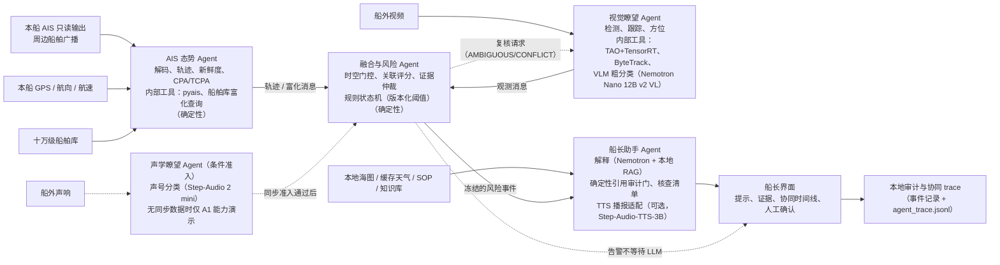

# 海事离线 AI 中枢：项目定义与验证计划 v0.4

> 队伍：念头通达
>
> 赛事：NVIDIA DGX Spark 黑客松（2026-07-12 ～ 2026-07-22）
>
> 文档日期：2026-07-14（v0.4 审计边界与 TTS 裁决固化）
>
> 当前阶段：架构冻结（4+1 Agent），进入主干实施与评分切片执行
>
> 决策口径：以《选题评分系统 v0.3》与**赛事官方评审标准**双重对齐；未经验证的能力不得按已实现表述
>
> 配套执行文件：[《实施切片与验收手册 v0.4》](./海事离线AI中枢_实施切片与验收手册_v0_4.md)

**v0.4 变更摘要**（审计边界与 TTS 裁决固化；v0.3 摘要见上一版文档）：

1. **冻结解释上屏授权链**：确定性告警事实即时上屏；LLM 的 `ExplanationDraft` 仅在服务端缓冲，完整解析并通过确定性引用审计门后，解释才可进入 UI；禁止未审原始 token 流上屏。
2. **拆分生成与审计权责**：`audit_status` 从 LLM 输出 schema 移除，改由确定性校验器生成 `AuditResult`；UI 只信任校验器封装的最终结果，模型不得给自己盖章。
3. **限定可选同模型复核 pass**：仅当截至 D7 的全部必做切片与演示门槛全绿时才可考虑；它不是第二 Agent，不拥有最终审计权，也不作为多 Agent 得分载体；确定性门始终是唯一上屏授权者。
4. **TTS 探针执行化**：Step-Audio 2 mini 通过 SP0 后才可启动 Step-Audio-TTS-3B；P2 探针从拉取命令发起起算，下载、加载到首个可播放 WAV 共用 30 分钟 wall-clock，超时即停且 D8 前不重试。
5. **收紧 TTS 兜底口径**：TTS 不作为 SP0 门槛；仅探针 `PASS` 后才有资格成为 A1/演示的条件保险，失败或超时均静默退出主线。

---

## 1. 执行摘要

本项目定位为：

> **面向外海弱网与离线环境的、本地多模态航海态势感知（Situational Awareness，SA）与船长决策辅助中枢。**

系统从本船已有设备的只读接口持续接收 AIS、本船定位与航行状态，同时分析船外视频和船外声响；它将合作式数字报告与独立物理观测按时间、空间和置信度关联，形成可追溯的周边态势。当出现接近风险、未知目标或跨模态证据冲突时，系统向船长或值班驾驶员展示依据，请求人工瞭望，并提供受海图、规则和船方 SOP 约束的决策参考。

目标架构中的核心推理和数据处理在 DGX Spark 本地运行，不依赖云端 API。网络可用时只用于增量更新天气、航行警告和资料；断网后，已缓存数据和船载实时传感器仍可支持降级运行。全部感知、推理与生成模型锁定 **NVIDIA 与 Stepfun（阶跃星辰）官方开源生态**：视觉与语言推理采用 NVIDIA Nemotron 系列（TAO/TensorRT/NeMo 工具链），听觉理解与语音播报采用 Stepfun Step-Audio 系列；检测器微调与全部推理均在 Spark 单机完成，体现"同一台机器上训练 + 推理"的平台全栈能力。

系统不是自动驾驶、自动避碰或认证导航设备，不控制舵机和主机，不替代法定瞭望，最终判断与操作责任始终属于船长和值班人员。

英文定位：

> **A local-first multimodal maritime situational-awareness and decision-support copilot for vessels operating in weak-connectivity and disconnected waters.**

---

## 2. 已经形成的项目共识

### 2.1 已确认

- 目标用户是船长和值班驾驶员，产品角色是 SA 与决策辅助。
- 核心场景是外海弱网或断网下的 24/7 本地值守。
- AIS 与视频目标关联是当前最可信的主链路。
- 多模态价值来自不同传感器的“能力差”，而不是同一个模型扮演多个角色。
- 系统必须输出证据来源、数据时间、置信度和降级状态，而不只给结论。
- 采用人工在环：系统提示风险、请求人工瞭望、解释依据，不自动执行操船动作。
- 团队具备专业海事监测人员、真实航路数据、AIS 数据及十万级船舶数据资源。
- 模型全部选用 NVIDIA 与 Stepfun 官方开源模型（详见 §4.1），微调与推理均在 DGX Spark 本地完成。
- 系统以 **4+1 多智能体架构**表述与实现：四个异构主链 Agent（AIS 态势、视觉瞭望、融合与风险、船长助手）+ 一个受数据准入控制的声学瞭望 Agent；各 Agent 满足 §4.0 操作性定义，之间只通过结构化消息通信并全程落盘 trace；身份富化、场景理解 VLM、引用校验、TTS 为 Agent 内部工具。
- FVessel 公开基准数据集（同步 AIS + 视频 + 相机标定 + 融合真值）作为 G0 保险数据源与定量评估集；自有同步样本作为 demo 叙事首选。
- LLM 解释 + **确定性引用审计门**为 MVP 必做项（评分关键路径）；十万级船舶库经 AIS 态势 Agent 的身份富化工具进入融合证据链。

### 2.2 明确不做

- 不接入雷达：雷达数据敏感，当前无法获得合法、稳定的数据接口。
- 不做船内人员冲突识别。
- 不宣称自动避碰、自动航线控制或取代驾驶台值班。
- 不让 LLM 自由生成转向、变速或避碰命令。
- 不把第三方互联网 AIS API 当作船载离线 AIS 的替代品。
- 不以“IMO 认证的 e-navigation 系统”对外宣传。
- 不使用 NVIDIA 与 Stepfun 官方开源生态之外的第三方大模型（确定性算法、工具库如 pyais/ByteTrack 不受此限）。

### 2.3 仍待验证

- 是否能取得同一时间、同一海域的 AIS 与船外视频样本，以及二者的时间同步质量。
- 是否能取得船外麦克风或既有声响接收系统的数据输出。
- 船上天气数据的实际来源、字段、更新方式、使用授权和离线缓存格式。
- 目标船舶 AIS 品牌型号、只读接口、输出报文和现场接入授权。
- 海事专家能否给出可测试的风险阈值、异常标签和处置边界。
- 多模型在 DGX Spark 上的吞吐、延迟、显存/统一内存占用及长期稳定性。

### 2.4 评分对齐矩阵（v0.3 修订）

赛事官方评审标准共六项。本项目每一项的得分载体、文档锚点与不可裁剪项如下；**标注"不可裁剪"的项目在任何进度压力下都不得移出 MVP**。

| 评审标准 | 权重 | 本项目得分载体 | 锚点 | 是否可裁剪 |
|---|---:|---|---|---|
| 项目实用性、行业落地价值与技术创新性 | 25% | 外海弱网 SA 真实痛点；异构证据互验 + 诚实降级的创新架构；商业落地路径（手册 §21 五级） | §3、§4 | 主干不可裁剪 |
| 智能体融合与模型优化技术深度 | 25% | **4+1 异构 Agent 协同，以 S4–S5 协同 trace 为主要证据**（跨 Agent 结构化消息链，含融合→视觉复核请求，可回放）；S6 解释 Agent + 确定性引用审计门（可核验解释的差异化）；**SF1 三层模型调优**（微调 / TensorRT / 工作点） | §4.0、§4.1、手册 S4/S6/SF1 | **协同 trace、S6 与 SF1 不可裁剪** |
| 项目完整性 | 20% | MapLibre 前端 + WebSocket 后端；切片验收证据体系；一键启动/重置演示 | 手册 §3、S7 | 不可裁剪 |
| 平台适配性 | 15% | 全栈 NVIDIA（TAO 微调、TensorRT/vLLM 推理、Nemotron 系列）+ Stepfun（**主选 Step-Audio 2 mini**；Step-Audio-TTS-3B 仅在 SP0 限时探针 `PASS` 后成为平台适配保险）；Spark 单机训练+推理 | §4.1、手册 SP0/SF1 | **双生态出场不可裁剪** |
| 演示效果（Demo 视频） | 10% | 90 秒主闭环 + iptables 断网高光 + 微调前后对比镜头 + 协同 trace 动画 + 能力演示段 | 手册 V1 | 不可裁剪 |
| 赛事征文（十日谈） | 5% | 每日开发日志（验收证据目录即素材），D9 汇编 | 手册 E1 | 不可裁剪 |

> 解读：第 2、4 两项合计 40% 的权重由四个载体承接——**S4–S5 协同 trace、S6 解释+审计门、SF1 三层调优、双生态模型出场**。这四者是"不做就直接丢分"的硬载体，优先级等同主干；评分评的是协同质量与调优深度，不是 Agent 数量——这正是 v0.3 收敛的依据。

---

## 3. 用户问题与产品价值

外海值班具有四个同时存在的约束：

1. 网络不稳定，云端模型和在线数据源无法成为安全链路的前提。
2. AIS、视频、声音、海图和天气分散在不同设备与界面中。
3. 人员需要长时间持续注意，真正危险的事件稀少但不能漏掉。
4. AIS 是合作式报告，存在缺失、延迟、误填、关闭或伪造的可能。

产品价值不是“替船长开船”，而是：

> **在云端不可用、信息分散、人员注意力有限时，持续把异构证据整合成来得及看、看得懂、能核验、可追责的航行态势。**

商业化可优先面向船东、船队运营方和船载设备集成商，以每船软件许可、边缘设备集成、运维与模型更新服务收费。真实价值需要用误报次数、风险发现提前量、人工确认时间和离线可用率证明，而不是仅以模型准确率证明。

---

## 4. 系统边界与总体架构

### 4.0 什么算一个 Agent（操作性定义，v0.3 新增）

本项目中，称为 Agent 的组件必须同时满足五条判据：

1. **独立状态**：维护自己的持久或会话状态（轨迹库、证据库、事件状态机、对话上下文），不是无状态函数；
2. **独立数据源或能力**：拥有其他 Agent 不具备的传感器数据或专属能力面；
3. **结构化消息契约**：输入输出为版本化 schema 的结构化消息，不以自由文本传递事实；
4. **事件驱动激活**：可由数据到达、状态变化或其他 Agent 的请求触发，并能主动向其他 Agent 发起请求；
5. **可单独降级**：失效时输出显式降级状态，主链其余部分继续运行。

**Agent ≠ LLM**：AIS 态势与融合与风险是确定性 Agent，船长助手是生成式 Agent（其审计门仍是确定性工具），声学瞭望是感知模型 Agent——"能力差而非角色差"是本架构的差异化主张。据此，身份富化（按目标查询）、场景理解 VLM（按复核请求推理）、引用校验器（精确匹配）、TTS（输出适配）均为 **Agent 内部工具**：它们无独立状态、不主动发起协作，不冠以 Agent 之名。若全绿门槛后启用共权重、异系统提示的额外推理，它也只能称为**可选同模型复核 pass**，属于船长助手 Agent 内部推理步骤，不新增 Agent、不承担最终审计。

全文统一口径：**四个异构主链 Agent（AIS 态势、视觉瞭望、融合与风险、船长助手）+ 一个受数据准入控制的声学瞭望 Agent；身份富化、场景理解 VLM、引用校验、TTS 为 Agent 内部工具。**

### 架构图



架构原则：

- **感知与计算分层**：AIS 解码、CPA/TCPA 和规则判断采用确定性逻辑；视频与音频使用专业感知模型；LLM 负责解释、检索和组织信息。
- **多智能体协同（v0.4 固化）**：4+1 架构，每个 Agent 满足 §4.0 五条判据；Agent 间只通过结构化消息通信，全部跨 Agent 消息落盘 `agent_trace.jsonl`，形成可回放的协同证据链；融合与风险 Agent 在证据模糊或冲突时**主动向视觉瞭望 Agent 发起复核请求**——"一个 Agent 的发现触发另一个 Agent"是本项目多智能体协同的可展示形态。确定性告警字段不等待 LLM；`ExplanationDraft` 仅在服务端缓冲，完整解析并通过确定性引用审计门后才可上屏，未审原始 token 流不得进入 UI。
- **本地优先**：核心闭环不调用云 API，弱网仅用于可中断、可恢复的数据更新。
- **状态常驻**：系统持续维护目标轨迹、数据年龄和事件状态，不是一次性问答。
- **证据优先**：每条告警保留原始来源、时间戳、关联过程和置信度。
- **失败可见**：数据过期、传感器缺失或模态冲突时显示降级，不伪装成确定结论。

### 4.1 模型选型与内存预算（v0.3 修订，全部锁定 NVIDIA + Stepfun 官方开源生态）

按 4+1 Agent 组织；"└ 工具"行为该 Agent 的内部工具，不是独立 Agent。

| Agent / 内部工具 | 职责 | 模型 / 实现 | 生态 | 量化与内存估算 | 激活模式 |
|---|---|---|---|---|---|
| **AIS 态势 Agent** | 解码、轨迹、新鲜度、CPA/TCPA | 确定性逻辑 + pyais 库 | — | 可忽略 | 常驻，事件驱动 |
| └ 工具：身份富化 | MMSI→注册船型/尺寸交叉验证 | 确定性查询（十万级船舶库） | — | 可忽略 | 按目标触发 |
| **视觉瞭望 Agent** | 船舶检测与跟踪、画面方位 | NVIDIA TAO 预训练检测器（DINO 系）+ ByteTrack，导出 TensorRT 引擎；SF1 微调对象 | NVIDIA | 引擎约 1–3 GB | 常驻，逐帧 |
| └ 工具：VLM 粗分类 | 粗船型 / 场景描述证据 | Nemotron Nano 12B v2 VL（NVFP4-QAD，社区已有 Spark/vLLM 运行手册） | NVIDIA | 约 7–9 GB | 按融合复核请求触发，不逐帧 |
| **融合与风险 Agent** | 时空门控、关联评分、证据仲裁、规则状态机 | 确定性逻辑（版本化阈值） | — | 可忽略 | 事件驱动 |
| **船长助手 Agent** | 告警解释、核查清单、人工确认交互 | 默认 Nemotron-3-Nano-30B-A3B（MoE 稀疏激活，NVFP4，解码快、契合带宽约束）；备选 Nemotron Nano 9B v2（官方 DGX Spark NIM 容器） | NVIDIA | NVFP4 约 16–18 GB / 约 6–8 GB | 按告警触发，≤150 token；草稿服务端缓冲 |
| └ 工具：引用审计门 | 解释中数字/引用溯源精确校验；生成 `AuditResult` | **确定性校验器（零模型）** | — | 可忽略 | 完整草稿生成后同步校验；唯一上屏授权者 |
| └ 工具：TTS 播报（可选加分） | 告警语音 | Step-Audio-TTS-3B（ModelScope 开源） | Stepfun | 约 4–6 GB | 仅 SP0 限时探针 `PASS` 后启用；按告警触发，失败静默降级 |
| **声学瞭望 Agent（条件准入）** | 雾号等规则化声号分类 | Step-Audio 2 mini（端到端音频理解，可处理非语音信号，ModelScope 开源） | Stepfun | 约 8–16 GB | A1 能力演示时段加载；同步准入通过后进主融合 |

内存纪律（v0.4）：常驻核心（检测引擎 + 解释 LLM）约 **18–21 GB**（v0.2 为 25–30 GB，差额来自移除独立审计模型 6–9 GB）；全量峰值（含 VLM、音频、TTS 同时加载）约 **45–58 GB**，远低于 128 GB 统一内存的 80% 上限。**错峰激活**仍是硬约束的应对：视觉逐帧持续、不能让路；LLM 全部按事件触发、短输出，解释草稿在服务端完成审计后再上屏；同一时刻至多一个大 LLM 处于解码状态。所有估算以 SP0 实测为准并写入 `configs/models.yaml`（含生态归属字段）。

> 型号说明：以上型号均已核实为官方开源且有 Spark/aarch64 可行性证据（Nemotron Nano 9B v2 有 DGX Spark 专用 NIM 容器，保留为解释 Agent 备选；Nemotron 系列有官方 Spark 部署指南；Nano 12B v2 VL 的 NVFP4 量化版有社区 Spark 运行手册；Step-Audio 2 mini 与 TTS-3B 在 ModelScope 开源）。SP0 若实测某型号不可用，按同生态内就近降级并记录，不引入第三方生态模型。

---

## 5. AIS 离线接入与态势计算

### 5.1 正确的接入方式

AIS 是在海事 VHF 上运行的自主连续广播系统。产品通常不是逐艘“轮询”周围船舶，而是从本船经过认证的 AIS 设备持续读取其已经接收到的数据流。

推荐链路：

```text
周围船舶 AIS 广播
        ↓ VHF
本船经过认证的 AIS 设备
        ↓ 厂商认可的只读隔离接口
AIVDM / AIVDO 数据流
        ↓
本地解码、轨迹维护和多模态融合
```

- `AIVDM`：本船设备收到的其他 AIS 目标报文。
- `AIVDO`：本船自身 AIS 报文。
- 真实部署应使用 IEC 61162/NMEA 0183 等标准船载接口或厂商认可的隔离网关。
- AI 不修改 AIS 配置、不代发报文、不主动询问其他 AIS 站点，也不插入认证导航设备的关键传输链路。

### 5.2 AIS 能提供什么

| 信息类别 | 代表字段 |
|---|---|
| 身份 | MMSI、船名、呼号、IMO 编号 |
| 船型与船体 | 船型、船长、船宽、定位天线参考位置 |
| 动态航行 | 经纬度、SOG、COG、船首向、转向率、航行状态、报告时间 |
| 航次 | 目的港、ETA、吃水等，视设备类别和报文完整性而定 |

这些字段是船方设备广播的合作式声明，不是经过密码学认证的绝对真值。系统必须允许身份缺失、数据误填、重复 MMSI、报告过期和故意伪造等情况存在。

### 5.3 为什么不能按固定帧率处理

AIS 的报告周期会随船速、转向和设备类别变化。Class A 的典型标称周期包括：

| 状态 | 位置报告周期 |
|---|---:|
| 锚泊/系泊且不超过 3 节 | 3 分钟 |
| 0–14 节 | 10 秒 |
| 0–14 节且转向 | 3⅓ 秒 |
| 14–23 节 | 6 秒 |
| 14–23 节且转向 | 2 秒 |
| 超过 23 节 | 2 秒 |

因此，视频关联不能直接使用“最后一个 AIS 坐标”，而应：

1. 读取报告时间、SOG、COG、航行状态和转向率；
2. 把 AIS 目标外推到视频帧时间；
3. 根据数据年龄和预期报告周期计算新鲜度；
4. 随数据变旧扩大位置不确定区域；
5. 再与视频目标的方位和运动轨迹进行关联。

第三方数据库和 API 可能进行降采样、聚合或延迟转发，不能用其到达频率代表船载原始 AIS 发射频率。

---

## 6. 异构多模态瞭望

| 模态 | 独有能力 | 主要盲区 |
|---|---|---|
| AIS | 身份、位置、速度、航向、CPA/TCPA 基础 | 非 AIS 目标、误填、延迟、关闭或伪造 |
| 视频 | 物理存在、外观、画面方位和连续轨迹 | 雾、黑夜、遮挡、单目精确测距不足 |
| 船外音频 | 雾中仍可能有效、号笛模式和声源方向 | 风噪、机噪、反射、重叠声源、难以确定身份和距离 |
| 海图/天气 | 航行约束与环境风险语义 | 依赖数据完整性、新鲜度和授权 |

### 6.1 视觉关联

AIS 提供“目标声称自己是谁、在哪里、如何运动”；视频提供独立物理观测。关联至少需要：

- 本船时间、位置和航向；
- 摄像头内参、安装方向和视场角；
- AIS 目标外推位置及从本船计算的方位；
- 视频目标的画面方位和连续轨迹；
- 随数据年龄变化的不确定性门限。

没有完成时间同步和摄像头标定时，只能称为两个信息面板，不能称为融合。

### 6.2 听觉瞭望

航海规则中的听觉瞭望主要关注具有航行意义的船外声响，例如能见度受限时的雾号、操纵与警告声、锚泊/搁浅声号和遇险信号。全封闭驾驶台可使用声响接收系统，把船外声音传入驾驶台并显示大致来向。

比赛原型可验证：

- 有限集合的规则化号笛模式识别（声学瞭望 Agent，Step-Audio 2 mini）；
- 左/右、前/后或方位扇区级声源方向（**仅在取得真实麦克风阵列/多通道数据时**；公开单通道录音只做类型识别，不做方向）；
- 与同时间 AIS 方位、视频目标的交叉验证（仅在取得同步音频时）；
- 证据不一致时的人工瞭望请求。

音频保持两条路径：**同步路径**（取得与主场景时间对齐的船外音频→通过数据准入→声学瞭望 Agent 进入主融合）与**能力演示路径 A1**（使用公开真实船舶声号录音，明确标注"与主场景未同步"，仅演示 Step-Audio 2 mini 的声号分类能力，不进入融合主张）。无论哪条路径，Stepfun 音频模型都必须出场（评分对齐，§2.4）。

VHF 语音识别暂不进入 MVP：它涉及口音、频道噪声、通信纪律、隐私和更复杂的误识别责任。

### 6.3 融合结果必须允许三种结论

1. **证据一致**：AIS、视频或音频在时间和方位上互相支持。
2. **证据不足**：只有单一来源，保留目标但降低结论强度。
3. **证据冲突**：不同模态不一致，明确显示冲突并请求人工核验。

对于仅由视频或音频发现、没有 AIS 的非合作目标，在没有雷达或可靠测距传感器时，系统只能报告大致方位、视觉/声学证据和人工瞭望请求，不得声称精确距离、CPA/TCPA 或碰撞概率。

---

## 7. 天气、海图与 e-navigation 边界

### 7.1 天气数据必须拆分

| 数据类型 | 作用 | 离线边界 |
|---|---|---|
| 本船实时观测 | 当前风速、风向、气压、温度、能见度及趋势 | 船载传感器可本地持续提供，具体接口待确认 |
| 航路天气预报 | 未来风、浪、流及危险时间窗口 | 需要预先缓存或弱网间歇更新 |
| 海事安全信息 | 气象警报、航行警告 | 可来自 NAVTEX、SafetyNET 或船方既有服务，视船舶配置而定 |

当前观测只能说明“现在发生什么”，不能单独支持“未来某时刻某航段进入危险窗口”。若没有带发布时间、有效时间和空间位置的预报，系统必须降级为当前风险与短时趋势提示。

天气适配层至少统一以下字段：数据来源、接收时间、发布时间、有效时间、空间位置、关键气象要素、质量标记和过期状态。比赛阶段取得一份真实代表性文件或数据流即可验证适配路径，但在接口未确认前，天气危险窗口不能作为已完成的主闭环。

### 7.2 e-navigation 的正确表述

IMO e-navigation 是覆盖船上、岸上、通信、信息整合和呈现的总体战略，不是一个保证断网工作的单一产品或认证标签。本项目可以表述为：

> **遵循 e-navigation 的船载信息整合、人本设计、可靠性和韧性原则，采用本地优先、弱网可用、断网降级架构。**

不得表述为“获得 IMO e-navigation 认证”或“e-navigation 保证完全离线”。

---

## 8. 船长决策助手与责任边界

系统可输出：

- 风险目标的相对方位、数据年龄、CPA/TCPA 和证据置信度；
- AIS 与视频/音频是否关联，以及关联依据；
- 未知目标或跨模态冲突；
- 请求人工瞭望和核查清单；
- 根据本地海图、缓存天气和专家规则计算的危险时间窗口；
- 在预先批准的航段或避险走廊中进行排序，并解释约束。

系统不可输出或执行：

- 未经规则约束、由 LLM 自由生成的转向或变速命令；
- 自动舵、主机或航线控制；
- 对非合作目标的虚假精确距离或碰撞概率；
- “已确保安全”“可替代瞭望”等保证性结论；
- 静默压制不确定或冲突证据。

建议的提示形式：

> 左前方 AIS 目标预计 8 分钟后进入设定 CPA 阈值；AIS 数据年龄 4 秒，视频关联置信度 91%。请人工确认瞭望。依据：AIS 轨迹、视频目标 #17、本船航向与当前阈值配置。

---

## 9. 参赛 MVP 与 90 秒核心闭环

### 9.1 MVP 范围

**必须完成：**

- 本地 AIS 原始数据实时回放与解析；
- 目标轨迹、数据新鲜度、位置外推和 CPA/TCPA；
- 至少一个 AIS–视频目标关联场景（融合证据含 AIS 态势 Agent 身份富化工具的船库交叉验证）；
- 证据、置信度、数据年龄和降级状态的可视化（MapLibre 态势界面，本地底图断网可渲染）；
- 风险提示、人工确认与本地事件审计；
- **解释 Agent + 确定性引用审计门闭环**（评分关键路径，不可裁剪；审计徽章上屏，模板回退仅为运行时保险）；
- **协同 trace 可回放**：S4 起全部跨 Agent 消息（含融合→视觉复核请求）落盘 `agent_trace.jsonl`，主场景消息链可完整回放（评分关键路径，不可裁剪）；
- **SF1 三层模型调优**：同一冻结验证集（按视频段/场景隔离划分）上的微调前后对比 + TensorRT 前后延迟/FPS + 工作点消融（评分关键路径，不可裁剪）；
- **双生态模型出场**：NVIDIA（检测/VLM/解释）与 Stepfun（主选 Step-Audio 2 mini）各至少一个模型在最终演示中真实运行；
- DGX Spark 上的本地推理和性能测量。

**取得真实输入后再纳入（同步路径）：**

- 船外号笛识别与声源方向进入融合主张（声学瞭望 Agent 通过数据准入）；
- 天气危险窗口和航段排序。

**无同步输入时的保底路径：**

- A1 音频能力演示（Step-Audio 2 mini，公开真实录音，明确标注未同步，不进入融合主张）；
- 语音播报（船长助手 Agent 的 TTS 适配器，Step-Audio-TTS-3B）仅在 SP0 限时探针 `PASS` 后作为可选加分项；失败或超时静默降级，不得挤占主线。

**本次不做：**

- 雷达融合；
- 自动操船；
- 船内人员冲突识别；
- VHF 自由语音理解；
- 完整 ECDIS 或认证导航系统替代。

### 9.2 90 秒固定回放

90 秒是从异常出现到判断、行动和结果可见的核心价值闭环，不是指路演只能讲 90 秒。

| 时间 | 演示事件 |
|---:|---|
| 0–15 秒 | 展示系统处于离线模式，AIS、视频和本船状态在本地持续输入 |
| 15–35 秒 | 一艘 AIS 目标进入关注范围，系统显示自适应数据新鲜度和外推轨迹 |
| 35–50 秒 | 视频检测到对应目标，完成时间与方位关联（如触发复核请求，协同时间线可见） |
| 50–65 秒 | CPA/TCPA 或证据冲突触发风险提示，展示原始证据和置信度 |
| 65–80 秒 | 系统请求人工瞭望；船长确认或驳回关联结果 |
| 80–90 秒 | 风险态势更新，事件、人工决定和模型依据写入本地审计记录 |

若取得同步音频，可在 35–65 秒加入“雾号方向与 AIS 方位一致”或“有声响但无 AIS”的第二物理证据。天气与航路建议应作为第二场景，不要挤入尚未验证的主闭环。

---

## 10. 评估指标

| 模块 | 核心指标 |
|---|---|
| AIS 接入 | 报文解析成功率、目标轨迹连续性、数据年龄识别准确性 |
| 轨迹预测 | 不同数据年龄下的位置外推误差、CPA/TCPA 误差 |
| 视频感知 | 目标检测召回率、误报率、跟踪稳定性、处理帧率 |
| AIS–视频融合 | 正确关联率、错误关联率、未匹配率、关联延迟 |
| 多智能体协同 | 主场景跨 Agent 消息链完整率、复核请求触发与响应延迟、trace 可回放性 |
| 音频（如纳入） | 声号分类准确率、方向扇区准确率、风噪下误报/小时 |
| 告警 | 发现提前量、端到端延迟、误报/小时、人工确认时间 |
| 本地运行 | Spark 推理延迟、吞吐、峰值内存、持续运行稳定性 |
| 模型调优（SF1） | 三层证据：L1 微调前后 mAP/召回/误报（场景隔离冻结验证集，绝对值 + 相对值并报）；L2 TensorRT 前后延迟/FPS/内存；L3 工作点消融曲线；训练在 Spark 完成的资源记录 |
| 解释与审计 | 确定性告警事实上屏 P95 延迟、经审计解释完整上屏延迟、输出 token 预算符合率、审计门溯源通过率（100%，构造性保证 + 实现验证）、注入对抗样本拦截率（20/20） |
| 双生态出场 | 演示中真实运行的 NVIDIA / Stepfun 模型清单与版本（`models.yaml` 留证） |
| 安全与审计 | 告警证据完整率、过期数据显式标记率、人工确认留痕率 |

评估集应由海事专家标注“目标是否匹配、风险是否成立、提示是否可行动”，并保留专家分歧，不把单一模型判断当作真值。

---

## 11. 硬门槛现状

依据《选题评分系统 v0.3》，本项目在硬门槛层面当前最多只能进入“24 小时验证”，还不能直接认定为优先项目；最终建议仍需完成 12 项会议评分后由评分表给出。

| 门槛 | 当前状态 | 说明 |
|---|---|---|
| G1 数据 48h 可用 | 保险已落实、自有样本待验证 | AIS/航路资源较强；FVessel 公开数据集（26+ 段视频 + 同步 AIS + 完整相机标定 + 逐秒融合真值）已确认为保险数据源与评估集；自有同步样本仍为 demo 叙事首选 |
| G2 异常 48h 可定义 | 待验证 | CPA/TCPA、数据过期和跨模态冲突可定义；阈值与标签需专家确认 |
| G3 前 72h 最小链路 | 待验证 | 架构清楚，尚无完整数据→模型→界面回放证据 |
| G4 核心闭环 ≤90 秒 | 方案通过、实测待验证 | 固定剧本已明确，需真正跑通计时 |
| G5 Spark 技术路径 | 型号路径已核实、实测待验证 | 全部型号有 Spark/aarch64 可行性证据（NIM 容器、官方部署指南、社区运行手册）；吞吐/内存/稳定性由 SP0 实测 |
| G6 安全与责任边界 | 原则通过 | 人工在环、只读接入、禁止自动操船等边界已明确 |

---

## 12. P0 / P1 风险

### 12.1 P0：不解决就不能成立

1. **没有可合法使用的同步 AIS–视频样本**：无法证明核心融合能力。→ 缓解：FVessel 公开数据集为保险数据源（岸基固定相机场景，含标定与融合真值）；触发保险时"本船"退化为位置已知的固定相机，属算法更简单的特例，对外叙事须如实说明。
2. **目标船舶没有可用的 AIS 只读接口或授权**：商业部署路径不成立（不影响比赛原型）。
3. **时间同步、摄像头标定和本船航向不可靠**：无法完成真实空间关联。→ FVessel 自带完整相机参数，保险路径下此风险消除。
4. **没有专家确认的异常定义和评价真值**：告警无法透明评估。→ FVessel 自带逐秒融合真值，可作评估集底线；专家标注仍用于自有场景。
5. **DGX Spark 无法满足最低实时性或持续运行要求**：竞赛技术路径不成立。
6. **把天气列为主能力但拿不到预报输入**：危险窗口将沦为演示假数据；应及时降级出 MVP。
7. **评分关键载体缺席**（v0.3 修订）：SF1 三层调优、S6 解释+审计门、S4–S5 协同 trace、双生态模型出场四者中任一缺席，将直接损失"智能体融合与模型优化 25%"与"平台适配 15%"的对应权重——它们与主干同级，不得因进度压力裁剪。

### 12.2 P1：可以降级，但会削弱价值

- 无雷达使非 AIS 目标缺少可靠距离和 CPA/TCPA。
- 风噪、机噪和声学反射降低号笛分类与测向可靠性。
- AIS 误填、关闭、伪造、漏收和第三方数据延迟造成身份或轨迹偏差。
- 密集船流中多个目标方位接近，容易发生错误关联。
- 长期运行可能产生告警疲劳，必须控制误报/小时并支持分级。
- 天气数据过期或字段不完整时，系统必须显式降级。
- 解释 Agent 在带宽受限下可能超出延迟预算：应对为 ≤150 token 输出上限 + MoE 稀疏激活模型优先；确定性告警事实先行，LLM 草稿服务端缓冲并在总时限内审计，超时直接回退确定性模板，禁止以原始 token 流绕过审计门。
- SF1 微调可能无正收益：应对为三层调优证据结构，L2 TensorRT 与 L3 工作点消融保证调优深度证据不悬空；L1 负结果如实报告。
- 若宣传措辞接近“自动避碰”或“IMO 认证”，会引入不必要的法规与责任风险。

---

## 13. 下一轮 24/48/72 小时验证计划

### 24 小时：冻结真实输入与测试定义

- 确认一段可使用的 AIS 原始报文和同步船外视频；记录授权、时间基准和坐标信息。
- 确认目标船 AIS 型号、只读输出接口或可用于替代验证的报文格式。
- 由海事专家标注至少一个正确关联、一个无 AIS 目标或一个风险事件。
- 确认船外音频和天气是否能在 24 小时内取得；不能则将对应能力退出本轮 MVP，保留 AIS–视频主闭环。
- 固定第一版风险阈值、禁用动作和人工确认流程。

### 48 小时：跑通最小链路

- AIS 解码→轨迹状态→数据新鲜度→位置外推。
- 视频检测/跟踪→画面方位。
- 完成一个时间和方位关联，输出置信度。
- 完成风险提示→人工确认→事件留痕。
- 记录第一轮错误案例，不以手工挑选成功样本代替评估。

### 72 小时：迁移 Spark 并实测演示

- 在遵守项目安全自检与内存纪律的前提下部署到 DGX Spark。
- 测量模型加载内存、端到端延迟、处理帧率和持续运行稳定性。
- 跑通并录制 90 秒固定回放。
- 更新证据索引和评分表；没有新证据的评分不得提高。

### 72 小时之后：D4–D10 排期（v0.3 修订，覆盖全部十天赛程）

| 日程 | 主要工作 | 对应评分项 |
|---|---|---|
| D4 | SF1 微调训练启动（长任务尽早发射）；S6 审计门实现与对抗注入测试；协同 trace 落盘与回放脚本 | 智能体融合与调优 25% |
| D5 | SF1 L1 评测 + L2 TensorRT 引擎回填 S3；A1 音频能力演示（Step-Audio 2 mini） | 调优 25% + 平台 15% |
| D6 | 定量评估补样本（FVessel 10+ encounter）；SF1-L3 工作点消融批处理；性能压测与内存基线复测 | 实用性 25% + 完整性 20% + 调优 25% |
| D7 | 全链路彩排（一键启动/重置 ×3）；缓冲与缺陷修复 | 完整性 20% |
| D8 | V1 Demo 视频制作（脚本、录制、剪辑、配音） | 演示效果 10% |
| D9 | E1 十日谈汇编成文；提交包按 §2.4 矩阵逐项自检 | 征文 5% + 全项 |
| D10 | 缓冲、最终提交 | — |

> 十日谈日志从 D3（2026-07-14）起每日记录并回补 D1–D2；验收证据目录（`results/acceptance/`）即日志素材，不额外增负。

---

## 14. 最终对外表达

### 一句话

> 我们为外海弱网和断网船舶构建一个 24/7 本地运行的多模态 AI 瞭望中枢：它持续融合 AIS、船外视频和航行声响，用彼此独立的证据帮助船长更早发现风险、核验目标并作出决定。

### 三句话

> AIS 告诉我们目标声称自己是谁、在哪里、如何运动；摄像头和船外声音提供独立的物理观测。系统在 DGX Spark 上持续完成时间对齐、目标关联、风险计算和本地解释，即使断网也能工作。它不接管船舶，而是把每条提示的来源、不确定性和人工确认过程透明地呈现给船长。

### 核心差异化

> **不是把多个模型放在一起，而是让身份、视觉和声学三种具有不同盲区的证据相互验证，并在证据不足或冲突时诚实降级。**

### 平台与生态表述（v0.3 修订）

> 全部模型来自 NVIDIA 与阶跃星辰官方开源生态：视觉检测用 NVIDIA TAO 微调并以 TensorRT 部署，场景理解与解释用 Nemotron 系列，听觉理解与语音播报用 Step-Audio 系列；检测器微调与全部 Agent（四个主链 Agent 与声学瞭望 Agent）的推理在同一台 DGX Spark 上完成——128 GB 统一内存让"训练 + 多模型常驻推理"在单机闭环。

### 多智能体表述（v0.3 新增，答辩统一口径）

> 四个异构主链 Agent 协同——AIS 态势 Agent 知道目标"声称自己是谁、如何移动"，视觉瞭望 Agent 看到真实物理目标，融合与风险 Agent 仲裁证据一致、缺失与冲突并在模糊时主动请求视觉复核，船长助手 Agent 把结果转成经确定性审计门核验的可行动信息——外加一个受数据准入控制的声学瞭望 Agent 提供第三种独立感官。全部协同过程以结构化消息落盘，可逐条回放。

---

## 15. 主要参考资料

- [IMO：《1972 年国际海上避碰规则公约（COLREGs）》](https://www.imo.org/zh/about/conventions/pages/colreg.aspx)
- [IMO：e-navigation 总览](https://www.imo.org/en/ourwork/safety/pages/enavigation.aspx)
- [IMO：e-navigation Strategy Implementation Plan](https://wwwcdn.imo.org/localresources/en/OurWork/Safety/Documents/enavigation/MSC.1-Circ.1595%20-%20E-Navigation%20Strategy%20Implementation%20Plan%20-%20Update%201%20%28Secretariat%29%20%282%29.pdf)
- [IMO MSC.86(70)：声响接收系统性能标准](https://wwwcdn.imo.org/localresources/en/KnowledgeCentre/IndexofIMOResolutions/MSCResolutions/MSC.86%2870%29.pdf)
- [USCG：Automatic Identification System Overview](https://www.navcen.uscg.gov/automatic-identification-system-overview)
- [USCG：How AIS Works](https://www.navcen.uscg.gov/how-ais-works?pageName=AISReferences)
- [ITU-R M.1371-6：AIS 技术特性与报告周期](https://www.itu.int/dms_pubrec/itu-r/rec/m/R-REC-M.1371-6-202602-I%21%21PDF-E.pdf)
- [IALA：AIS VDM/VDO 展示接口示例](https://www.iala.int/wiki/ialanet/index.php/Online_Data)
- [FVessel：AIS–视频融合基准数据集（含相机标定与逐秒融合真值）](https://github.com/gy65896/FVessel)
- [DeepSORVF / FVessel 论文（IEEE TITS 2023）](https://arxiv.org/abs/2302.11283)
- [NVIDIA：Nemotron 家族 DGX Spark 部署指南](https://build.nvidia.com/spark/nemotron)
- [NVIDIA：Nemotron Nano 12B v2（Hugging Face 模型卡）](https://huggingface.co/nvidia/NVIDIA-Nemotron-Nano-12B-v2)
- [Stepfun：Step-Audio 2 mini（ModelScope）](https://www.modelscope.cn/models/stepfun-ai/Step-Audio-2-mini)
- [Stepfun：Step-Audio2 GitHub](https://github.com/stepfun-ai/Step-Audio2)
- [本项目：《选题评分系统 v0.3 · 会议操作手册》](./选题评分系统_会议使用说明_v0.3.md)
