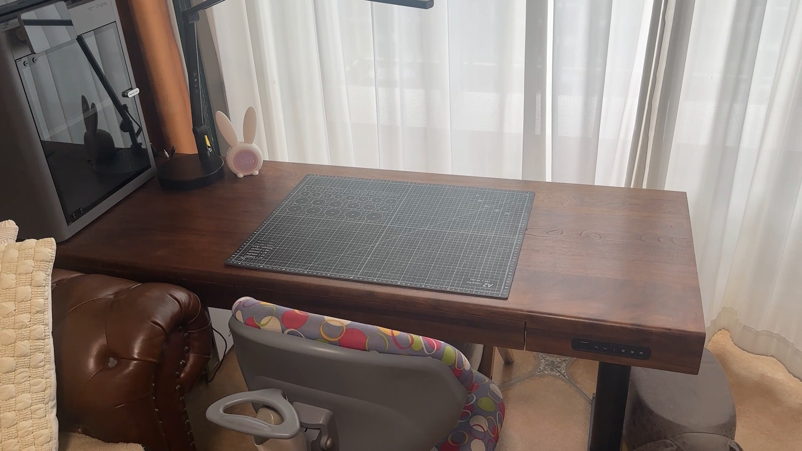
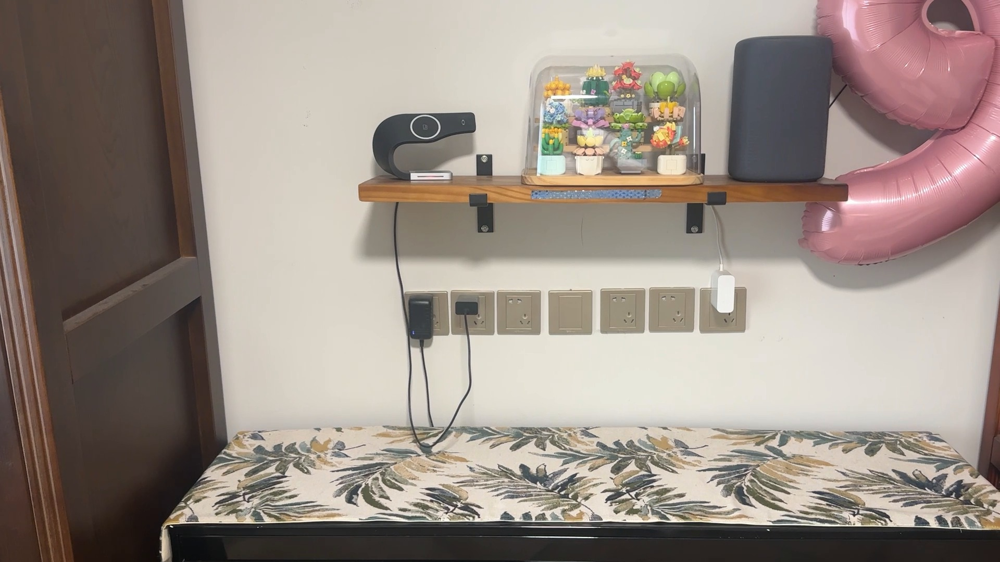
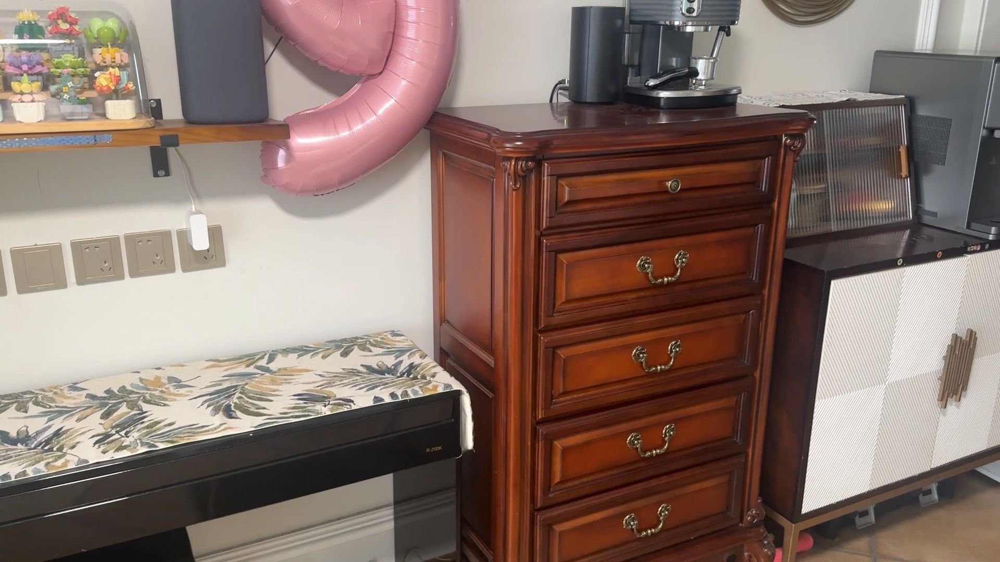
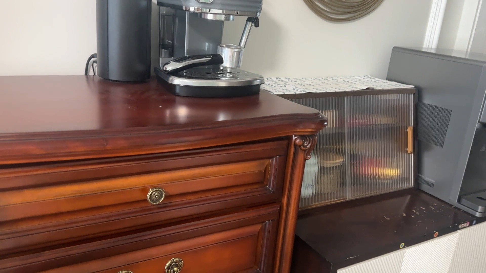

# HERO_S1 新房空间视觉裁定 v1

现有 `new_1.mp4` 已足够定出冻结英雄任务的 5 个目标区域；无需补拍视频。该证据包是自动空间生产器失败后的独立视觉覆盖层，所有接受项记为 `VISUALLY_ADJUDICATED`，不计入 `AUTO_ACCEPTED`。

- 源视频：`local-data/hero_s1/new_1.mp4`
- 源视频 SHA-256：`fb7004841507c10fc95b283c190db0d887d232c281cb5a5400ad88943a2b84fe`
- 自动空间规范化 SHA-256：`8b4616b04f1ca1697f45652ac3cf3b4dec8256683f2fefd96678dce514067baa`
- 视觉裁定规范化 SHA-256：`d7bfea852368bb965b3286cb8cad180f98a36dfe2748750322ed3f8ba991ee88`
- 授权依据：用户允许视觉代理先行判定人工视觉、region ID 与 anchor ID，仅在证据不可见或误差无法处理时再汇报。

## 冻结映射

| 输出区域 | Anchor | 自动候选 / 轨迹 | 代表帧 | 视觉结论 | 电源状态 |
|---|---|---|---|---|---|
| `study_desk` | `study_desk` | `auto_study_desk_01` / `new_1_t273` | `kf_003240`，54.144s | 完整书桌面，直接保留标签 | `UNKNOWN`：插座端点不可见 |
| `vanity_top` | `vanity` | `auto_unknown_60` / `new_1_t356` | `kf_004260`，71.190s | 花布覆盖长台面；区域身份明确，家具语义沿用冻结目标 | `NEAR`：同帧可见下方插座排与线缆 |
| `wall_shelf` | `wall_shelf` | `auto_unknown_79` / `new_1_t369` | `kf_004260`，71.190s | 墙上木搁板；与下方花布台面几何分离 | `NEAR`：同帧可见下方插座排 |
| `chest_top` | `chest_of_drawers` | `auto_unknown_98` / `new_1_t415` | `kf_005040`，84.224s | 红木斗柜及顶面 | `UNKNOWN`：设备线缆可见，插座端点不可见 |
| `display_cabinet` | `display_cabinet` | `auto_unknown_102` / `new_1_t529` | `kf_005640`，94.251s | 竖纹玻璃门柜及内部隔层 | `UNKNOWN`：不能以未看到插座证明不靠近 |

## 代表帧

### 书桌面

### 花布台面与墙上木搁板

### 红木斗柜

### 玻璃展示柜

## 仍不可由当前视频证明的边界

- 容量 `small/medium` 仅为相对分类；精确可用面积、净高与承重未测量。
- 书桌面出现标注为 `A2` 的网格切割垫，但实物是否为标准 59.4 × 42.0 cm 尚未确认，因此不作为冻结尺度。
- 门洞净宽和主要通道净宽缺少同平面已知尺度、相机标定或深度，不能从单目移动视频可靠推导。
- 搬后摆放效果、儿童触及高度、通道绊倒关系和湿区关系需最终实景或专门测量，当前不伪造结论。
